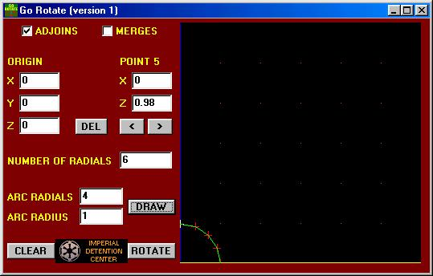
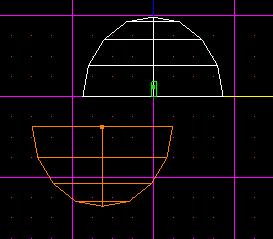
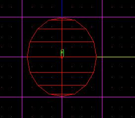
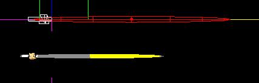
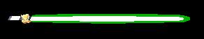

Author: Mark "Deathbane27" Allred

First of all, I suggest you download the
[GoRotate](http://www.code-alliance.com/~editors/jediknight/plugins/gorotate.zip)
plug-in for JED. It makes things a lot easier in this field... I'll
start off with a Glowsaber for an example.

Making the glow looks cool with a lot of stuff, but the best use of it
is in making lightsabers and projectiles. I'll start off with a
lightsaber for an example. To start, import **sabg.3do**.

Now, use the GoRotate plug-in to create a half-sphere. The Radials and
Arc Radials should reflect how much detail you are going to have in the
glow. 6 Radials and 4 Arc Radials are usually enough detail. Now hit the
Draw button, then the Rotate button.

Once you have your half-sphere, copy the sector it and paste it. Flip it
on the Z axis (Hit F9 to bring up the tool window).

Now hold Ctrl + Shift drag one half-sphere so it's touching the other.
Adjoin and merge them to make one large sphere. Set the sector flags to
'Preview as 3DO'.

Now it's time scale that puppy down. First, though, rotate it 90 degrees
around the X axis. Now scale it by .14 on the Y axis, and 0.004 on the X
and Z axes. Drag it so it looks like it's coming out of the saber (You
may have to close and re-open the 3D-preview window to see it).

As you can see, the ends are a little pointy. Slice off the end that
sticks into the saber handle, and drag the end vertices in to make the
other end rounder.

Okay, you're probably wondering right about now when I'm going to
actually tell you how to make the glow. Just hold your horses...

Copy the 'cylinder', and scale it up a bit so it fit's around the first.
Set the surfaces in the first cylinder to a white mat (your own), and
the ones in the larger cylinder to a mat of the color you want your
saber. (**sabvbld.mat** is a good one to use for a green saber.) Flag
the surfaces in the larger sector as translucent. You will notice that
you can't see the small sector in the large one.

Okay, now it's finally time to tell you how do it. Take the 'glow'
sector, and scale it on the X or Z axis by **-1**. That's right, **-1**.
Turn it inside-out.

That's pretty much it for making glow. You probably want to make a
larger copy the Glow sector around the first, so you have 2 levels of
glow (you can't see it in JED, but you can in
[Fun3do](http://outpostd34.com/droid/download/index.html)). Yeah, I
could have just said "Scale the sector by -1" in the first place, but
then this tutorial would be too short...

Special thanks to [Jamontoast](mailto:darkforce_st@hotmail.com) for
telling me how to do this.
