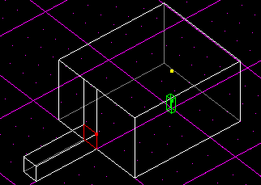
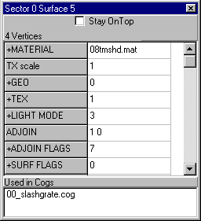
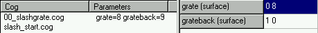
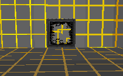

Author: 8t88

     A slashable grate is a cool feature of a JK level that's sure to
help with your review scores. Slashable grates are surprisingly easy to
make. So let's begin\!

     First, select the default sector and switch to surface mode. Select
a side wall and cleave a square on it, preferably close to the ground,
0.2 JKUs high. Now, press the "X" key to extrude the surface you just
cleaved. Your level should look something like this.

     For this surface, shown selected above, we'll use 08tmshd.mat for
the material. Next, we need to make it so that the engine draws that
surface. When you extruded it was like adjoing the two sectors. Under
the surface editor, set the GEO value to 4, draw textured.  
     Now, under Adjoin Flags, uncheck the second checkbox or flag. This
sets the surface to impassible so you can't walk through it. Now, check
the second and third Surface Flags checkboxes, Used in COG and
Impassible respectively. Now, do all that again for the other side or
surface of the adjoin.  
     Write down the sector and surface numbers for each of the surfaces
in the adjoin; you'll need these later. You'll find these at the top of
the face editor.

     Now, on to the COG\! Under the Tools menu, select Placed Cogs.
Press the Add Cog button. You will see a long list of COGs. Select
00\_slashgrate.cog and press OK. There are two fields you need to enter.
Under grate, enter one of the surface numbers (sector and surface
number) and under grateback enter the other number. The format for this
is Sector\#\[space\]Surface\#. Press Refresh and close that window. Now
save and compile. That's all there is to it\!

The slashable grate in action

|                 |                 |
| --------------- | --------------- |
|  |  |
| Before          | After           |
