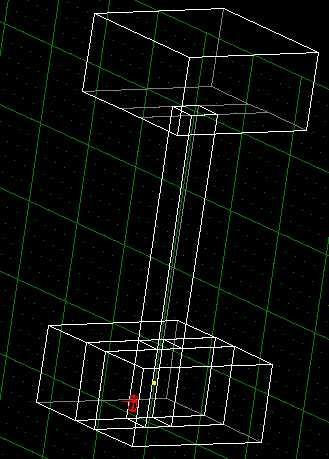
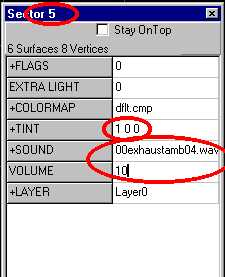
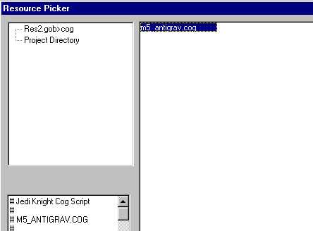
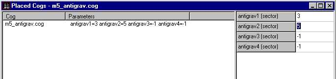

Author: Myrddraal
  
Have you ever wanted to go flying up a shaft without having to put in
all those messy elevator settings?? Well, anti-grav tubes (as seen in
Blades of Death DM level) are a great way to achieve this. This very
easy COG can help to spice up even the most boring level. Here's how to
do it:

First, let's start a new level. You should see the very familiar basic
sector. Now cleave that baby up\!\! From the top view (1) cleave it so
that there's a sector about 4x4m (any size will do, really, but I'm
using 4x4m) going straight up the middle of what was your original
sector. Now find this 4x4 middle sector, and find its top face. Extrude
that face\!\!\! Drag it up high\!\! Now use the 'k' command to throw in
another sector the same size as the original, and place it on top of the
pipe you just made. Find your new sector's bottom face, cleave it up
just like the bottom sector, and adjoin the middle face. now you should
have something like this:  
  

And, if you press the infamous 'F12' button (or in other words, go to 3D
Preview):  
  

....You should get something like this, now let's colour it
in\!\!\!....  
  

.....awwww, pretty\!\! (excuse the tacky textures, just trying to show
things up\!\!)

Now to start getting a little technical\!\! Get your 'pipe' sector (the
one up the middle for those of us who are a little slow) and press
'Enter'. You should get a window with all of the variables for that
sector. Now all you've gotta do is change a bit here, input something
else there and change all that, and your done\!\! Here, have a look at
this:  
  

Firstly, I want you to look at the blue window bar at the top and note
down the number of the sector (in my case its 5, as circled). Next,
ignore all that flags and light and colourmap crap, go straight to tint,
and double click on it. Chose a colour that you like (red looks good in
an anti-grav tube) and select it. Now, out in the sector editor again,
go to my third circle, at the sounds, choose a nice sound by double
clicking for the list (for those out there who don't know, a + before
the variable means that you can double-click on it to see the options)
and pump up the volume a bit. You need to do this both for the big pipe
up the middle and the little sector in the middle of the original one, I
mean the one that the pipe comes out of. Now that takes care of it,
almost.....well sort of........well ok, to tell the truth, all that
would happen when the player walks in there is that he would see a heap
of red and hear a strange sound, but here's how to make him go up:
first, you need Conman, so if you haven't already got it, go to
[darkjedi.com](http://www.darkjedi.com) and get it. Now, once you have
it, or if you already have it, open it up and open jk1mp.gob (in your
episode folder) and go down to cogs, pick out the right COG (which
happens to be 'm5\_antigrav.cog') and extract it to your project
directory.  
(e.g.-
c/-JediKnight/episode/jed/projects/mylevelthatimusingtodothistutorial\!\!)  
  

Now that it's in there, you should be able to go to 'placed cogs' and
'add cog' and see this under project directory:  
  

Good, now add the COG and go to the variables, put in the numbers of
BOTH of the sectors that you had to note before, it should look like
this:  
  

Well that's it, if you have any questions, feel free to ask me,
[e-mail](mailto:myrddraal_fade@mailexcite.com) me or use ICQ to contact
me on 15649749.
