Author: [Brian Lozier](mailto:lozier@bigfoot.com)  
Creator: [Mangore Kiramin](mailto:mangore_kiramin@geocities.com)  
  
This technique was developed and taught to me by Mangore Kiramin. I just
want to get that out of the way first so he doesn't kick my @$$.  
  
Anyway, lets get started. This tutorial is intended to teach a great way
to make awesome looking random floors. This technique is great for
framerate, as it only adds one extra vertex per instance, and no extra
adjoins. It does add 4 edges and an extra 3 faces, but these don't
impact framerate very much at all.  
  
What do I mean when I say "rugged terrain?" Well, if you take a stroll
outside, chances are the ground is not perfectly flat. Most likely, the
ground slopes and curves all over the place, especially if you live out
in the country. This technique is most useful when creating outdoor type
levels and underground type levels.  
  
One thing to remember, before you use this technique on a surface, make
sure to set that surface to floor. If its not, you will have triple the
work to do after you are done making the contours of the ground. This is
because, like I said, you will end up with 3 extra faces (if you set the
floor flag first, when you cleave the surface, it will stay flagged like
that).  
  
Now, basically what we are going to do is take the floor surface of a
sector, cleave it into 4 PERFECT triangles, and then drag the center
vertex down to create a small pit. There are a few important things to
remember when using this technique.

  - You must only use it when the floor of the sector has not been
    cleaved up. This means that if you have cleaved the floor surface
    before, this technique will not work -- you will get a non-convex.
  - Use textures that aren't too picky about alignment. When you drag
    the pit down, it is impossible to get perfect alignments. I often
    use a custom dirt texture.
  - You will learn to use the snap-to-vertex option -- if you do not use
    it, you will likely get errors, so don't try shortcuts unless you
    know what you're doing.
  - Once you have your center vertex, align the grid to it using
    \[shift+s\] - that way you will have no problem moving it back to
    its previous position if you mess up.

If those tips don't make sense right now, don't worry, as they will be
repeated in context during this tutorial.  
  
Now we will actually start. Use the default sector in JED. Go to the 3d
preview, and click on the floor. Once this is selected, go back to the
main editing window, and press \[shift+1\]. This will switch your view
to the top view (if it isn't already there).  
  
Now is where it is important to read carefully. In this sector, snapping
to the vertices isn't that important, as its very easy to eye-ball it.
However, in more complex situations, you will need to use this function
to get the technique to work.  
  
Press the \[c\] key to implement the cleave tool. Then, hold down the
\[shift\] key, and cleave the surface from one corner, diagonally across
to the opposite corner. You will notice that the shift key causes your
cleave line to snap to the vertices. This is very important.  
  

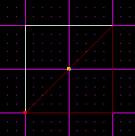

  
Now, press the \[c\] key once again, hold down shift, and cleave across
the other direction. Make sure to go all the way to the opposite vertex
even though it won't cleave that far. This makes sure that this cleave
will line up perfectly with the next one we will do.  
  

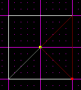

  
Now you must select the remaining surface (as shown below). You can go
to 3d preview and select it, or just keep clicking till the correct
surface is selected.  
  

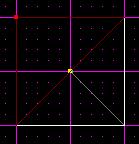

  
Cleave this one across using the \[shift\] key just like you did the
other two. It should snap to the center vertex, but if not, cleave all
the way to the opposite corner.  
  

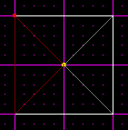

  
The hardest part is now done. The next step is to switch to vertex mode
and select the center vertex. Once that is done, switch to a side view
using \[shift+2 or 3\]. Snap the grid to the vertex using \[shift+s\].
This will allow you to easily move your vertex back to its original
position if you accidentally make a mistake. Once again, this isn't too
important here, but once you get into more complex surfaces, it will
be.  
  
Now drag the vertex down a shade as shown below.  
  

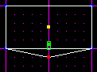

  
This just created a perfect little pit in the center of your sector. If
you want, you can drag the vertex to the side as well.  
  

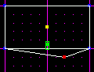

  
You can switch to the other side view and drag the vertex around as
well, but make sure to check the consistency checker after each move. I
would post a small picture so you can see the result, but it doesn't
show up well in screenshots. If you test your level, you will notice
that the ground sloped.  
  
This was a very simple example, but this technique can be very powerful
for creating realistic environments. Consider the following picture.  
  

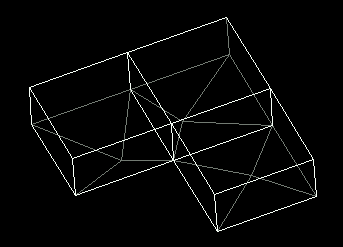

  
That is 3 sectors, all using this technique. When the player walks
across them, it will seem very hilly and random. Of course looking at
them from the JED view, it doesn't seem random, but when you are
actually walking in it, in game, it has a great effect.  
  
This technique can be used for all shapes of sectors. The vertex you
drag, however, may not always end up in the center. Consider the
following picture. The floor surface was cleaved twice to get the center
vertex, then all the remaining corners were cleaved inwards to meet up
with it. This still makes triangles, so you will not get a non-convex.
Remember to use the \[shift\] key to snap to the vertices.  
  

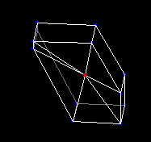

  
As mentioned before, do not try this on a floor that has already been
cleaved. The floor you start with must span the full sector. Here is an
example of a sector that this technique cannot be used on.  
  

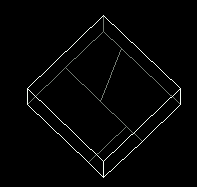

  
Notice that the floor is cleaved all funny. This sometimes happens
(though hopefully not to this extreme) when making levels. It is not
possible to get a bunch of triangles linked at the center on one vertex,
so the technique will not work here.  
  
Knowing that, keep it in mind when building your areas. A lot of times
you can apply this technique to the floor, then shape the sector for a
more random looking effect.  
  

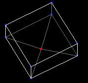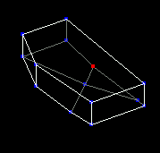

  
This is the before and after. I used the normal jed sector to create the
floor, then shaped my sector.  
  
Hopefully this will get you started. It can also be used on the ceilings
and walls if you can get it to look right. When texturing, make sure to
use a texture that is not so picky about stitching, as this doesn't
allow for perfect stitching.  
  
As always, feel free to use the [Message Board](http://forums.massassi.net/)
to ask questions.  
  
