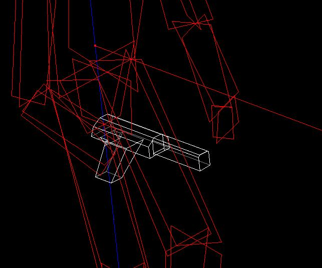
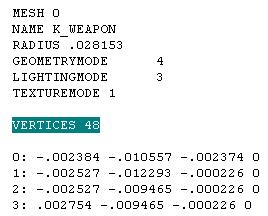
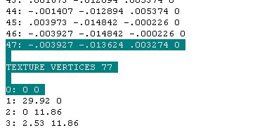
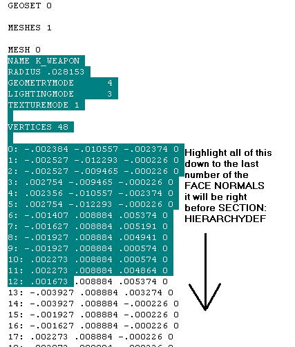
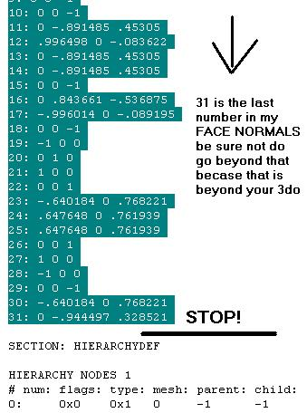
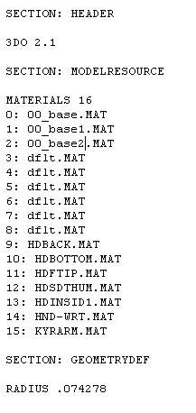
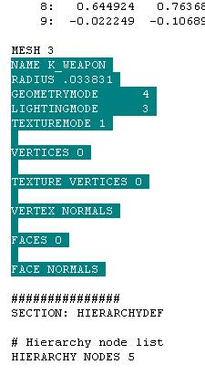
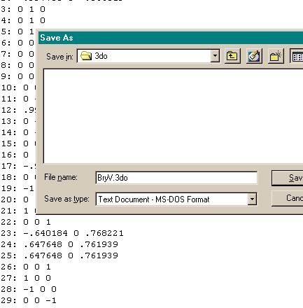
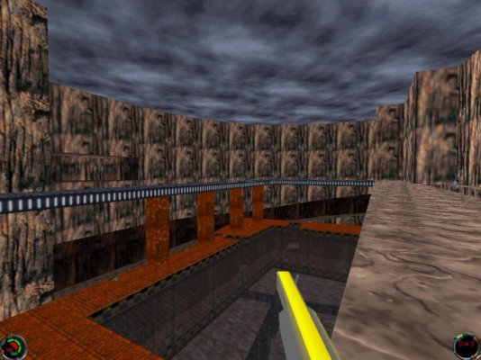

Author: Z@NARDI
  

This tutorial is intended to assist new editors with making an internal
gun model. I won't be covering Power Ups or External Mode much, but I
will be working right with you with pictures of every step I make, and
if you have any questions that you would like to have answered quickly
you can reach me on ICQ. My UIN is 43779070.

**The materials you'll need are**

  - [JED.94](/programs/)
    (the version used in this tutorial)
  - Word Pad or equivalent text editor
  - [intgun.3do](intgun.3do)

-----

Okay, the first thing you should do is create a gun model. Make sure you
have it facing down, so when you go to View Mode 3 (Shift + 3) the gun
handle is on the left and the gun is facing down. Now, if you've already
started making your gun and it's not facing down, just hit F9 and rotate
your gun on its X-axis at a 90 degree angle. If that doesn't work just
try different things out; here is mine (notice I haven't put it facing
down yet)...

...(yes it sucks, but it's just an example) and remember guns don't have
to be a great piece of architecture. The biggest reason for that is just
one word: texturing. Texturing a 1000-surface gun can be annoying. Also
when creating your gun, you want it to be sized correctly right? Click
on "View" in JED, then go to View things
as: and click wireframe. I use Kyle to make sure my gun is correct size,
you can use another gun if you want it to be the size of, say, the
Stormtrooper rifle. After you have finished your gun, create a folder in
your \\JediKnight\\Resources directory and name it 3do. In JED select
your gun sector(s) (to multi-select hold Alt and drag your mouse over
all sectors), but before exporting it as a 3do: while you have all the
sectors selected, hit Enter or go to Items Editor, you'll see a window
that tells you at top what sector \# it is, how many surfaces and
vertices, etc. Look down that window till you come across +LAYER; type
in K\_WEAPON to replace "Layer0." That's it. Now go to File, then Export
Sectors as 3do, then save your gun (e.g. gun.3do).

  

**Working on the Internal Mesh:**

Okay, now open up Word Pad, then open up gun.3do (or whatever file name
you just gave it). Again, I'll use mine:

Now, if you scroll down you see a bunch of numbers: those numbers are
just your 3do. The first thing you see after the Header and
Modelresources sections you see a list of materials. It says Materials,
and next to that is a number that tells us how many textures we used—I
didn't texture mine so it stayed at the default texture, but if you
textured yours it'll have a list of the different textures you used. If
you *did* texture yours just make sure you didn't use more than 9
textures (I'll explain why a little further down).

Look down a bit further where it says: MESHES. It's right under GEOSET
and right before MESH 0. MESHES are basically used for animation: say I
want a part on my weapon to move on its own, I'd select the sector(s)
that I wanted to move, and on the Item Editor where it says +LAYER I'd
give it a name. If I named it KICKER, and I also had the rest of my
weapon at K\_WEAPON, under that: MESHES in the 3do it would say 2 (one
mesh for my K\_WEAPON and one for my KICKER) now one line down where it
says MESH 0, that just tells you what the mesh number is. Since there is
only one mesh it means that's the only one. Another line down, it says
NAME K\_WEAPON: if yours doesn't say K\_WEAPON change it. It doesn't
hurt anything, just makes it look like mine, but you don't want to mesh
with anything else. Now you're going to do some copy-n-pasting. Back to
talking about meshes:

MESH 0  
NAME K\_WEAPON  
RADIUS .028153  
GEOMETRYMODE 4  
LIGHTINGMODE 3  
TEXTUREMODE 1  
  

after that part of the mesh, it says VERTICES

then a number (remember in the Item Editor it tells you that; that's
just how many vertices are in your mesh or gun). After you scroll past
your number of vertices, how ever many there may be in your weapon,
you'll find this:

TEXTURE VERTICES (\#\#)

There will be a number after that: remember it all varies with different
guns:

What I've highlighted is the end of the 48 vertices (it says 47 because
it starts on 0) and the TEXTURE VERTICES, then I have the beginning of
the Texture vertices... I think you get the idea now, so I'll just tell
you the rest of what is under VERTICES and TEXTURE VERTICES. This is how
it looks:

VERTICES (\#\#)  
TEXTURE VERTICES (\#\#)  
VERTEX NORMALS  
FACES(\#\#)  
and the last thing  
FACE NORMALS  

All that makes up your gun. What you want to do now is copy all of the
text from NAME K\_WEAPON ---\> through to \<---face normals:

  
  

Once you have all of that highlighted go to
Edit, and hit
Copy. Now open up the intgun.3do that
comes with this tutorial. Under MATERIALS you see 16 of them: 9-15 are
used up if you see that. Don't change those unless you want Kyle's hand
to have different textures. If you used any textures you need to put
those in your MATERIALS. For example, say I use 00\_base.mat,
00\_base1.mat and 00\_base2.mat as textures for my gun. This is what I
would do in that MATERIALS part:

That's why you can't use more that 9 textures on your gun. Also, you
can't delete those dflt.mat textures 3-8 even if you don't use dflt.mat
texture. If you do delete them your gun won't work. Simple as that. Now,
scroll down till you see: MESHES 4. That says how many meshes we have
(as mentioned earlier). The first mesh you see is K\_Rhand (MESH 0) or
Kyle's right hand. If you scroll further down the second mesh is
K\_Rshouldr (MESH 1): that's Kyle's right shoulder. Scroll down some
more and you'll find K\_Rforearm (MESH 2), Kyle's right forearm. Down
some more is K\_WEAPON (MESH 3) (if so far you're lost, go to Edit then
find type in the meshes (e.g. K\_Rshoulr) and it'll highlight it for
you). Now back to K\_WEAPON: you will see it has 0 vertices, 0 texture
vertices, no vertex normals, 0 faces and no face normals. This is what
you want to do with that:

Highlight it just like I've done. Now go to Edit and hit Paste. If you
copied every thing right your weapon you made will be up there. Now go
to File and hit Save As... Save it as BryV.3do and make sure you save it
in your \\JediKnight\\Resources\\3do directory (FYI: when I use my
version of Word 97 I have to hit Save As... and select "Text Document -
MS-DOS Format")

Okay, after you've saved your weapon as BryV.3do (which is the internal
mode for the bryar pistol) and you've saved it in your Resources\\3do
directory, fire up Jedi Knight and see how it looks:

MAGICALLY THERE'S A GUN\! That wasn't so hard, now was it? If it was, or
you didn't understand what I just wrote, give me a buzz on ICQ @
43779070. If you don't have ICQ e-mail me at
[soulfly\_tribe99@hotmail.com](mailto:soulfly_tribe99t@hotmail.com).
