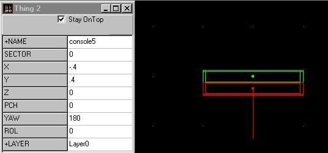
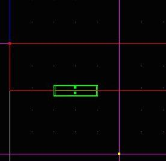
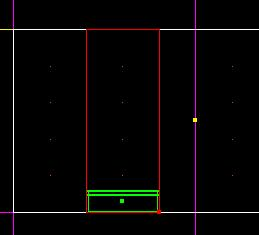
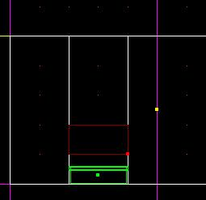
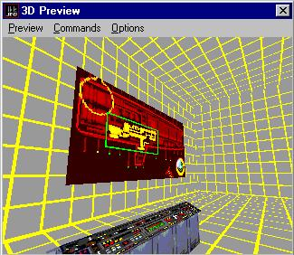
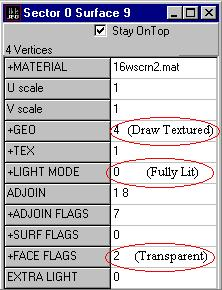
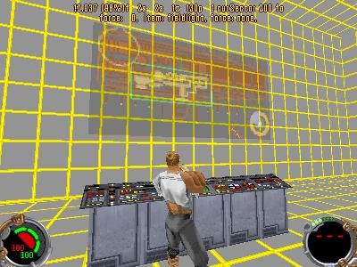

Author: 2D
Holograms for JK/MotS  

-----

Author: [Sam Coulson](mailto:samcoulson@hotmail.com)  
  

Making holograms for Jedi Knight and Mysteries of the Sith is easy and
makes you look like you really know your stuff when it comes to editing.
It only involves setting some flags on an adjoined surface. (No
cogs--yay\!)

  - Use these links to skip around or read it all the way through:   
    [Creating the Surface](#cleaving)
    [Making it Show Up](#texturing)
    [Setting the Flags](#flagging)
    [Troubleshooting](#troubling)

### Creating the Surface

First, we need to select a computer console to place our floating
hologram above. You don't need one for this to work, but it makes it
look a whole lot better. The best one to use is the 'console5'. Just
type it in the thing's name area or select it in the template
'Doors/elev etc-walkstructure'. Place two of them facing back to back
(make sure they aren't sticking through the floor):

Now that we have something to "project" our hologram, we are going to
create the surface that will actually be our hologram. Cleave the sector
straight between the two consoles like so:

Now you have created a nice surface that we can play with. Multiselect
both of them (one surface belongs to each of the two sectors--make sure
you get them both).

**\*\*Note:** Every time that you have to cleave
a surface while making a hologram, make sure you multiselect BOTH SIDES
before you cleave. It will save you half the time and work than if you
don't. Also remember to clear your multiselection after each cleave by
pressing the 'Backspace' key.

Looking at the surfaces from the side, cleave a 4 meter slice in both
sides:

Now multiselect both of the new surfaces above the consoles and cleave a
2 meter section a little above the consoles: (Remember the
[note](#note)\!)

### Making it Show Up

Now that we have our surface that will become the hologram, we can
choose what we want it to look like. Multiselect both surfaces and keep
them multiselected until we are done making our holo. Double-click on
the '+MATERIAL' button in the item editor so you can choose the mat to
use as the holo. Ones that work nicely are:

  - 09wcomp2.mat
  - 16wscrn1.mat
  - 18wscrn1.mat
  - 00awarn.mat
  - 00sctrl.mat
  - 00starg.mat
  - 00starg3.mat
  - 00tctrl.mat
  - 06acscreen.mat
  - 06acscreen1.mat
  - 14ascrn.mat
  - 14awscrn.mat
  - 41apanelb.mat
  - 41ardscrnx.mat
  - 41pschem1.mat
  - 54amoth.mat
  - 16wscrn2.mat
  - 16wscrn3.mat

Right now, our surface is adjoined to both sectors, and is invisible. To
make it show up go to the '+GEO' text area in the item selector. Click
on the text area so it is selected, and double-click on the '+GEO'
button.

\*\*If you double-click the button without clicking on the text area,
you will go into the texture selector because it (the texture selector)
is automatically selected when the window is activated.

After doubleclicking on the '+GEO' button, you should see a nice little
window with values that you can select. We want our picture to show up,
so select 'Draw Textured' (I don't think it matters if you select the
first or the last 'Draw Textured'--if you have problems [e-mail
me](mailto:samcoulson@hotmail.com)). Once you have selected 'Draw
Textured' click 'OK'. Make sure that both surfaces are still
multiselected, or you will have to set the flags for the other side of
the surface.

Now that we have done that, our hologram should appear. Hit 'F12' and go
into the 3-D Preview. Your holo should look like this (maybe with a
different mat):

### Setting the Flags

There's still two more things to do to make this look really good
(besides retexturing the mat).

Most holograms are transparent, so we need to set another flag to make
it so. This flag is in the '+FACE FLAGS' section on your Item Editor, so
open it just like the ['+GEO' button](#GEO). Then select 'translucent'
and click 'OK'. You won't be able to see that it is transparent in the
3-D Preview, but it shows up in the game.

This next flag is optional, but makes the hologram look very real. What
we will do is make the holo look like it has its own power source by
having it fully lit, just like in the movies. To do this open the
'+LIGHT MODE' button like you did the ['+GEO' and '+FACE FLAGS'](#GEO)
and select 'Fully Lit'.

Here's the flags that we used--make sure that
both surfaces have them all\!

When your surface has all the right flags, test it. Look at both sides,
shoot it, and jump through it to make sure everything works. This is
what it should look like in the game:

### Troubleshooting

Here are some problems I ran into while making my own holograms. If your
problem isn't here, e-mail me at <samcoulson@hotmail.com> and I will do
my best to help you.

***I can't see one or both sides of my hologram\!***  

  - Either your eyes are closed, your monitor is off, or you didn't set
    the 'Draw Textured' flag. If you have fixed the first two
    possibilities, go to the [Making it Show Up](#texturing) section and
    double-check everything, or check the [list of flags](#flags) that
    both surfaces should have.

***I can't move through my hologram\!***  

  - This happens when your surfaces did not get adjoined to each other.
    Go and select one of the surfaces that needs to be adjoined and
    press 'A' to adjoin it. Make sure that all the surfaces around the
    hologram are adjoined also.

***One or both of my consoles aren't there\!***  

  - Your 3do(s) are not assigned to a sector. Make sure they are inside
    a sector, select them, and press 'Shift A'. Save and test.

**Good Job\! You have now made your own hologram for your level\!**

If you have any comments, questions, problems, or cool screenshots of
your level, e-mail me at <samcoulson@hotmail.com>.
