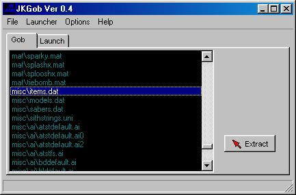
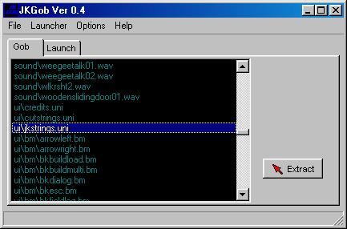
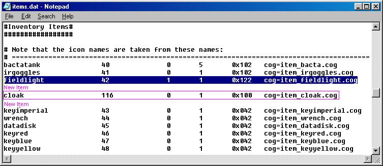
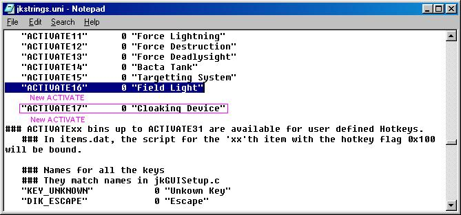

Author:
Adding Hotkeys  

-----

Author: [Hell Raiser](mailto:hell_raiser64@softhome.net)  
  

So you wanna add hotkeys to some of your newly made items, force powers,
or weapons, do ya? Well, you've come to the right tutorial. This
tutorial will show you, the gamer, how to put in 15 more items, force
powers, or weapons without replacing a single thing in Jedi Knight.
Well, let's get to it.

Note: This tutorial is geared towards those who have made something new,
tottaly cogged with a new bin \# and everything, and that nothing has
been added in items.dat.

**Utilities needed:**

  - Conman or JKGOB
  - Some kinda text editor, notepad will do
  - A new item, force power, or weapon to add

Ok, first off, take your ungobing utility and open res2.gob and look for
Misc\\items.dat and ungob it to your resource dir. Then open up
res1low.gob (or high) and look for Ui\\jkstrings.uni and ungob it to
your Jedi Knight\\Resource directory.

Open up items.dat and add in your item/force power/weapon like so:

Look for "fieldlight 42 1 1 0x122 cog=item\_fieldlight.cog" and place
your item/force power/weapon under it, or below the section. This is
important as JK looks for the flag of 0x100 to determine what is
hotkeyable, and they have to be in order. Your new stuff has to come
after what JK has. That is the key to get everything working\!\!\!

Don't forget to make sure that the bin number is the next highest one,
116. It doesn't have to be, but it has to be under 199 and can't be 150,
that's taken. Make sure that your cog also has the right bin number in
it if it calls to see if it's activated or not.

Also, the first number is how low the bin can go, if you always have it,
like the fieldlight, put a 1 there, if you can lose it, or pick it up,
put 0. The second number is the maximum you can have of it. So if you
have grenades, and the max you can have is 5, put 5. The flag, always
put 0x100 no matter what. Not sure what 0x122 or 0x102 does, so don't
put that. =) and finally cog= is what cog your new item/force
power/weapon uses.

Oh, about the name at the beginning of the line.  "cloak" is the bm that
JK will look for to display at the bottom of the screen.  I'm not
totally sure on this topic, but if you don't have a bm made and named
right (its kinda funny, can't remember, I'll write a tutorial on that
too. ;)   ) then JK might crash or something else. (haven't tested) Just
put one of the other names in its place, like "wrench" will show the
wrench icon.

Close and save.

Now open up jkstrings.uni and "search" for ACTIVATE16. Under that,
follow the rest of the ACTIVATE as an example.

ACTIVATE17   0   "description"

Now that you're done with that, close and save. If you've done
everything right, you'll see your hotkeyable item at the bottom of the
list in Jedi Knight. Assign a key, and test.

That's it, you're ready to add more hotkeyable items to Jedi Knight.

The above example used my cloaking device that will be in Jedi Knight
Freeze Tag.
