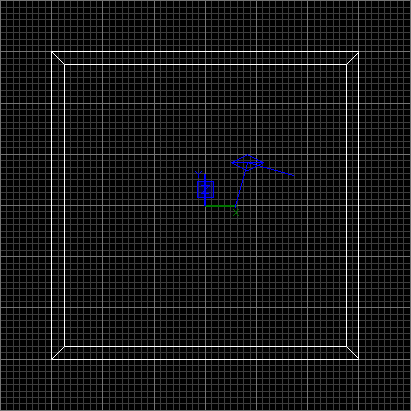
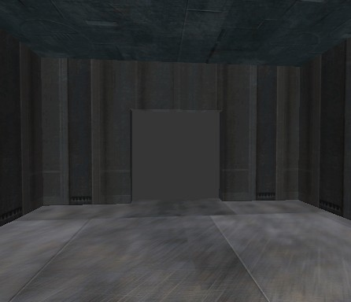
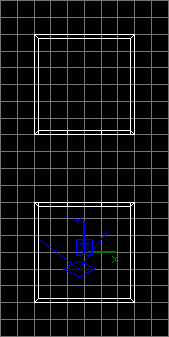
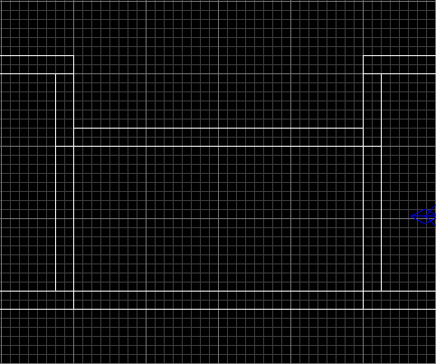
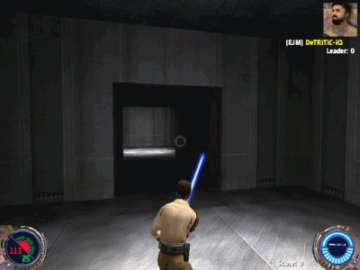

Author: DeTRiTiC-iQ

*This tutorial assumes that you can already make an individual room.*

**Included:** [corridors.map](corridors.map) (the final .map file for
this tutorial)

1.  Start off with making a simple room:
    
    

2.  Now select one of the walls and use the Clipping tool
    , cut a hole in the wall in the shape of the
    corridor you want.
    
    ### How to use the Clipping Tool:

    1. Select the Clipping tool by press 'X' or by clicking the button ''
    2. Click where you want the clipping to start and where you want it to finish
    3. The part of the brush which will be kept is highlighted with a different colour (in my case, yellow)
    4. Press 'Enter' to confirm the clip, press 'Ctrl+Enter' to select the other part of the brush, or press 'Shift+Enter' to keep both parts of the brush.

3.  You should end up with something like this:
    
    

4.  Now create an identical room but facing the opposite direction (you
    can select all the brushes in the room by shift+click, then
    duplicate with 'space', and finally rotate with ):
    
    

5.  Using a similar method to what you used to make your initial room;
    create a long, open-ended room (ie 2 walls, ceiling and floor) that
    fits the holes in your main rooms:
    
      
    *(Note this is a view from the side)*

6.  Now you should be ready to add spawn points and lights for a test
    compile. Here is a screenshot of the level running.
    
    
