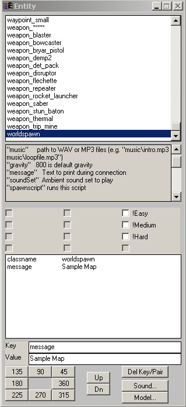

Author: Pommy

This tutorial will guide you through readying your just-completed map
for public release and/or submission to Massassi.

**Sections:**

* [Adding the finishing touches to your map](#1)
    * Adding your map name to the map loading screen
    * Creating a levelshot
    * Creating an .arena file
* [Pk3'ing your level up](#2)  
    * Creating the pk3
    * Knowing what files to add in your pk3
* [Sending it to Massassi](#3) (optional)  
    * Adding a readme
    * Adding screenshots
    * Making the zip file

-----

<span id="1"></span>

## Adding the finishing touches to your map

When you have compiled and tested your map to your satisfaction, it is
ready to make it professional and official. Be sure your map name has
its according game type in front, i.e. if it's Free for all ffa\_sample
or Capture the Flag, ctf\_sample. First, you have to make sure your map
name shows up on the loading screen.

Let's say your map bsp file is called ffa\_sample.bsp. You don't want
the loading screen to say ffa\_sample.bsp, you want it to say "Sample
Map". To do this, open your map using JK2 Radiant or GTK Radiant
(preferred), and press "n". This will bring up the entity window. Scroll
down to where it says "worldspawn". There, enter the key "message" and
the value "Sample Map". (Replace "Sample Map" with whatever your map
name is.)

  
*Add the message and the key value*

The next objective is to make a levelshot for your level; that is, a
picture to display in the background when the map is loading in place of
a black screen. To do this, start the game, bring up the console, type
"g\_gametype 0", then "devmap ffa\_sample", and join the spectators.
Bring up the console and type "bind f12 levelshot" (or another key, if
f12 is taken). Navigate to the location where you want the levelshot to
be, and press f12 when you are ready to take the shot. BE SURE YOU ARE
IN THE RIGHT POSITION BECAUSE ONCE YOU TAKE THE LEVELSHOT THE MAP WILL
RESTART, AND IF YOU ARE UNSATISFIED YOU WILL HAVE TO DO IT AGAIN. Take
note of what the levelshot file is called, it should be written in the
upper-left corner. The levelshot will be saved in your
gamedata/base/levelshots folder.

Now, it's time to make the .arena file. Use your favorite text editor
(Notepad is suggested), and create a new document. Don't save it yet.
Let's say that your map name is ffa\_sample.bsp. Write this, exactly as
written here, in your document:

``` 
 {
  map           "ffa_sample"
  bots          "Luke"
  longname      "Sample Map"
  fraglimit     "30"
  type          "ffa team_ffa"
 }
```

Let's break this down:  

  - **map:** this is the name of your bsp.
  - **bots:** what bots you want to have if the minimum players is set
    to 2 and no bots are specified by the player.
  - **longname:** the same name you set for the loading screen.
  - **fraglimit:** the default kill limit.
  - **type:** gametypes you want your map to be played in. If more than
    one, put a space between each type.

Save the file as ffa\_sample.arena.

<span id="2"></span>

## Pk3'ing your map up

Fire up your favorite Archive Manager (I prefer
[WinZip](http://www.winzip.com)). Create a new zip file. Place your bsp
in a folder called "maps". Place the arena file in a folder called
"scripts". Finally, place your tga (levelshot) in a folder called
"levelshots". Put all 3 folders in your new zip file. Save the zip.
Then, navigate to the location where you saved the zip (say you named it
ffa\_sample.zip) and rename it ffa\_sample.pk3.

<span id="3"></span>

## Sending it to Massassi (optional)

If you would like to submit your level to the Massassi Temple
([www.massassi.net](https://www.massassi.net)), or if you plan to
distribute it in any way, you should zip your file and add a readme and
screenshots. To zip your file, simply repeat the instructions with the
pk3, except only add the pk3 to the zip and don't rename it. You will
need a readme so your file is legal. A sample readme can be obtained
[here](https://www.massassi.net/submit/sample_readme_jk2.txt), at the
Massassi Temple. Add your readme to your zip file. Next, you need
screenshots. Start up your game and enter your level. Bring up the
console and type bind f11 screenshot, as you did with your levelshot. Go
around your level and take 2 screenshots that depict your level. Add
those to your zip, they will be found in your gamedata/base/screenshots
directory.

Finally, if you are sending to Massassi, you will need to follow it's
specific submission guidelines. These guidelines can be found at
[https://www.massassi.net/submit](http://www.massassi.net/submit/).

Well, if you've done all that, your map is ready to go. Good luck on
distributing it, and congratulations\!
