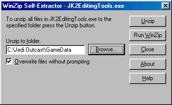
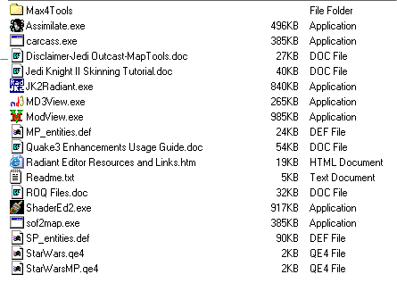
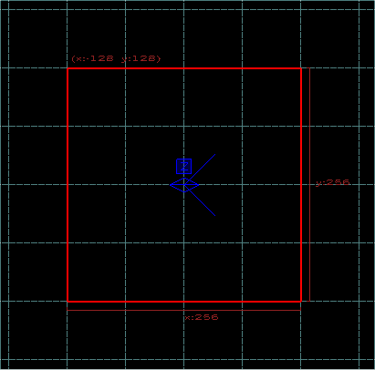
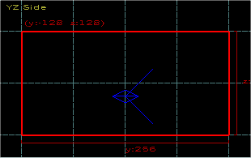
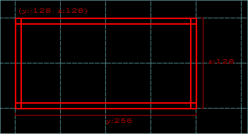
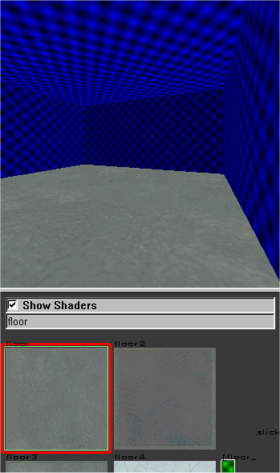
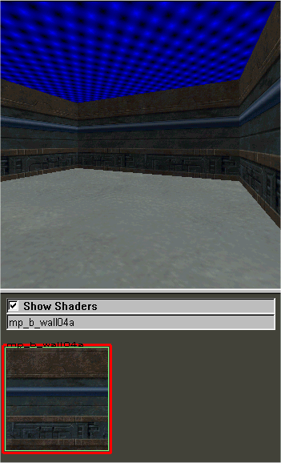
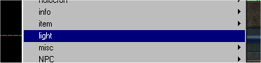
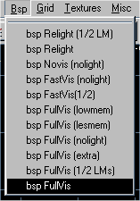
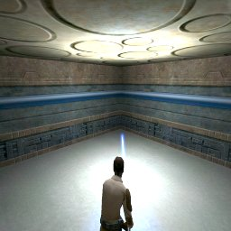

Author:
JK2Radiant Beginners Tutorial  

-----

Author: [Vincent Valentine](mailto:whooz@cox.net)  
  

If you haven't already, download JK2 Radiant from
[www.jediknightii.net](http://www.jediknightii.net/files/index.php?link=file&id=145)
or [www.massassi.net](http://www.massassi.net/programs/). After you've
downloaded it, open the file and run the executable file,
JK2EditingTools.exe.

A dialog will come up, asking you where you want to extract the files
to. This **must** be your gamedata folder. For example, on my computer,
Jedi Outcast is installed in *C:\\Jedi Outcast*. So I would type in
*C:\\Jedi Outcast\\GameData\\*

After the extractor is finished, open up the new Tools folder in the
GameData directory. These are all the tools Raven has given us (so far)
that we can use to edit Jedi Outcast.

Since this tutorial is only covering basic level editing, we won't deal
with the other programs. Double click JK2Radiant.exe to load the map
editor. It **will** take a while to load. Don't give up\! The first time
Radiant loads, it has to set several configurations; the loading time
from then on will be much faster.

Grey on white is bad. It hurts after a while. Lets make it green. Go to
Misc\>Colors\>Themes, and select Black and Green. Ah... my eyes feel
better already.

Now, to make sure you have all the necessary views open, go to Edit, and
select preferences. Make sure that the first icon view in the
Views/Rendering box is selected.

Okay, lets make a room\! Creating a brush is simple, you just drag the
mouse. Along the top and left side of the main editing window, you'll
see a bunch of numbers. These are the map coordinates. Left click and
hold where the 128 (on the left side) and the -128 (on the top)
intersect. Drag the mouse over to where -128 (left) and 128 (top)
intersect, creating a red box.

  
\*Note: That blue thing is the camera.

Now, we'll need to make sure the box is the right height. To change
views, press **\[Ctrl\]+\[Tab\]**. Change views until *YZ Side* is
displayed in the upper left corner of the main window. To make it
taller, left click above the long side on the top and drag the mouse
upward. Drag it until the top line is on 128, then bring the bottom to 0
if it isn't already.

We have just created a brush, which is a solid object in Jedi Outcast
(and most other modern 3d games). But to actually have a level, you have
to hollow out the brush. Otherwise the level would be unplayable; you
have to have an empty space bounded by solids to run around in. To
hollow the brush, hit the hollow button on the button bar.  Now your map (hopefully) looks like this:

Now that it's hollowed, deselect it by pressing **\[Esc\]**.

Let's texture this baby up. For this you won't need the main editing
window, so lets focus on the 3d preview. Navigating in the 3d preview is
fairly simple. The arrow keys move you around, **\[A\]** and **\[Z\]**
look up and down, while **\[D\]** and **\[C\]** move you up and down.

If you not inside your room, move inside it using the controls stated
above. Select the floor by holding **\[Shift\]+\[Ctrl\]** and left
clicking on it. It should turn reddish. We need to load a texture set to
choose textures from. In the Textures menu, click *bespin*. The textures
may take a while to load; be patient.\]

The Texture Browser should be right below the 3d preview. You can scroll
through the textures and pick your own, or you can type in the box
*floor* and select the first texture that appears. Your floor surface
should be now textured.

You can also select a group of brushes to texture at one time. Click in
the 3d preview, then hit **\[Esc\]** to deselect the floor. Hold
**\[Shift\]** and click each of your rooms foor walls. Once again, you
may pick your own texture, or type in *mp\_b\_wall04a* and select that
texture. Your walls should all be textured and (hopefully) aligned
correctly.

Deselect your walls (**\[Esc\]**, remember?) and select the cieling.
Texture it using your own texture, or *ceiling01*. Your room should be
completely textured. But what good are textures if you cant see them in
game? You need a light\!

In the main editing window, click somewhere in the middle of your room.
From the large menu that comes up, select "light".

Switch to other views (**\[Ctrl\]+\[Tab\]**) and move your light into
the center of the room by clicking it and dragging. You just created a
light, so you can see your beautiful level. But what good is that if you
can't actually get in your room? You need a player\_start\!

Deselect your light (**\[Esc\]**), and once again, right click in your
room, and from the menu, choose info\>info\_player\_start. Look in other
views and make sure that he is completely inside your level and a little
bit above the floor. If your player is not above the floor, he will fall
through the floor, which is not a good thing.

Now your level has everything it needs. Save your level (File\>Save As),
and save it in Jedi Outcast\\GameData\\Base\\Maps. This is extremely
important if you want to be able to play your level. After you have
saved, go to Bsp\>Fullvis.

A command window will pop up and do some stuff... it may take a while.
This is a compiler, which converts your level into information Jedi
Outcast can use to run a level. After it's done (it will say *Finished*
in the title bar), close that window and exit Jk2Radiant. You're ready
to test your level\!

Load the Jedi Outcast Single Player program. After you're in the
interface, bring up the console by pressing **\[Shift\]+\[\`\]**. In
case you don't know, the **\[\`\]** key is right above **\[Tab\]**. Type
in *devmap \[maptitle*\], where *\[maptitle\]* is the name of your
level. For example, my map is called MyMap.map, so I would type *devmap
MyMap* without the \*.map extension. Your level will load, if you did
everything right.

Now that are are somewhat familiar with how JK2Radiant works, you can
use tutorials made for Quake3 Radiant and apply them to Jedi Outcast.
Have fun\!

