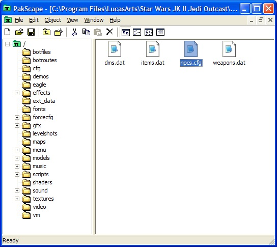
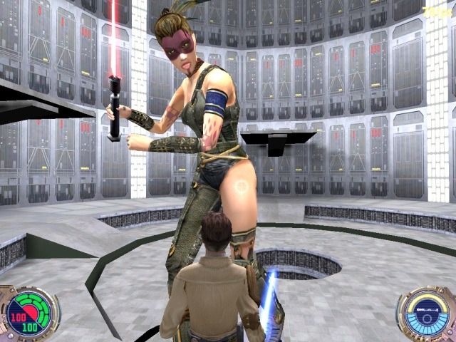

Author: DeTRiTiC-iQ

**Included:** [Tavion.pk3](jk2_scaling.zip) (has
JumboTavion from the tutorial and a few other funny resizes)

In Jedi Outcast it is possible to easily create and modify npcs for use
in your own levels or just for comedy value, this tutorial will look at
how to copy an old npc to a new one and change their size attributes.

1.  Extact npcs.cfg from assets0.pk3, it's in the ext\_data subdirectory
    of the pk3
    
    

2.  Copy the file to a seperate directory and remove its read-only
    attributes if it has them, then open the file in a text editor such
    as Notepad. In this example I will be using Tavion, so look for the
    Tavion reference in the file.
    
        Tavion  
        {  
        playerModel tavion  
        rank commander  
        saberColor red  
        reactions 3  
        aim 3  
        move 5  
        aggression 3  
        evasion 4  
        intelligence 5  
        hfov 160  
        vfov 160  
        playerTeam enemy  
        enemyTeam player  
        // race human  
        class tavion  
        snd tavion  
        sndcombat tavion  
        sndjedi tavion  
        yawSpeed 120  
        walkSpeed 55  
        runSpeed 200  
        health 300  
        dismemberProbHead 10  
        dismemberProbArms 35  
        dismemberProbLegs 10  
        dismemberProbHands 50  
        dismemberProbWaist 10  
        }
    
    From this it should be pretty obvious what most of these do,
    changing the dismember values to between 0 and 100 will change the
    percentage probability of that limb being dismembered, health is
    health etc.

3.  Add the following values to the npc details (don't create a new npc,
    because at this stage new npcs will always use the stormie rifle.
    This tutorial will be updated once a method to avoid this has been
    found):
    
        scaleX 300  
        scaleY 300  
        scaleZ 300  
    
    This will scale each of the axis by 300%. Alternatively you could
    use:
    
        scale 300
    
    to scale all axis by 300%
    
    You should end up with something like this:
    
        Tavion  
        {  
        playerModel tavion  
        rank commander  
        saberColor red  
        reactions 3  
        aim 3  
        move 5  
        aggression 3  
        evasion 4  
        intelligence 5  
        hfov 160  
        vfov 160  
        playerTeam enemy  
        enemyTeam player  
        // race human  
        class tavion  
        snd tavion  
        sndcombat tavion  
        sndjedi tavion  
        yawSpeed 120  
        walkSpeed 55  
        runSpeed 200  
        health 300  
        scaleX 300  
        scaleY 300  
        scaleZ 300  
        dismemberProbHead 10  
        dismemberProbArms 35  
        dismemberProbLegs 10  
        dismemberProbHands 50  
        dismemberProbWaist 10  
        }

4.  Now save the file, put it in its own pk3 file under the same
    ext\_data subdirectory and put the pk3 in the "Star Wars JK II Jedi
    Outcast\\GameData\\base" directory, and your ready to go. To test
    your new NPC, activate cheat codes using /helpusobi 1 in the console
    and then type:
    
         npc spawn "npcname"
    
    so in this case it would be:
    
         npc spawn "Tavion"
    
    
    
    The new 27x Tavion should appear (3 times in 3 dimensions = 27).
    Experiment with different aspects of the scaling or other npcs
    properties to get some interesting results. For example I made a
    small army of mini-lukes, it's funny to watch.

\- End
