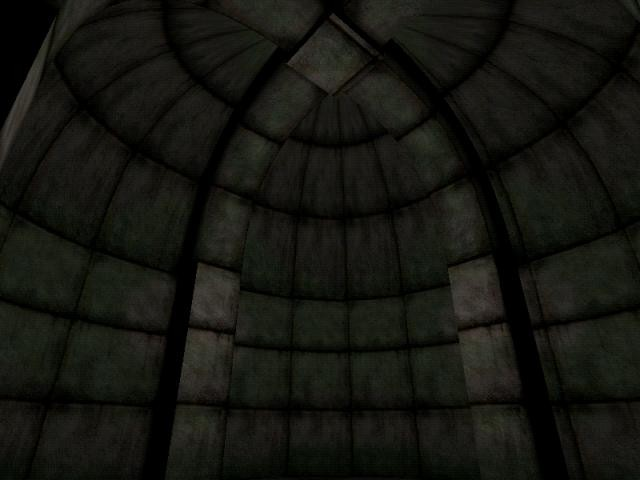

Author: JM

**Note:** *the following is edited from a transcript of a tutorial
session conducted on the \#coffestain channel via IRC.*

**JM**: We are going to build a \[archy ceiling thing\].

**JM**: First we need a column. If you haven't got GTKRadiant open yet,
get it up now.

**JM**: Open up any texture set and pick a texture. A plain one, we
won't be getting into texturing it today.

**JM**: Make a brush that's 64\*64\*256 - very simple column.

**JM**: At any rate, texture the top face of your column with caulk.
There's going to be curve sitting there.

**JM**: Clone the brush, and move it so it's sitting on top of the
original. Then turn it into a square cylinder.

**JM**: Now switch to a side view if you aren't already in one.

**JM**: Feel free to ask if you don't understand something.

**JM**: Select your new patch, and hit V to enter vertex mode. Bend it
so it makes a 90 degree angle. Take the top vertices and move them so
the top face faces the left. Make sure it stays the same size. Then move
the middle vertices so all the yellow lines are straight.

**JM**: Select the column and patch, clone them and rotate them 90
degrees (Little button with two zs and an arrow on the top bar)

**JM**: Rotate it twice, and position it so the arches line up with a
bit of space between them.

**JM**: Then make another, and move it so they form a t shape. Fill in
the left over gap with a brush, this will look sort of like a keystone.

**JM**: That was pretty basic; now it's going to become a ceiling.

**JM**: Create a brush that fits into the corner of the T shape, and
turn it into a bevel (curves menu) Rotate and resize as neccessary to
make the bevel connect the outer edges of the columns, and make sure
it's at the same altitude as the arches and the same size.

**JM**: The matrix might be facing the wrong way - make sure you can see
the texture from below the arches.

**JM**: Once you've got your bevel prepared, select it and switch to a
side view. Enter vertex mode.

**JM**: Drag all the top vertices to a single point, right where the
arches meet.

**JM**: Switch to the other side view and do it again.

**JM**: Then drag the middle vertices up so they are level with the top
of the bevel.

**JM**: Sweet, isn't it?

**JM**: Just a few things to take care of - we need a wall below the
ceiling. Create another bevel the same way you did before, and position
it so it lines up with the columns.

**JM**: All you need to do it caulk behind it. Make a brush the same
height as all your geometry, and cover it with caulk. Then position so
it fits exactly behind the corner wall. Use two to make the corner
itself.

**JM**: Then you need a smaller one only as tall as the arches behind
the arches that are above the columns.

**JM**: Select the caulk, the ceiling, and the wall. Clone, rotate, and
fit in place on the other side of the T.

**JM**: Select that entire half (except the arches on the open side)
clone, rotate, and make it a solid round room.

**JM**: For those of you still going - make a roof of caulk above
everything, toss in a floor, add a player start, a light, compile and
enjoy.

