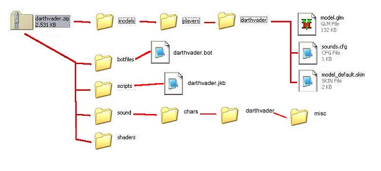

Author: Michael Frost

## Packing It Up\!

The diagram below gives a basic layout as to what should go where into
the initial Zip/PK3 File. You should have at least two (2) separate
folders if you want a working model with bot capabilities. If you are
making a more complete model, with a sound pack and all, your folder
structure should look like this, with your main ZIP/PK3 being in the
top-left most corner of this picture:

### Structure Layout

ZIP -\> Models -\> Players-\> ModelName -\> Model files

ZIP -\> BotFiles -\> ModelName.bot

ZIP - \> Scripts -\> ModelName.jkb

ZIP -\> Sound -\> Chars -\> ModelName -\> Misc -\> Sound Files

ZIP -\> Shaders -\> Shader files

And there you go\!

Rename your zip to .PK3 and your model should be ready to go. Go test it
ingame\!

**Packing it all Up**

Ok, you have everything ready to go. Make sure all your folders are set
up within the zip file and simply rename the zip file to .PK3. If you
plan to release this file to major distribution sites, make sure you
create a simple readme for the model, stating the contents, file size,
polygon count for your model, installation instructions, and possible
pertinent copyright information (LucasArts, etc.). Don't forget to put
your info in there so people know who made this\!

Now, put your PK3 and Readme.txt file into a new zip file, and e-mail it
off to the appropriate sources\!

* Back: [Handling Shaders for JK2](../15_Shaders/)
* [Return to this Tutorial's Table of Contents](../)
* Next: [TheEnd\!](../17_End/)
