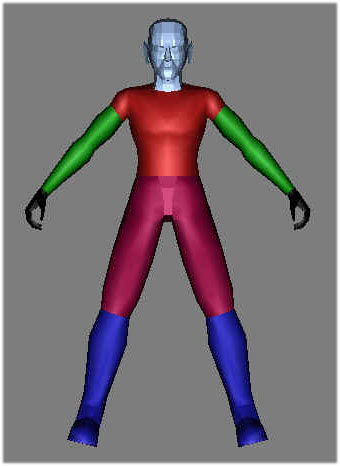
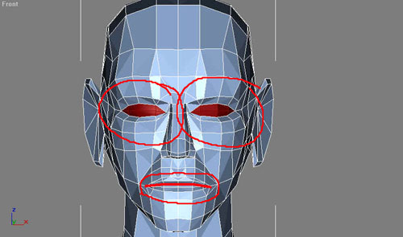
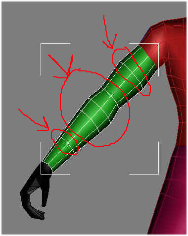
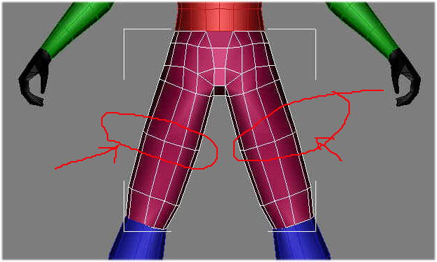
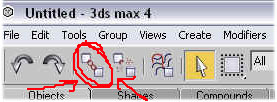

Author: Michael Frost

## Model Setup

I won't be telling you how to make a model. If you are at this point in
the tutorial you should have something ready to go... I suggest looking
for tutorials at
[www.3dcafe.com](http://www.3dcafe.com/)
and
[www.polycount.com](http://www.polycount.com/)
to get you going on this matter. I will simply give pointers to how to
best set up a model for the Jedi Outcast engine.

**Tips for Model Setup**

You should allow enough segmentation for both animation, and for
dismemberment.

These are simply guidelines for how I try to set up a model for JK2 --
Jedi Outcast to allow the model to animate properly with the skeletal
setup.

The colored areas show how I have my models generally broken down, for
proper dismemberment:

<table>
<colgroup>
<col style="width: 50%" />
<col style="width: 50%" />
</colgroup>
<tbody>
<tr class="odd">
<td><ul>
<li>
Pelvis and thighs are one piece
</li>
<li>
Shins and feet are one piece
</li>
<li>
Torso is solid
</li>
<li>
Head is separate from torso
</li>
<li>
Arms are separate from torso
</li>
<li>
Hands are separate from arms
</li>
</ul></td>
<td style="text-align: center;"></td>
</tr>
</tbody>
</table>

## Animation

**Face**

You should have the mouth split at the point where the lips meet, and if
you want make it so that there is a mouth cavity behind the lips, and
teeth, so when your model opens its mouth, you don't see through the
back of its head\!

For eyes, model them separate from the eyelids as round spheres, then
cut the back half of those eyes off. Line up your eyelids with the eye
pieces and you wont have too much to worry about for when they animate.

**Arm**

Bicep and Forearm should have one segment, and 2 to 3 segments for the
elbow

**Thigh**

I have one segment setup for the thigh, in the middle. At the hips, it
is best to have an extra segment in there for animating from the hips
and crotch area to avoid stretching parts that shouldn't be stretched...

For the knee, I usually have 2 to 3 segments -- one above the joint, one
below, and one in the middle of it, like the elbow

And those are the only main guidelines you should try to follow for
model creation. If you don't care about dismemberment don't worry about
breaking your model up, however it gives the model a bit more polish
especially for those lightsaber battles\!

## Model Naming Procedures

Aside from the Skeleton, which already has a naming scheme set up for
it, the character model requires a specific naming setup or else things
such as dismemberment will not work properly. The names are all fairly
self-explanatory, they refer to what body part they are.

  - Hips
  - Torso
  - Head
  - R\_Arm
  - L\_Arm
  - R\_Hand
  - L\_Hand
  - R\_Leg
  - L\_Leg

Those are the key names -- R\_Whatever and L\_Whatever of course stand
for Right and Left. The corresponding mesh parts should be named as
such.

## Naming Caps

Caps, now, for dismemberment, must be named accordingly

  - Torso\_cap\_head\_off
  - Head\_cap\_torso\_off
  - R\_arm\_cap\_torso\_off

The \_"off" gives the indicator to hide the model piece until
dismembered. The cap designated to be on the stumps of the torso, for
example, would start with Torso\_cap -- and it would end with whichever
part would go on the opposite end. So, a cap for the torso at the stump
of the neck would be named **Torso\_cap\_Head\_off**.

## Alternate Parts

Should you happen to have any extra item that is attached to a specific
body part -- IE. Armor, a belt, a vest, and such -- and are modeled
separate, and you would like to be able to produce the model in-game
either with or without that model part, create it as a separate model,
and have a prefix on the Name that contains the name of the model part
it is attached to, or linked to. This method also helps to keep things
clear when selecting the parts or otherwise.

For example, with Exar Kun, I created a separate cape, as well as armor,
for the character. The armor -- one piece for each shoulder -- was named
**R\_Arm\_Pauldron**. The shoulder armor was linked to the R\_arm, the
cape was Torso\_Cape, and it was linked to the torso.

Get the idea?

## Linking the Pieces

Okay, so you now have a model named appropriately and are ready to go
for linking, then skeletal setup. You should also link the appropriate
pieces to their correct part, leading up to whichever part you call
"Hips".

i.e., Head -\> Torso -\> Hips

To do this you must use the link tool in Max:

Have the piece you want to link to its parent selected, click on the
Link tool as shown in the picture, then drag from the piece to its
parent. It will link it to the model.

For the arms, go R\_hand link to R\_arm, R\_arm to Torso, and so on and
so forth.

For caps, have the piece that is supposed to cover the hole on the end
of the limb linking to its limb... i.e., R\_arm\_cap\_r\_hand\_off links
to R\_arm, Torso\_cap\_head\_off links to torso, and so on.

In the end, when we get the skeleton included, you should link the bolts
to hips which works, then link hips to Stupidtriangle\_off bolt. Any
additional parts, such as, say, goggles which would be a separate model
yet attached to the head, would be linked to the Head model piece.

To see what is linked and what is not, double click the model piece you
named Hips and move it -- all parts should move by the end of linking,
save for the skeleton.

## Textures

The textures can be in BMP, TGA or JPG format -- if in TGA, it supports
alpha channels, primarily useful for shaders. For JPEG images, make sure
you save in baseline standard format within Adobe photoshop -- other
formats seem to get weird results in JK 2, for me at least... whatever
works for you, great.

You can compile your parts into a single texture, or do them over
multiple small textures for different parts (face, torso, arms, legs,
etc). It is better practice IMO to put them onto one or a few textures,
not quite as many as they used as in JK2, but hell, today's hardware can
handle a lot worse than this.

## Model Icon Images

One thing to note is that you should create 256x256 JPG files for your
model, one fore each .Skin file, named icon\_default.jpg,
icon\_blue.jpg, and icon\_red.jpg for the Default, Blue, and Red
textures of your model, so that they show up in the in-game selection
menus. These files will go in the custom model folder with your GLM file
and textures as well.

* Back: [Setting up for Editing: Extracting Assets 0](../2_ExtractingAssets0/)
* [Return to this Tutorial's Table of Contents](../)
* Next: [Getting a Skeleton\!](../4_SkeletalExtract/)

