Author: Michael Frost

## Getting a Skeleton\!

Here we will create a file to act as a basic template for our 3D model,
using the Jedi Knight base skeleton. I have also included my own
skeleton file with this tutorial, called "Skeleton\_weighted.max" for
you to see what the end result is.

Open up 3D Studio Max.

Go to File → Import

Navigate to the folder C:\\base\\models\\players\\kyle\\, or wherever
you have the models from the Jedi Knight 2 Editing Tools

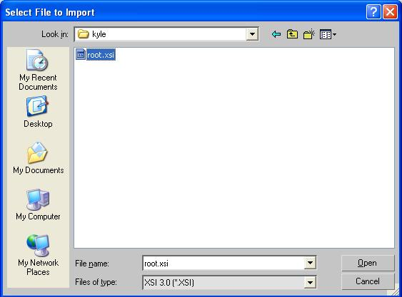

Change the "Files of Type" rollout to XSI (\*.XSI) type

Select the Root.XSI file, and click Open --

You will see this box:

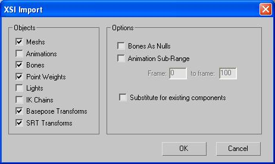

Under the XSI Import box, uncheck the "Animations" Check-box, as shown,
and leave everything else as default.

You will now see this appear in your viewport: *(image 2.13)*

[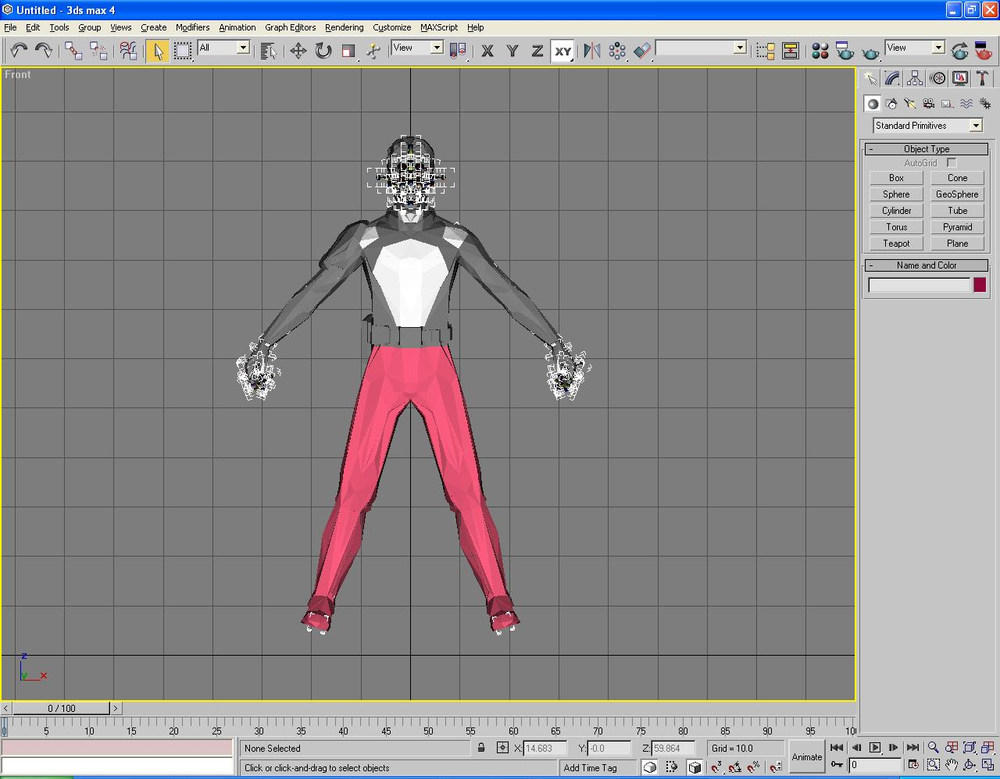](Image47.jpg)

**(image 2.13 Kyle's Root.XSI file, imported)**

This is the full Kyle Katarn model, with the 3 Level of Detail models
included in the viewport. Don't worry, I will explain about the Level of
Detail (L.O.D) models further on in this tutorial, for those who don't
know what I am talking about.

You will now have to select all parts of the model, except for the
skeleton, and delete them part by part, leaving behind only the main
bolt parts, and the skeleton.

The easiest method I find is to first do this:

First, find the object known as "Stupidtriangle\_off\_1", and select it.

(You can use the "H" key to go to the item select window to find out
exactly where it is.) *(see image 2.14)*

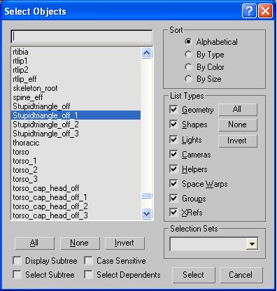

**(image 2.14 -- 3d studio Select Objects Rollout)**

Once you have found this triangle, select it, and move it either
horizontally or vertically away from the main mesh layout. *(image
2.15)*

[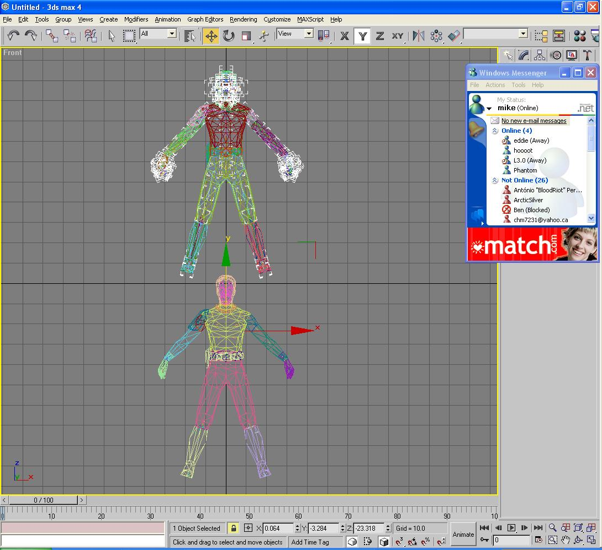](Image49.jpg)

**(image 2.15 -- 3d studio Select Objects Rollout)**

You see, it moves the whole mesh that is linked to it --
Stupidtriangle\_off bolts are essentially the top of the heirarchy chain
for the JK2 model system, meaning everything roots back into it through
linking. I will explain more about how to set this up on your model
later. For now, lets move on.

Double-click Stupidtriangle\_off\_1 -- this should select all of the
first LOD model. You do not need this mesh at all for the skeleton, so
hit Delete.

Now, repeat these steps for the second and third LOD models, via the
Stupidtriangle\_off\_2 and Stupidtriangle\_off\_3 bolts.

This will leave you with a single mesh -- this model will not have any
parts with a \_1, \_2, or \_3 extension.

**Next Step:**

You will have to begin deleting the model bit by bit -- do not delete
any of the bolts and such, nor the skeletal parts. Start with Hips, and
move on from there.

\*IMPORTANT NOTE:

**There are two items between the skeleton's feet, Mesh\_Root and
Model\_Root.**

**DO NOT DELETE THEM\!**

Those are required for the skeleton to work in-game.

Do not forget the caps at the end of the limbs and such. You will end up
with a viewport looking like this *(image 2.16)*

[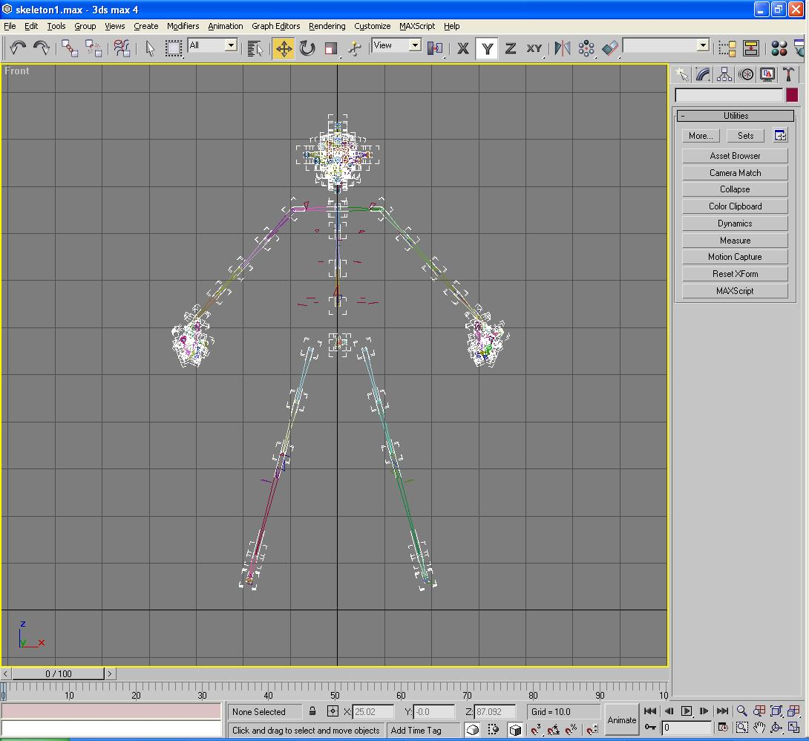](Image50.jpg)

**(image 2.16 -- Results after removing Kyle model, leaving behind
framework)**

Now, we must weight the Bolts to the skeleton.

This will be the first exposure now to the Skin modifier within 3D
Studio Max 4 -- you will have to apply a Skin modifier to each
individual Bolt (Bolts are the red triangles shown in the viewport,
separate from the skeleton.) *(image 2.17)*

[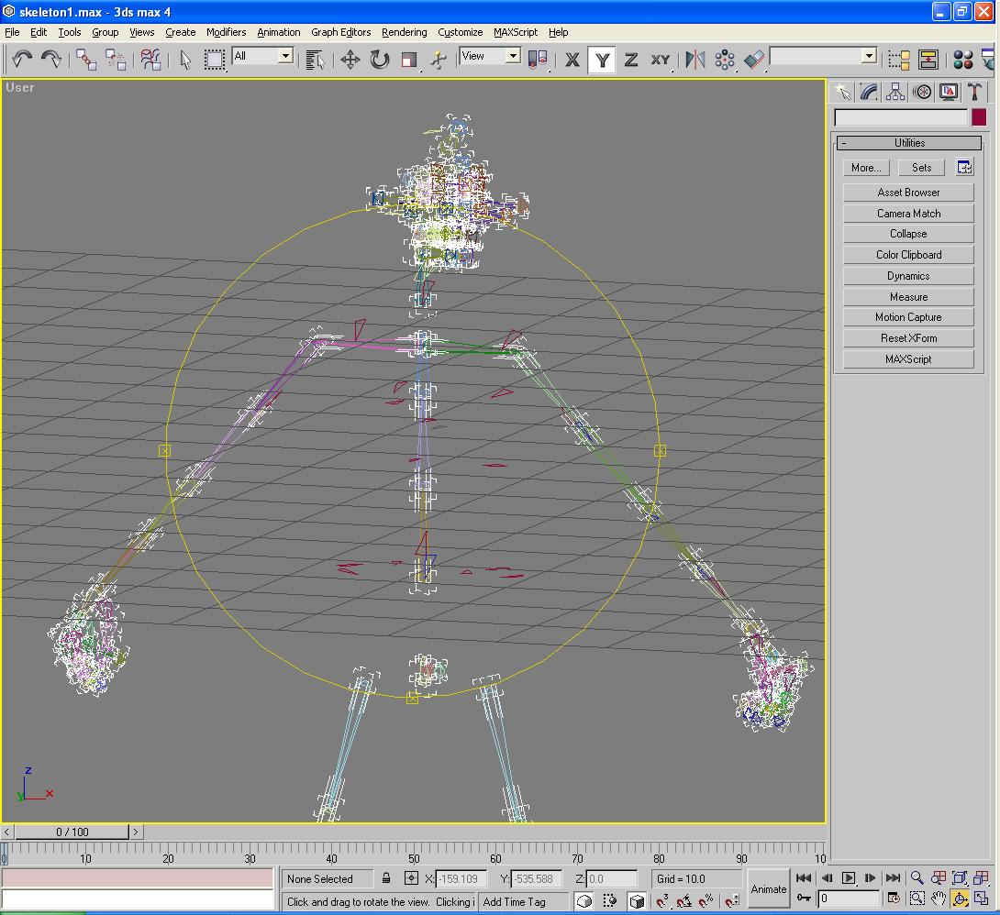](Image51.jpg)

**(image 2.17 -- Red objects: Model Bolts)**

and link it to the corresponding skeleton part.

For example, click on the **"bolt\_shldr\_r"**, near the right shoulder
of the skeleton.

You may also use the "H" select button to choose this item as well, as
it is named bolt\_shldr\_r. *(image 2.18)*

[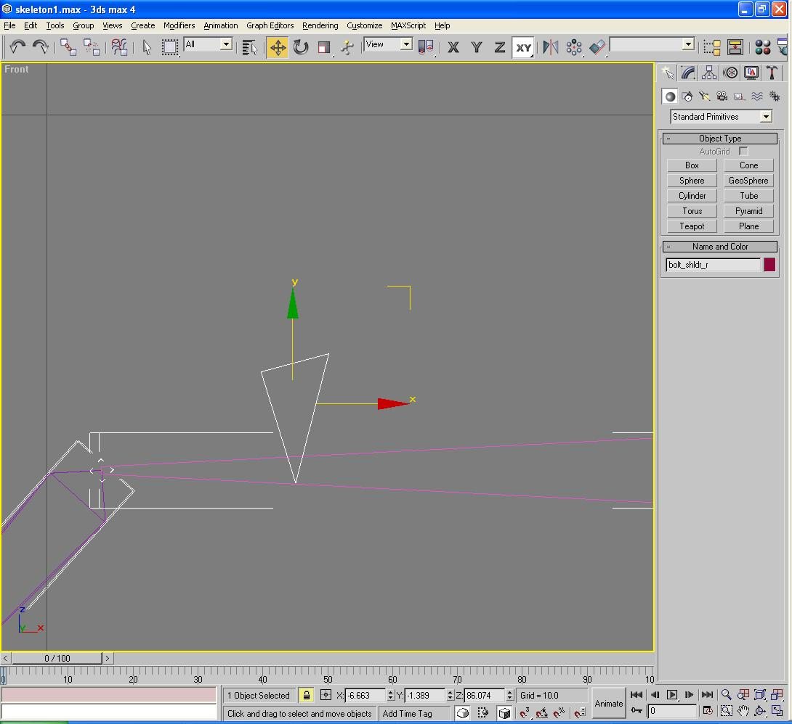](Image52.jpg)

(image 2.18 -- Bolt\_shldr\_r, Selected)

Click on the **Modify** tab. *(image 2.19)*

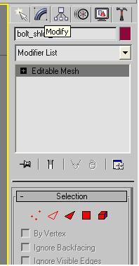

**(image 2.19 -- 3d Studio's Modify list)**

Click on the Modifier List rollout, and under the Animations Modifier,
you will find "Skin" *(image 2.20)*

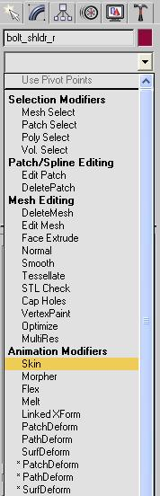

**(image 2.20 -- Skin Modifier's location)**

The Skin Modifier layout looks like this:

(image 2.22)

**(image 2.22 - Skin Modifier Panel)**

Click on the "Add Bone" button located in this panel. This will bring up
the "Select Bones" window. *(see image 2.23)*

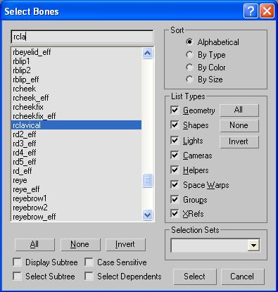

**(image 2.23 -- Select Bones Window)**

The corresponding bone for this model is "**rclavical**" (as shown in
image 2.24 -- white highlighted bone with transparent box around it) so
you want to select it in the "Select Bones" selection window, and then
click the "Select" button in the lower right hand corner of the window.

Now, the Modifier Panel should look like this: *(image 2.24)*

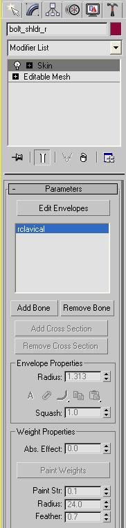

**(image 2.24 -- Skin modifier panel, with the "rclavical" bone added)**

You will now see that "rclavical" is listed in the window above "Add
Bone".

You want to now click on the "Edit Envelopes" button *(image 2.25)*

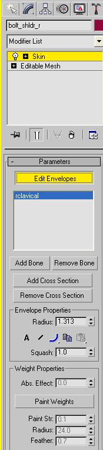

**(image 2.25 -- Skin modifier panel, Edit Envelopes activated)**

Now, click on the "Paint Weights" button, below, under "Weight
Properties" *(image 2.26)*

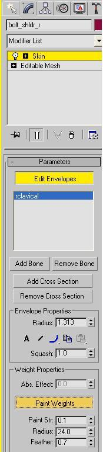

**(image 2.26 -- Paint Weights Selected)**

For now, don't worry about Paint Str, Radius, or Feather, I will try to
explain those later to what I know.

With "Paint Weights" clicked on, go back into the main viewport, and
scroll your mouse over top of
bolt\_shldr\_r, and you will see two
yellow lines at about a 45 degree angle, parallel to each other. *(see
image 2.27)*

[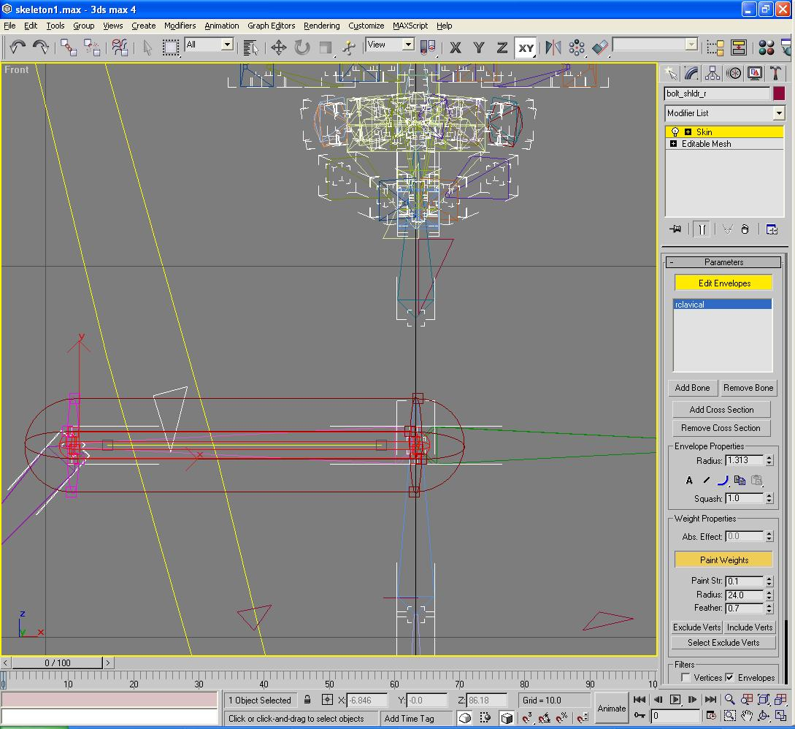](Image60.jpg)

**(image 2.27 -- Paint Weights cursor)**

Those yellow lines are the extents of the "Paint Weights" function -- it
is for assigning vertices from a model to be linked to the selected
bone. If you change that number within the Radius box underneath the
"Paint Weights" button, it will shrink or enlarge this yellow
frame/cursor.

Currently, since we only have one bone selected, weighting is simple --
just scroll your mouse over the Bolt, and left-click your mouse once.

You will see the bolt now have a red dot at the end of each corner on
the bolt/triangle -- *(see image 2.28)*

**(image 2.28 -- Skin modifier, weighted vertices on the bolt)**

This means those vertices are now weighted to the "rclavical" bone.

To now de-select "Bolt\_shldr\_r" since we are finished with it, click
on the Yellow- Lit Up "Edit Envelopes" button, and click on another mesh
piece.

Congratulations, you have weighted one bolt\! Now just 40 or so others
and we're done.

You will have to follow these steps for each bolt on the model. I will
not repeat everything I have just said here; instead, I will indicate
which parts should be weighted to which bone in the following list,
starting from the legs up.

**BOLT     BONE**

Bolt\_r\_leg\_foot → rtalus

Bolt\_l\_leg\_foot → ltalus

Bolt\_r\_leg\_calf → rtibia

Bolt\_r\_leg\_cap\_hips → rtibia

Bolt\_hips\_cap\_r\_leg → rtibia

Bolt\_hips\_r\_knee → rtibia

Bolt\_l\_leg\_calf → ltibia

Bolt\_l\_leg\_cap\_hips → ltibia

Bolt\_hips\_cap\_l\_leg → ltibia

Bolt\_hips\_l\_knee → ltibia

Bolt\_hips\_r → pelvis

Bolt\_hips\_l → pelvis

Bolt\_hips\_br → pelvis

Bolt\_hips\_bl → pelvis

Bolt\_hips\_fr → pelvis

Bolt\_hips\_fl → pelvis

Bolt\_lchest\_r → upper\_lumbar

Bolt\_lchest\_l → upper\_lumbar

Bolt\_uchest\_r → upper\_lumbar

Bolt\_uchest\_l → upper\_lumbar

Bolt\_back → upper\_lumbar

Bolt\_chestg → upper\_lumbar

Stupidtriangle\_off → upper\_lumbar

Bolt\_shldr\_r → rclavical

Bolt\_torso\_cap\_r\_arm → rhumerus

Bolt\_r\_arm\_cap\_torso → rhumerus

Bolt\_r\_arm\_elbow → rradius

Bolt\_r\_arm\_cap\_r\_hand → rradiusx

Bolt\_r\_hand\_cap\_r\_arm → rradiusx

**\*Bolt\_r\_hand → rhang\_tag\_bone**

**\*NOTE : IMPORTANT**

**This bone MUST be bound to the "rhang\_tag\_bone" bone or else the saber
will not animate properly ingame. You may have noticed this on early
versions of Darth Vader, or Jango Fett.**

Bolt\_shldr\_l → lclavical

Bolt\_torso\_cap\_l\_arm → lhumerus

Bolt\_l\_arm\_cap\_torso → lhumerus

Bolt\_l\_arm\_elbow → lradius

Bolt\_l\_arm\_cap\_l\_hand → lradiusx

Bolt\_l\_hand\_cap\_l\_arm → lradiusx

Bolt\_l\_hand → lhand

Bolt\_torso\_cap\_head → cervical

Bolt\_head\_cap\_torso → cervical

Bolt\_head\_left → cranium

Bolt\_head\_right → cranium

Bolt\_head\_front → cranium

Bolt\_head\_back → cranium

Bolt\_head\_top → cranium

Bolt\_head\_eyes → cranium

And those are the general weightings that should be done for each bolt
part.

In order to check what is now weighted, find the bone called "pelvis",
and double-click it.

Attempt to move it sideways on the screen. If there is (are) a(any)
bolt(s) not moving, identify which one it was, undo any movements you
had made to the skeleton, and weigh the necessary parts.

Again, to test if anything was left un-weighed, click on the pelvis
bone, and try moving it. This also works when weighting your full,
finished model.

Be sure to save your skeleton when you are finished with this, as you
will need it once you are ready to import your model in-game.

* Back: [Model Setup](../3_TheModel/)
* [Return to this Tutorial's Table of Contents](../)
* Next: [Setting Up a Skeleton](../5_SkeletalSetup/)

