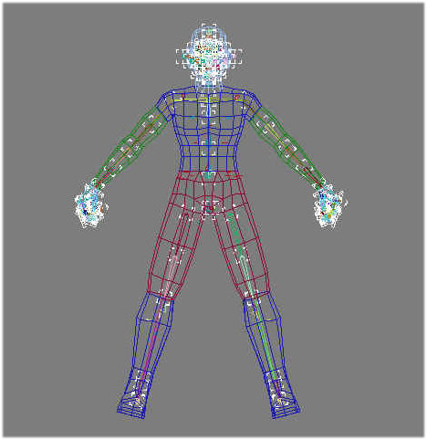
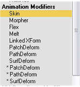
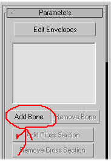
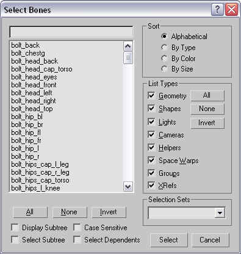
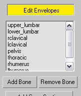
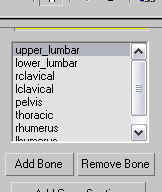
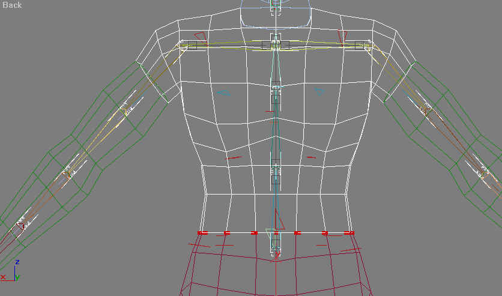
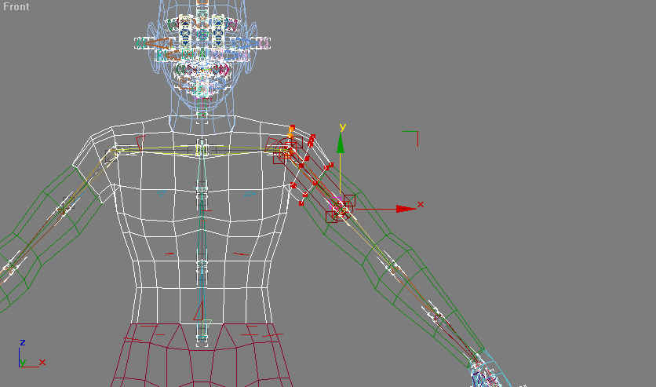

Author: Michael Frost

## Setting Up the Skeleton

Now to get the model in the game. What you will want to do is save your
model as a separate MAX file (e.g., MrBoxFinal.MAX) and then simply open
up our existing skeleton and bolts file from before (included with this
tutorial), which was weighted out already. After opening the skeleton,
go to Max's Merge function:

(File \> Merge), select your model's MAX file from its location, and you
will merge your model with the scene, as demonstrated below.

You should now have your character model overlapping the skeleton; that
is what we want. If, for whatever reason, your character model has
shifted, or is not lined up with the skeleton, line it up with the
skeleton by moving your model

**DO NOT MODIFY THE SKELETON. JEDI KNIGHT DOES NOT LIKE THIS...** just
some advice there... others have attempted this, but it simply results
in problems.

What you should do first is link the bolts to their appropriate
bodyparts of the model, or simply hit the "H" key, select all files
named "bolt", and link those parts straight to the model piece, hips.

**Next step? Skinning with the skin modifier\!**

Select a mesh body part of the character to start with by clicking on it
in Max, then go to the Modify Panel and choose Skin modifier.

Next, choose Add Bones under the Skin Modifier rollout panel. You will
get this screen:

Through here, you would select the appropriate bones for the bodypart --
I have named them below and explained what to blend the weights into.

OK\! Those are the basics to get you started on adding bones to a model.
Now, you have to modify the weights of the verts\!

**Modifying Bone Weighting within Max**

After having added bones, go to "Edit \> Envelopes" as seen below:

Select the bone that you would like to add weighting for:

Scroll down the Skin modifier rollout to Paint Weights:

Change its radius to a smaller number to allow more precise weighting
(it defaults to 24.0). I try to use between 1 and 5 units to be more
accurate.

Paint the weights onto your model for each bone by left clicking on
areas with vertices on the model piece. To undo any painted verts, hold
alt and left click on the verts that show up colored, and they should be
removed. Wash, rinse, then repeat for the rest of the model\!

For dismemberment, I highly recommend using simple weightings at the
points of dismemberment. For example, at the neck, make all points
around the spot that will separate the head from the neck weighted to
the cervical bone. Or, for the arm, if you are dividing near the
shoulder, make both sides of the vertices all linked to the Rhumerus or
Lhumerus bone so that you won't see them breaking apart in-game.

The colors for weighting use a colder/hotter indicator; vertices that
are blue, cold, have less influence; vertices with a red color, hot,
have full control.

Examples:

 
 

The weighting setup follows the layout of the skeleton; any model
vertices located around the bones should be assigned to those bones.
While weighting, you can easily check the weightings and how the mesh
will deform to the skeleton by selecting the bone and rotating it with
the Max's rotate tool.

Next I have a breakdown of what model parts should be linked to what
parts of the skeleton\!

* Back: [Getting a Skeleton\!](../4_SkeletalExtract/)
* [Return to this Tutorial's Table of Contents](../)
* Next: [Skeletal Reference for Linking](../6_SkeletalReference/)

