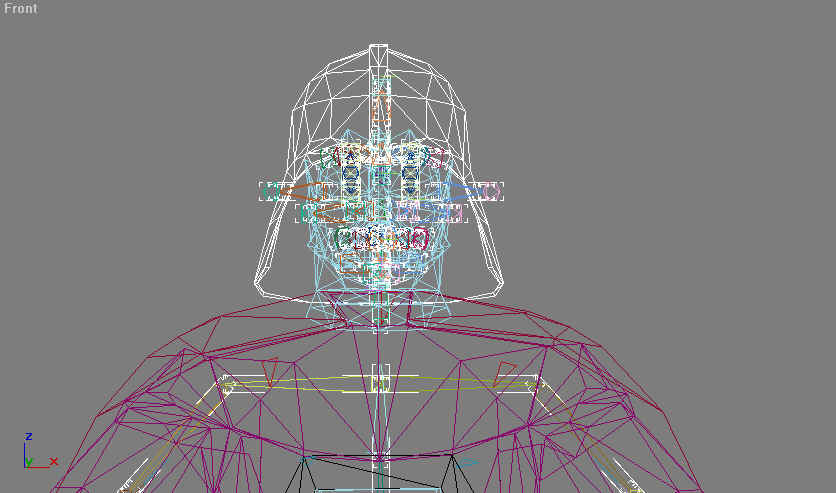
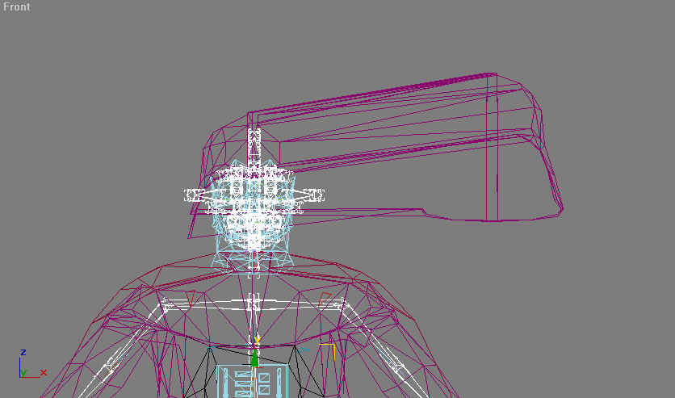
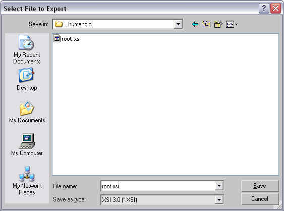
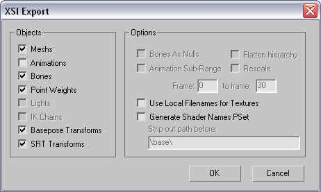

Author: Michael Frost

## Testing and Exporting Your Model as XSI

**Testing**

In the end, to see if you have linked everything to the skeleton, simply
double-click the bone Pelvis and attempt to move it left or right, then
undo any movements afterwards. If anything is unlinked, you will see it
stay in place while the rest of the model pieces move. It will look all
pointy and weird in parts that don't move\! Make note of which parts
didn't move and go and assign those vertices accordingly.

Example: I am not sure about the helmet on this model, so I test it.  

I select the Pelvis bone, and move it, and this is the result:

So here, the parts not moving with the body were unassigned. I undo the
Pelvis movement, go into the helmet's skin modifier, and check the
weightings of the helmet.

Once the model is completely weighted and linked, you now have to export
the model to XSI. Next step\!

**Exporting from 3d studio Max to XSI File\!**

In order to export, you must have the tool (XSIImporter.DLI) from the
downloaded SDK (Max4Tools dir) installed in your 3dsmax4 directory (
place it into the Plugins directory).

Now, in Max, Go to "File" \> "Export" and select to export it as a
filetype XSI, name it root.xsi, and export it to
c:\\base\\models\\players\\\_humanoid\\.

Make sure you have it setup as the file shows here:

Hit OK and it should export without any problems.

* Back: [Skeletal Reference for Linking](../6_SkeletalReference/)
* [Return to this Tutorial's Table of Contents](../)
* Next: [Converting your Model to GLM from XSI](../8_Assimilate/)
