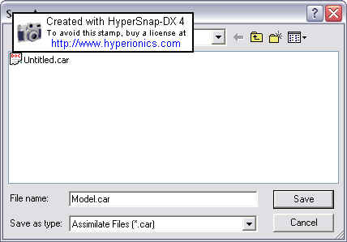
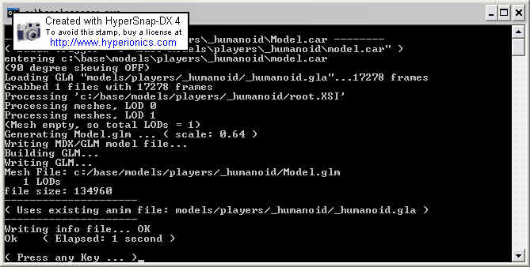

Author: Michael Frost

## Converting your Model to GLM from XSI

Get started by running Assimilate (the file with the Borg icon).

Go to "File" \> "Add Files", then select the file \_humanoid.gla (see
previous tutorials for where you extracted everything, if you are not
sure what I am talking about.. this file was located within the
assets0.pk3 file, in the models/players/\_humanoid/ directory -- it
should now be within the directory
c:\\base\\models\\players\\\_humanoid\\ ).

After adding that file, go to "Edit" \> "Preferences". Make sure all
fields are empty except compiler, which should now read
c:\\base\\carcass.exe, or wherever you have carcass located\!

Now, from the Assimilate menu, hit the B icon.

It will ask you to name the reference file -- name it Model.car, and
continue.

You will see this:

Hit any key at the end.

If all went well, you should have a GLM file now named model.glm within
the \_humanoid directory.

**Errors You May Encounter with Assimilate**

*Too many bones assigned to one vertice -- Vert XXX of part Model\_part
has X assignments, max is 4\!*  
Just as it says, you have one vert linked to too many bones. Fix? check
the assignments of that part in Max in skin modifier. They support a max
of 4 bone weights per vert.

*Unable to find model parts xxx xxx xxx -- Program could only find 46 of
80 parts, etc*  
This means you have not linked the files properly. Fix? Go into Max,
double-click the main root of the model (model\_root or perhaps just
Hips part on your model). This should select all linked pieces. If
anything does not get selected, aside from the skeleton, you need to
link it back in Max.

*Vertice 111 of part Model\_Hips is unassigned*  
Specific vertices of a certain part were not assigned to a bone. Fix? In
Max, assign the specific vert to a bone.

Most reasons are self-explanatory.

If anyone can think of any further errors please contact me and I will
update it\!

* Back: [Testing and Exporting Your Model as XSI](../7_ExportingFromMax/)
* [Return to this Tutorial's Table of Contents](../)
* Next: [Using Modview to Test the GLM](../9_Modview/)
