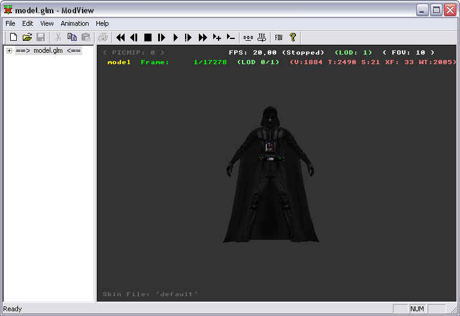
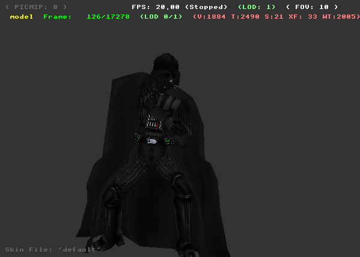

Author: Michael Frost

## Using Modview to Test the GLM

Now that you have a GLM file, take it and move it to the directory
c:\\base\\models\\players\\modelname\\, along with the model's textures
and skin file. Double click the GLM file, it should open Modview.

Within Modview, if you get shader errors, ignore them -- if you get
texture errors, ie. Unable to display xxx, it may be because of errors
in naming, errors with the jpg/tga itself, or various other points. Just
check your steps and the skin file, as well as making sure the files are
properly sized for the textures (ie. Multiples of 2 work well -- it
likes 256x256, 512x and 1024x best it seems... 384x384 would not work
for some reason...). JPG files should be saved in Baseline Standard from
Adobe Photoshop, whatever quality file, around 10-12 works well...

Now, if all went well, your model should appear within modview, in the
base pose

Hit play

It should begin animating\!

With this you should be able to tell whether the model is setup right or
not, by seeing how the vertices deform. If something is attached at the
wrong bone point you will notice it quickly. To fix this, go back into
Max, adjust the corresponding parts via the Skin modifier, save, export,
and assimilate again\!

If you happen to see parts out of place, upside-down or reversed, it is
because the parts, orientation has become skewed -- or screwed, same
difference.. heh. Take note of what part.

For example, if all parts attached to the torso are screwy yet the torso
is not, it may be because of the torso itself. Within Max, try resetting
the pivot point of the torso. That may fix it.

This is one example. Otherwise, one method I find useful, albeit
time-consuming and tedious, is if you have a messed up model piece
within Modview, go back into Max...

  - Find a model part that is working, and not right beside the affected
    piece
  - Apply an edit mesh modifier to that working piece
  - Attach the messed up piece to the working one
  - Select the polygons of the messed piece in sub-object, polygon mode
  - Detach the Polygons of the messed up piece
  - Re-link it to its parent part (r\_hand to r\_arm, etc)
  - Re-apply Skin modifier to the messed up piece, apply the weightings
    you did before in previous steps
  - Save, export, and assimilate
  - Run it in modview and see if the piece is messed up still

These steps may fix the error. If not, try looking at the different
parts it was attached to and your vertice weightings, making sure you
didn't link the right hand to the left bones or stuff like that, I had a
lot of stupid mistakes like that when I was learning.

## Quick Guide to Modview

Hold right mouse button -- Zoom

Hold Alt key, hold left mouse button on model, drag mouse -- Move model
around on screen

Hold Left mouse button -- Rotate around model

The keys on the top of Modview are pretty self-explanatory. This program
is a way to see if your model will work in-game. If your model shows up
in Modview, 99% are the chances your model will work in-game.

* Back: [Converting your Model to GLM from XSI](../8_Assimilate/)
* [Return to this Tutorial's Table of Contents](../)
* Next: [Creating .SKIN Files for Textures](../10_SKINfiles/)
