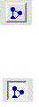
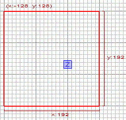
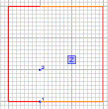
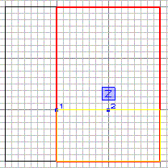
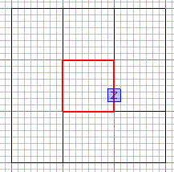
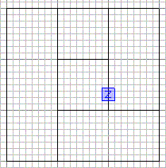
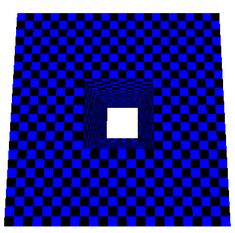

Author:
Clipping in Radiant  

-----

Author: [gammasts](mailto:gammasts@adelphia.net)  
  

So... you want to use the clip tool in Radiant. Just follow these steps
and you can learn how to make your brushes perfectly clipped.

These 2 buttons right here are your clipping tools. Just press it (or
hit the X key) to activate Clipping Mode.

Let's get started clipping. In this tutorial, I will show you how to cut
a simple square hole out of a square box.

First, create a brush that is 192x192x192. Look at the picture below for
an idea.

To make our first cut, hit the clip button. Next we choose our two
points to clip at. This is very similar to JK's version of clipping
(known as cleaving), except there is no dragging involved.

Next, press Shift + Enter to finish your clip.

Now, deselect all of the brushes.

Select the bigger section and we will make our second clip.

Repeat these steps until you get all four cuts done. Next, select the
inner brush.

Press the Backspace key to delete it.

Volia\! You have just completed your first clip.

You can use clipping to make doorways, holes, and other things that need
to be cut out. One thing you should not try with clipping is making
curves. Just use the cylinder for that.

