Author: Craig "UGG" Urquhart

Example: [door\_tutorial.zip](door_tutorial.zip)

## Sliding Door

1. Create the door entity using one of these methods:
    * In the popup entity menu, select func\_door from the func group to
      create a default door.
    * Select a brush and convert it to a door by selecting func\_door.
2. Press "N" to popup the door's properties.
3. Add an angle key, or just press one of the direction buttons. The door will not move unless it has a valid opening angle.
4. Add a soundset key to hear sounds when the door moves. The names of Jedi Outcast's door soundsets are listed below.

|                          |                                 |
| ------------------------ | ------------------------------- |
| 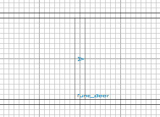 | 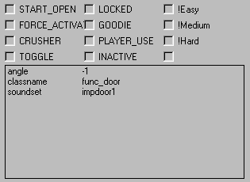 |
| Top View                 | Door Properties                 |

## Double Sliding Doors

1. Make two sliding doors and change the opening angle of one so that it moves in the opposite direction.
2. Add a team key to both doors. The name must be the same for each door if they are to move together.

|                          |                                       |                                       |
| ------------------------ | ------------------------------------- | ------------------------------------- |
| 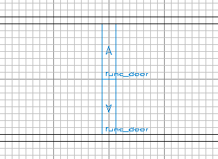 |  | 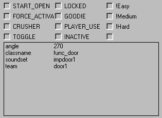 |
| Top View                 | Upper Door Properties                 | Lower Door Properties                 |

## Rotating Door

This is only possible in Return To Castle Wolfenstein, and in mods that
have added a func\_rotating\_door entity to the game code, like Urban
Terror. Also, it's unlikely that a rotating door can be made using
func\_pendulum or func\_rotating because those entities can not be
triggered.

## Trigger Activation*

1. Create the trigger entity using one of these methods:
  - In the popup entity menu, select trigger\_multiple from the trigger group to create a default trigger.
  - Select a brush and convert it to a trigger by selecting trigger\_multiple.
2. Resize the trigger to fit inside the walls. Make sure it's large enough for the player or npc to walk through.
3. Create an activation link from the trigger to the door by using one of these methods:
  - Select the trigger and the door, in that order. Press CTRL+K to create a default link.
  - Add a target key to the trigger, and a targetname key with the same name to the door.
4. Add a wait key to the trigger and make it slightly longer than the door's wait time. This stops the trigger activating while the door is open.

|                           |                                  |                                     |
| ------------------------- | -------------------------------- | ----------------------------------- |
| 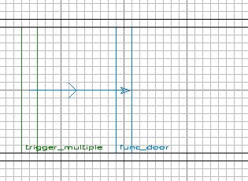 | 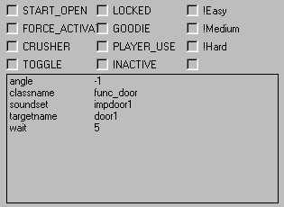 | 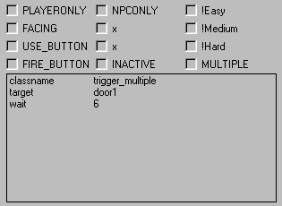 |
| Top View                  | Door Properties                  | Trigger Properties                  |

## Push Button Activation

1. Create a button entity using one of these methods:
  - In the popup entity menu, select func\_button from the func group to create a default button.
  - Select a brush and convert it to a button by selecting func\_button.
2. Position the button so that is does not go all the way through the wall when activated. Increase its lip property to prevent this.
3. Set the button's moving angle so that it moves into the wall when activated.
4. Create an activation link from the button to the door, like in the example above.

|                        |                               |                                 |
| ---------------------- | ----------------------------- | ------------------------------- |
| 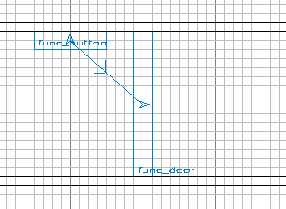 | 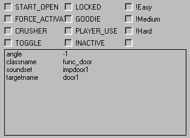 | 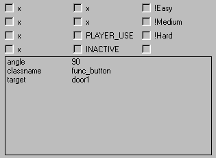 |
| Top View               | Door Properties               | Button Properties               |

## Switch Panel Activation

1. Create a trigger entity that the player can stand in while touching the switch.
2. Create an activation link between the trigger and the door, like in the example above.
3. Check the trigger's PLAYERONLY, FACING, and USE\_BUTTON spawn flags. Also, make the trigger's angle point towards the switch.
4. Create two panels for the switch using one of these methods:
  - In the popup entity menu, select func\_usable from the func group to
    create a default panel.
  - Select a brush and convert it to a panel by selecting func\_usable.
5. Add a targetname key to each panel, using the same name as the trigger's target key.
6. Check the STARTOFF spawn flag for one panel so that it remains hidden until the other panel is activated. This will be the "on" panel.
7. Position both panels over each other so that they can change while appearing to be a single switch.
8. Add a brush behind the switch to ensure that the level won't leak if both panels are hidden.
9. This switch, like most in Jedi Outcast, does not change back after the door closes. That type is better handled by a script.

|                         |                                 |                               |
| ----------------------- | ------------------------------- | ----------------------------- |
| 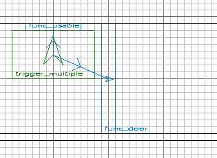 | 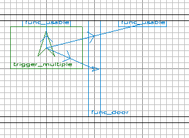 |  |
| Top View                | Panels Separated                | Door Properties               |

|                                   |                                     |                                    |
| --------------------------------- | ----------------------------------- | ---------------------------------- |
| 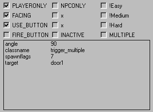 | 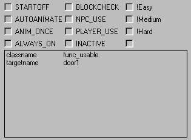 | 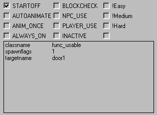 |
| Trigger Properties                | "Off" Panel Properties              | "On" Panel Properties              |

## Security Panel Activation

1. Check the door's LOCKED spawn flag. The door will only open once if it isn't locked first.
2. In the entity menu, select misc\_security\_panel from the misc group to create the panel.
3. Also, select item\_security\_key from the items group to create the key. It has to be a security key because a supply key does not work.
4. Create an activation link from the panel to the door, like in the example above.
5. Set the panel's front facing direction so that its back is aligned with the wall.
6. Add a message key to the panel and security key. The names must be the same for the key to work.

|                            |                                   |                                             |
| -------------------------- | --------------------------------- | ------------------------------------------- |
| 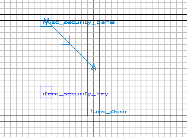 | 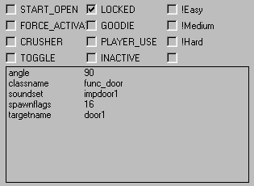 | 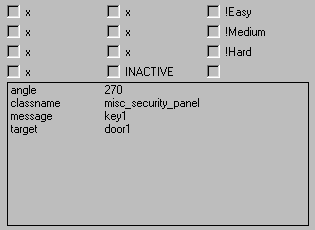 |
| Top View                   | Door Properties                   | Security Panel Properties                   |

|                                           |
| ----------------------------------------- |
| 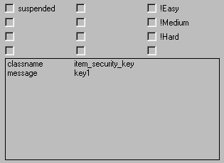 |
| Security Key Properties                   |

## Door Properties

|  Spawn Flag     | Description                                                             |
| --------------- | ----------------------------------------------------------------------- |
| START\_OPEN     | Moves to its destination when spawned, and operates in reverse.         |
| FORCE\_ACTIVATE | Can only be activated by a force push or pull.                          |
| CRUSHER         | Does not reopen if blocked.                                             |
| TOGGLE          | Waits in both the start and end states for a trigger event.             |
| LOCKED          | Starts locked, with the shader animmap at the first frame and inactive. |
| GOODIE          | Only opens if activator has a "goodie" supply key in his inventory.     |
| PLAYER\_USE     | Player can use it with the use button.                                  |
| INACTIVE        | Must be used by a target\_activate before it can be used.               |

&nbsp;

| Key         | Description                                                                          |
| ----------- | ------------------------------------------------------------------------------------ |
| target      | Fires when door starts moving from its closed position to its open position.         |
| opentarget  | Fires after door reaches its open position.                                          |
| target2     | Fires when door starts moving from its open position to its closed position.         |
| closetarget | Fires after door reaches its closed position.                                        |
| model2      | MD3 model to also draw.                                                              |
| angle       | Determines the opening direction.                                                    |
| targetname  | Name of the remote button or trigger field which activates the door.                 |
| speed       | Movement speed (default is 100).                                                     |
| wait        | Seconds to wait before returning (default is 3, never return is -1).                 |
| delay       | Seconds to wait before moving (default is 0).                                        |
| lip         | Lip remaining at end of move (default is 8).                                         |
| dmg         | Damage to inflict when blocked (default is 2, set to negative for no damage).        |
| color       | Color of light emitted by door.                                                      |
| light       | Radius of light emitted by door.                                                     |
| health      | Amount of damage to door before it will open.                                        |
| soundset    | Sound set to play when door moves.                                                   |
| linear      | Set to 1 for the door to move linearly rather than with acceleration (default is 0). |

## Door Sound Sets

|               |               |              |               |               |               |
| ------------- | ------------- | ------------ | ------------- | ------------- | ------------- |
| impdoor1      | impdoor2      | droid\_door  | door1         | door2         | door3         |
| door4         | door5         | door6        | door7         | door8         | door\_large1  |
| door\_large2  | door\_large3  | door\_large4 | door\_medium1 | door\_medium2 | door\_medium3 |
| door\_medium4 | door\_medium5 | door\_small1 | door\_small2  | door\_small3  | door\_small4  |
| door\_small5  | door\_small6  | stone\_door  | huge\_door    | large\_door   |               |

## Troubleshooting

1. Door does not move.Set an opening angle in the door's properties. There should be an arrow in the center of the door.
2. No sounds play when the door moves.Add a soundset to the door's properties.
3. Only one of the double doors opens.Check that both doors have the same name for their team key.
4. Trigger does not work.Check its size. Make sure the player or npc can touch it.
5. Push button slides along wall.It's using the default moving angle because none was given in its properties.
6. Switch panel does not work.Check that the trigger has an arrow facing the switch. Also check the spawnflags and targetnames.
7. Switch panel flickers when activated.The trigger needs a wait time greater than it's default of 0.
8. Key does not unlock door.Check that it's a security key with the same message name as the panel.
9. Door will not open again after using the security panel.The door must be locked first. The purpose of the security panel is to unlock it, not open it.

## Other Door Tutorials

[FNF's Door Tutorial](http://fnf.20m.com/q3rtut4.html)

Copyright &copy; 2002 Craig Urquhart.
