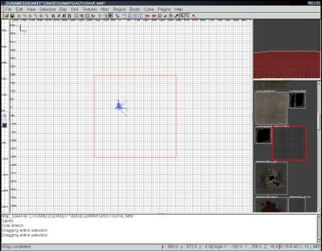
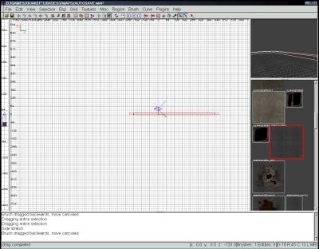
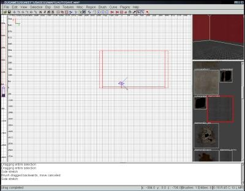
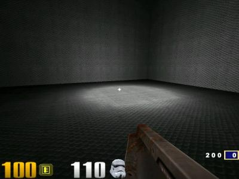

Author:
Creating Your First Room with GTKRadiant  

-----

Author: [JM](mailto:deyjaL@aol.com)  
  

Every good editing site needs it. Yes, the infamous first room tutorial.
I'm going to be quick and to the point.

  - **Tools needed:**  
    GTKRadiant 1.1.1 or above
    Q3 (or RtCW or JO or EF or whatever)

Time for the nitty gritty. I'm going to assume that GTKRadiant is
already set up. If it's not, you must not have installed it; it does
just about everything for you. I understand that many of you might have
a history editing Jedi Knight, and are used to JED - well, this is as
different as you can get, people.

First, go to the 'texture' menu at the top and load up any texture set
you want. The textures will show up in the texture picker box (If you
haven't got one, go into Radiant's preferences and set it to the
standard single view with extra windows tiled around it option.) Click
on one of the textures to pick it.

Now, in the big 2D window click the left mouse button and hold it down
as you drag it. Congratulations, you just made a brush. There are some
major differences between this and a similar operation in JED (If you've
never used JED, just ignore me.) First off, you just created a positive
space; a 3do type object; not a sector. Sectors don't exist here. The
player will walk ON this object, not IN it.

  
*My brush*

Everything in the map must be enclosed; nothing can be exposed to the
'void'. In JED this wasn't an issue, because there was no void. To make
this a room, we'll need walls and a ceiling. Press 'esc' to deselect
your floor brush. Now, drag out a thin brush on each side of the floor
brush. Hold shift while clicking a brush to select, and go ahead and
select all four walls (Just hold shift and click on each of them) Now,
press Ctrl+tab to switch to the first side view. Position the cursor
above the highlighted brushes and drag upward to make the walls.

  
*My walls*  
  
  
*My walls after I made them bigger*

Only the ceiling left. Press ctrl+alt twice to get back to the top view,
drag out your ceiling brush, switch to the side view, and adjust it
appropriately. Almost a workable map\! In the top view, right click and
select 'info/player\_deathmatch' from the list. Check all the views to
make sure it's completely inside the room. You might have to adjust your
room if you didn't make it big enough. A bit away from there, right
click and select 'light'. Make sure thats inside too.

Now save it. That's always very important.

Compiling couldn't be simpler. Just go to the bsp menu and select 'bsp
-vis -vlight'. Watch how fast that compiles. Don't get used to that, big
maps can take days to compile. Start up whatever game you just compiled
it for, and hit tilde to enter the console. Type '/devmap yourmapname'
to play. If it says it can't find it, try entering '/sv\_pure 0', then
try it again. Remember; if your map file was 'myfirstmap.map', the bsp
file is 'myfirstmap.bsp', and you should use '/devmap myfirstmap'. No
.bsp\!

  
*Not pretty, but it gets the job done*

Cheers,  
JM
