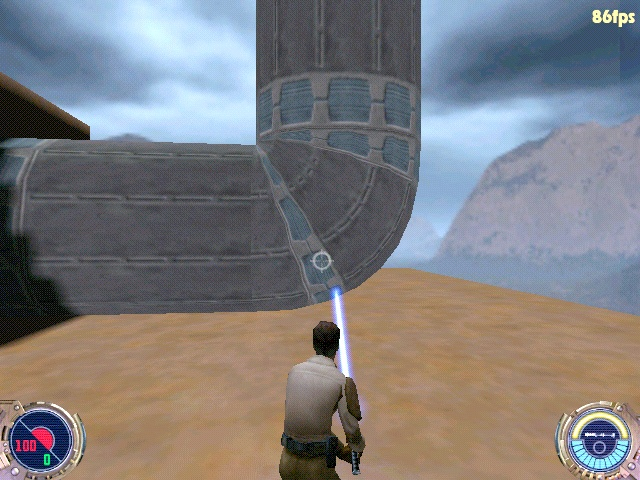

Author: How
to Create Curved Pipes  

-----

Author: [Stormtrooper](mailto:jeditrooper87@hotmail.com)  
  

I decided to make his tutorial because of all the recent questions about
making curving pipes in the Jedi Outcast Editing Forum. I'm using
GTKRadiant but I think that JK2Radiant will work also.

This tutorial is directed toward the editors with a moderate knowledge
of Radiant and not to the beginner.

Now, onto the tutorial.

Making a pipe curve is suprisingly easy. First, make a cubed brush.

Now, with that brush selected, go to the curve option in the selection
bar at the top and choose "cylinder," This will turn the selected brush
into a tube.

Now, we want to move the vertices around. To do this, select the center
vertex in the far right row and move it up to where the top vertex is in
that column.

Now, do the same to the bottom vertex in that row.

Now, the tricky part, we have to move the center vertex in the bottom
row up and to the right so that it is straight with the center vertex
and with the top-right vertex.

Now, move the last vertex in the bottom row all the way to the right so
that it's straight with the ones above it.

Now the pipe looks a little strange. To fix that we move the far-left
vertex in the center row down so that it's straight with the one to it's
right and with the one above it, so it should now look like this.

Now you can texture it if you haven't already done so.

Now that you have it textured, build a large box around the pipe and
hollow it out and put some textures on the wall if you want to.

Now, put in an Info\_Player\_Start, save as something like "pipetest',
and them compile.

Load Jedi Outcast, press SHIFT+\~ to bring down the command menu, then
type "map pipetest" and look at your finished product.

When you have finished this, experiment, test, try new and different
things with making pipes, you never know what you might make. :) Good
Luck\!
