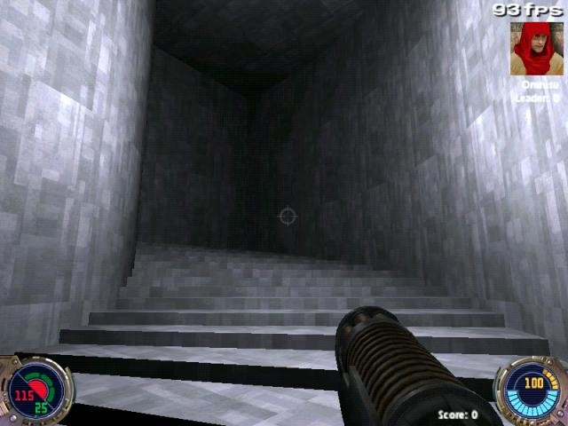

Author: JM

**Note:** *the following is edited from a transcript of a tutorial
session conducted on the \#coffestain channel via IRC.*

**JM**: We are going to make a spiral staircase.

**JM**: GTKRadiant open? YES?

**JM**: Everyone ready? You'll be amazed how quick and simple this is...

**JM**: Okay. Radiant open. Pick a texture.

**JM**: Make a square brush 512 units on a side and 8 units tall.

**JM**: Now clip it from the top left corner across diagonally to an
opposite side, pressing shift+enter so you keep both halfs.

**JM**: Do that until you have about sixteen nearly even sections.

**JM**: Everyone got that done? Select all the brushes.

**JM**: Then deselect the one all the way on the left (Just shift click
it again)

**JM**: Move the rest up 8 units, deselect the next one, move the rest
up 8 units, repeat until done. I'll wait (I have to do it too)

**JM**: Okay. You will need to create a roof. Make it the same size as
your original brush, but far enough above the stairs so the player can
walk under it.

**JM**: Then seal off the right and bottom sides of the stairway with
caulk.

**JM**: You will need to seal off the top and left, but only halfway.
Seal off the half of those sides closer to the 'point' where all the
steps meet.

**JM**: Now for the part that makes it not look like crap. Create a
brush exactly one fourth the size of the original brush. Then make it as
tall as the stairway, and position it so it fits exactly between the
bottom step the ceiling and lines up with your two smaller caulk
brushes.

**JM**: Goto the curves menu, and select 'bevel'. If you've built the
map in the same orientation as I said, it will be perfect already.

**JM**: Now we just need the OTHER wall\! Clone our bevel, position it
back over the first one, and stretch it out so it fills the entire
space, lining up with the other two walls.

**JM**: But theres a problem\! All you see is a wireframe, the surface
is on the otherside. Goto curves/matrix/invert.

**JM**: Seal off the ends, add a light and playerstart, compile and
enjoy.

**JM**: This is the 'cheap and dirty' way of making a staircase. You can
do better ones with lots of vertex editing.

**JM**: Or patches for the steps, which I might manage to figure out
before next time.

**Evil\_Giraffe**: if we used a patch mesh, we'd could probably get a
nice sloping roof as well

**Evil\_Giraffe**: or on the floor to have a sloping ramp

**JM**: Yes, you could put a patch up there quite easily.

**JM**: And there.

