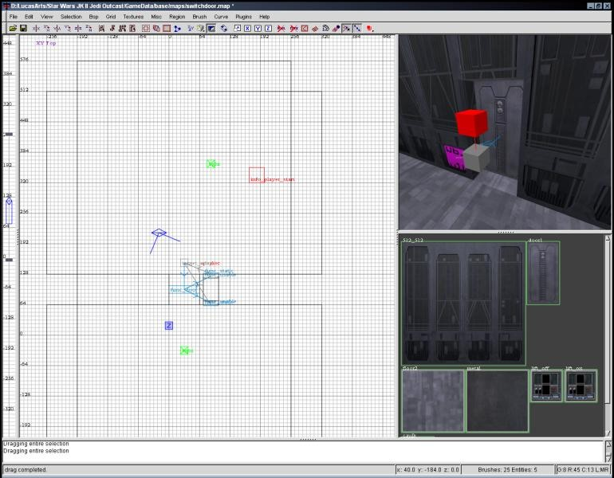

Author: JM

This tutorial will teach you about entity scripting, how to make those
nice animated switches, and, of course, how to build a door powered by a
switch\!

**Tools needed:** GTKRadiant

1.  Build the doorway (and the door). This is fairly straightforward.
    Just build the wall, with a hole in it, where the door is.
2.  Right click your door, and make it a func\_door. Press N, and click
    the 'up' button. Then give it a key 'target' with a value of
    'door01\_switch'. Give it a 'closetarget' with the same value as
    'target'. Finally, give it a 'soundset' key with a value of
    'impdoor1'.
3.  Create a brush to be the basic button. This is done in exactly the
    same manner as in my previous elevator tutorial. Stick it in the
    wall, or embed it, whatever you like. Right-click it and make it a
    func\_usable. Press N and give it a key 'targetname' with the value
    'door01\_switch'. Texture it with a switch\_off texture such as
    kejim/lift\_off.
4.  Clone it, and texture it with a switch\_on texture such as
    kejim/lift\_on. Position it exactly where the original switch is.
    Then press N, and click the 'start off' spawn flag.
5.  Using the caulk texture, create a brush the same size as the switch
    and position it immediatly in front of the switch. Set your grid
    size to 2, and make the brush as thin as possible. It should be
    right up against the switch, in front of it. This is the actual
    switch, not just for show like the others. Right-click this super
    thing brush and make it a func\_static.
6.  Create a target\_speaker near your door and switches. Press N, and
    click the 'sound' button. If you have unpacked the contents of
    assets0.pk3, you can browse for a sound file. Otherwise, you have to
    do it the hard way. Add a key 'noise' with a value of
    'sound/movers/switches/switch1.mp3'. This is the basic activation
    noise.
7.  Select the caulk thing, then select your target\_speaker. Make sure
    you select them in that order\! Press Ctrl+K to link them.
8.  Select the caulky thingermajig again and the door, in that order,
    and link them.
9.  Select just the caulk brush, press N, and give it the spawn flags
    'f\_push', 'f\_pull', and 'player\_use'.

All done\! The player can activate this switch many ways. They can walk
up to it and press 'use', or they can force push or pull it from a
distance. When the player activates the switch, it fires the speaker and
the door. When the door first starts to open, it fires the switches. It
fires them again when it closes. The switches, when fired, switch their
'on' state. A func\_usable dissapears when it is off and reappears when
it turns back on. The switch that is on dissapears, and the one that is
off appears, effectively switching the texture. Move the target\_speaker
near the switch, so it sounds like the sound is coming from the right
spot.

If you want to create more buttons, be carefull cloning the switches\!
This will reset all the spawn flags, and you will have to set them
again. Linking with Ctrl+K also resets spawn flags; that is why you set
them AFTER you linked the func\_static to the door and speaker. You will
note that simply targeting something at the door will open it AND flip
the switches\! It will even play the sound where the switches are.

  
*In my little map, I have a door with TWO switches.*

