Author: Michael Frost

In this tutorial, I will tell you about how I go about UV mapping. First
of all, you should select the model piece you plan to UV map – lets pick
the Torso from Mr. Box first.

Go into Sub-object Mode, Polygon. Select all polygons along the front of
the torso

[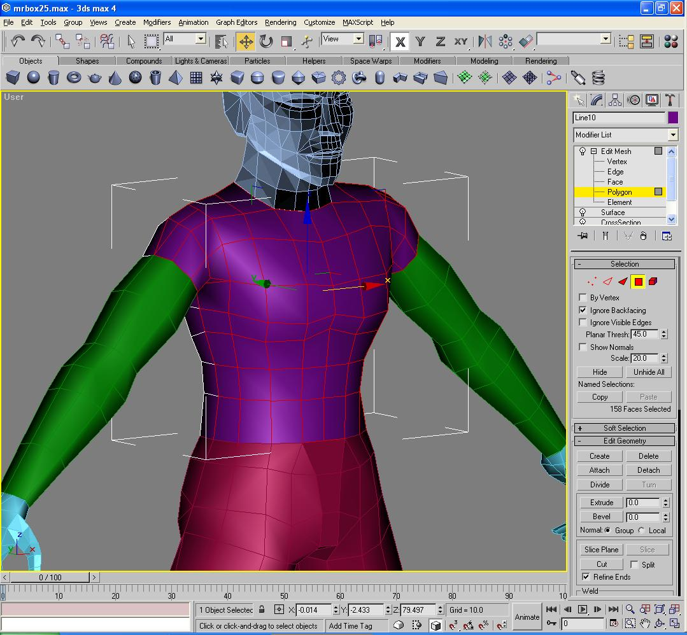](Image27.jpg)

Click Detach, then click OK to the Detach pop-up. You will end up with
this:

[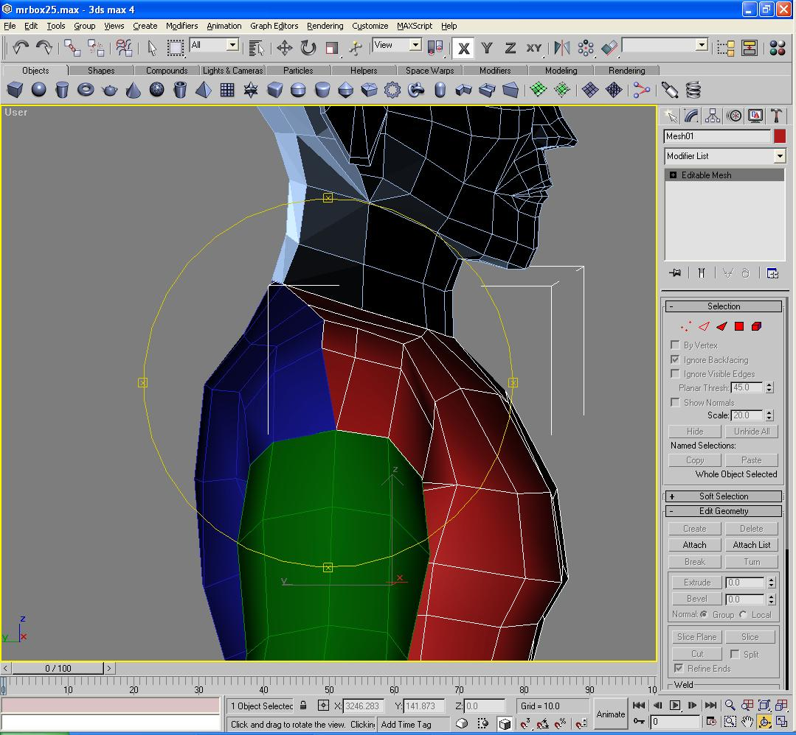](Image28.jpg)

Now, you will want to select both the front and back parts of the torso,
and make a COPY of them both. In other words, select both parts, hold
down the shift key, then click and drag the parts horizonally in the
viewport, as seen below:

[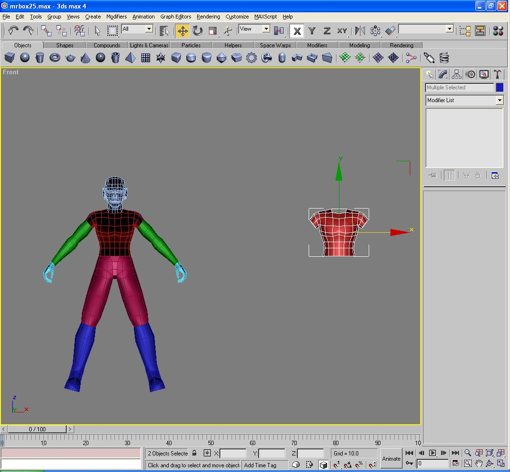](Image29.jpg)

We are doing this so that we have a backup of the torso model. It will
all come together in a minute…

Now, select the original torso model parts, front and back. Select the
model pieces, and shift-drag them again to make copies. However, this
time, when the Clone Options pop-up appears, select Reference, and hit
OK.

Now, the idea behind this is to take the polygons of the torso mesh, and
make them all rotate to face the viewport, and lay them out flat.

**DO THIS TO THE REFERENCED VERSION MESHES\!\!\! NOT TO THE COPIED
VERSION, NOR THE ORIGINALS\!\!\!**

[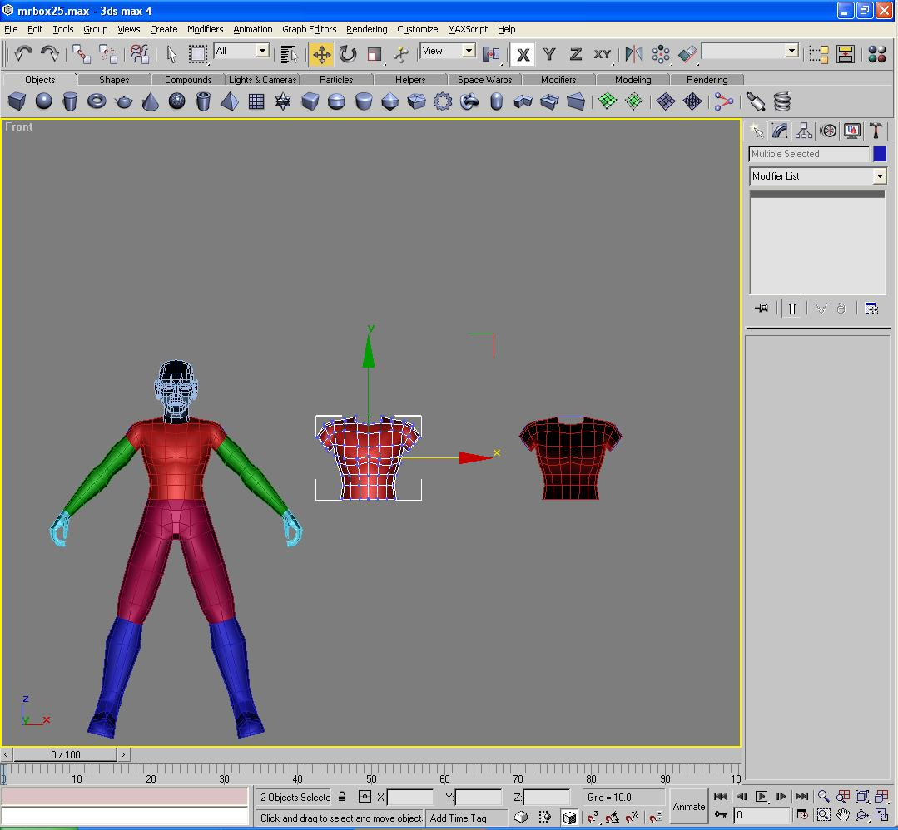](Image30.jpg)

I will take the mesh and start to flatten it out in the viewport, so
that the polygons are as close to being viewed straight-on; this is
essentially what a skin is.

What I do for my UV mapping textures is I lay the mesh pieces out flat
in a viewport, apply a Wireframe Texture to the model piece, then Render
the model piece via 3d studio max – this way I have a clean UV map
texture for applying to the model, and it is fit to the exact
proportions of the model.

**Wireframe texture in 3D Studio Max**

These are the settings for the wireframe texturemap:

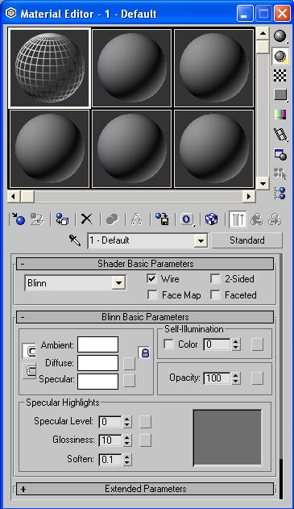

[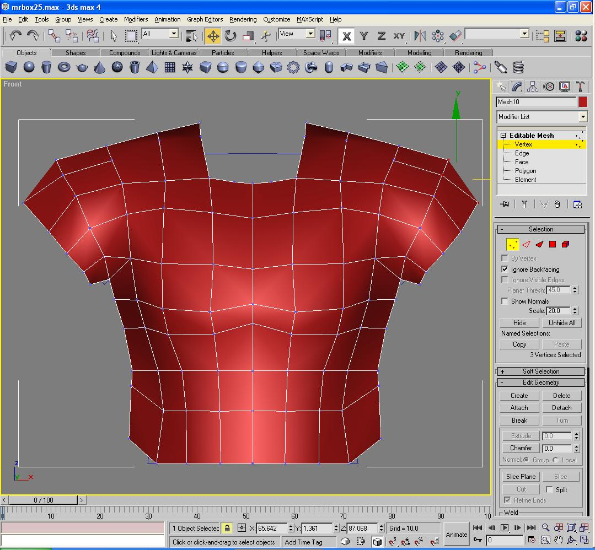](Image32.jpg)

That is the laid out model piece right there. You will notice, as you
move the referenced mesh pieces, the originals will move as well. You
want this to happen, this is good.

And in turn, I do the same thing for the back of the torso. However,
while moving the vertices in Sub-object Mode, I also selected all
vertices, rotating the mesh in the process, to face in the front
viewport.

[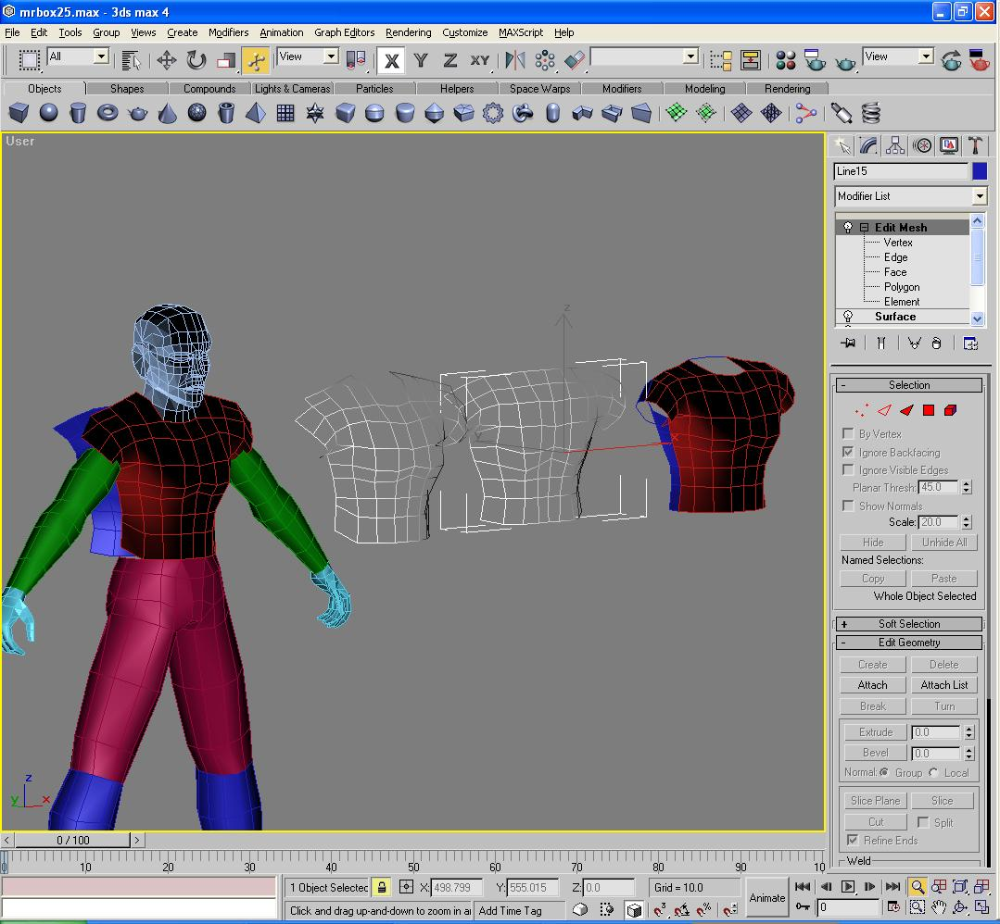](Image33.jpg)

[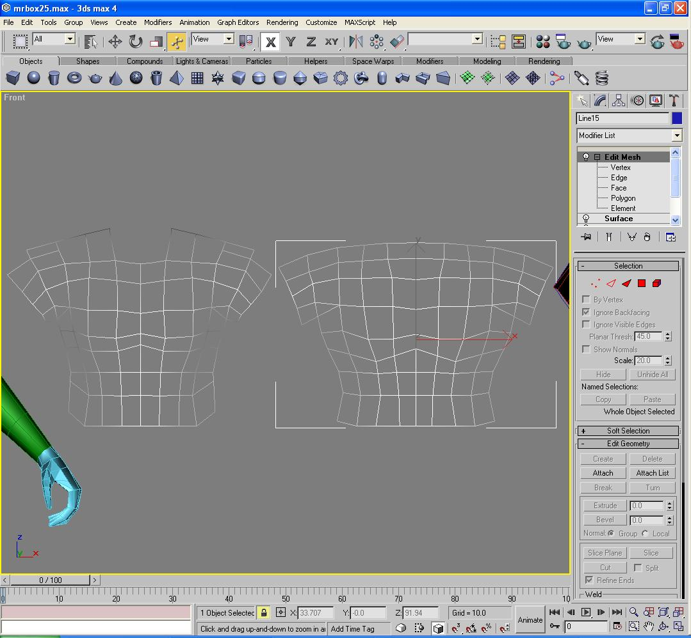](Image34.jpg)

Here is the mesh laid out, with the wired texture, which I rendered in
Max as Torso\_UVMAP1.jpg, at a render resolution of 512x512 - Make sure
your textures are rendered in multiples of 64 so Jedi Knight can read it
– ie. 128x, 256x, 512x, 1024x.

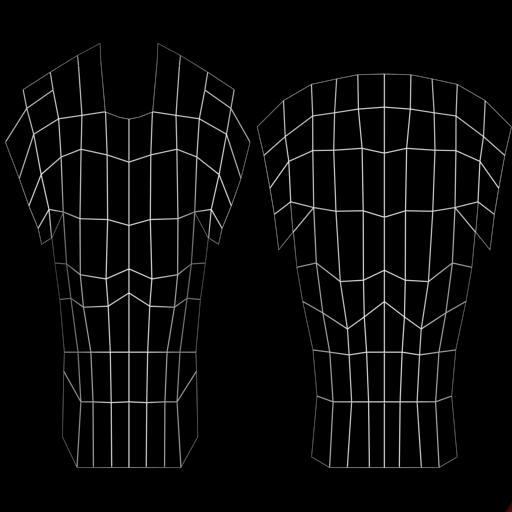

Now, to apply this texture to the torso, first I will go back into 3D
Studio Max, go into the material editor, and apply the Torso\_UVMAP1.jpg
file into one of the texture paths.

I apply the Torso texture to one of the laid out mesh pieces, either
back or front of the torso, then I will apply a UV map modifier.

Within this modifier, make sure the Orange outline box is around the
outside of your model, completely surrounding it, like so:

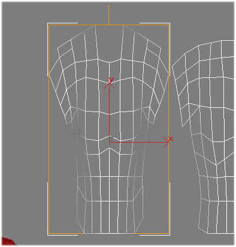

If the box does not surround the piece, or it is just a flat orange line
in the middle, make sure within the Alignment drop box for the Uvmap
modifier is setup for the proper Axis, X Y or Z, and hit Fit to see if
it surrounds the model piece.

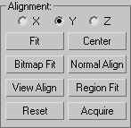

Now, once the UV map gizmo is aligned, apply an Unwrap UVW Modifier in
the modifier menu to the model piece.

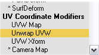

Under the Unwrap UVW modifier control menu, under Parameters, select
Edit. You should see this:

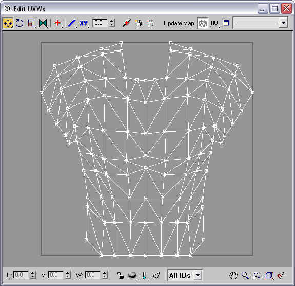

You should have the Appropriate texture map show up in the Unwrap
screen; if not, in the upper-right corner, click on the drop box with
the line through it and select "Pick Texture". Point it to your JPG
bitmap and line up your model vertices to the texture map.

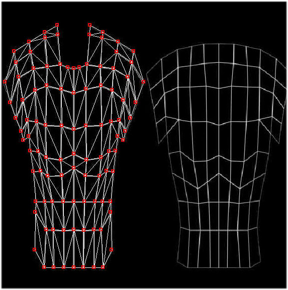

After you have setup the vertices for the model part, you want to now
apply a new modifier to your newly UV mapped model piece.

**Morpher**  
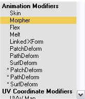

After applying the Morpher modifier, scroll down to the Create Morph
Target box in the morpher modifier rollout.

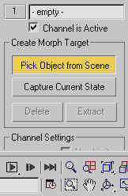

Click on "Pick Object from Scene" then select your original reference
piece to your UV mapped model piece. It should allow you to click on the
reference piece.

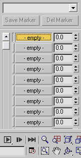

Your first box, highlighted yellow in the sample image, should list the
name of the reference model piece. Change the 0.0 to 100.0. Your UV
mapped piece should now morph back to its original shape\! Yay\!

Move it into proper position for your model, wherever it may happen to
be, the head, torso, whatever, and then wash, rinse and repeat for the
rest of the model, the arms, legs, back, head, etc\! I will leave it up
to you where you decide to split or not split your model if you want to
continue this technique. It is what I find most useful for me and gets
me very accurate results, and easily controlled seams on the model. With
this you should create a sample texture set of wireframes that you can
apply to your model and use for testing, then substitute in completed,
painted textures on your model\!
