Author:Basic Lighting

-----

Author: [Jake Troxell](mailto:jtroxell@chollian.net)

There are three different ways to do lighting in Jedi Knight: lights as
objects themselves in light mode, extra lighting by sector or surface,
and dynamic (or thing) lights. A level will benifit if you use each in
its proper place.

This is a basic lighting tutorial explaining how to use basic techniques
in all three ways. I may make a more detailed tutorial for those
"experts."

### Extra lighting

Extra lighting is simply adding more or less gamma correction to a
certain surface or sector. For example, in JK, when you adjust Gamma
with the F11 key, you are adjusting gamma globally, across the whole
level. Extra lighting is adjusting it sector by sector or surface by
surface. The downside to this is that no shadows are generated; which is
only logical, you aren't making light 'come' from anywhere, simply
adjusting the brightness of textures.

The highest amount of extra light possible is 1, fully lit, and lowest
is 0, nothing. Play around and experiment with it\! Extra lighting is
good if your level won't have many light contrasts or just to have light
dark rooms. That won't make for a good level though-- in addition doing
lighting that way is a serious pain.

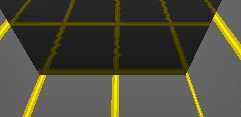

A good use for extra lighting is to make sure you can see. If you have a
totally dark sector with one light in the corner you could add .25 or so
extra light for visibility.

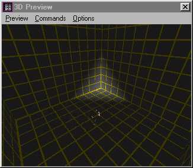

Before releasing your level, you should make a run through and look for
those surfaces that are completely black. Set them to .25, .30, .35, or
other applicable setting. This is the best use of extra light IMHO; as a
way of correcting mistakes made with the other type of lighting.

### Vertice Lighting

This section of the tutorial has a little more to it, since doing lights
in light mode is far more complicated than simple gamma adjustment.

After inserting a light, you will see in the item editor box two
variable settings: Intensity and range. Intensity is how bright (or
dark, but we'll get to that later) your light is. Expert disagree on
what the highest value is, as 100 seems to make a different effect than
10, but not much. We'll assume that 10 is the highest in this article,
and the lowest is -10. These values obviously make the light brighter or
darker, however, you'll get less shading the lower the intensity. The
range is how many vertices will catch the light. Let me drop into
technical mode here, and explain what vertice (or vertex, the terms are
synonymous) lighting is.

Light actually comes from the vertices, not the light. This is because
JK calculates that the lighting \_before\_ entering the level. In Quake
and it's spawn, lights are dynamic entities, able to be moved around,
and look like they are moved around. Think of a lantern here, swinging
and its light following it. These type of lights are called 'point
lights' or 'dynamic lights'. There is a difference between the two, but
in JK it is irrelevant.

Now, the way JK calculates lighting is like if there's a light on the
ceiling, but it can't shine from there -- it must be calculated as light
from the nearest vertices. (Roughly analogous to the corners of a room.)
The upside to this unrealistic technique? Speed. It takes FAR less math
to make a light that works this way than to make alight that works like
in Quake & spawn. You get a better framerate. (One reason you can run JK
at 1280x1024 hardware at 60 fps, as opposed to, say, Shogo.)

JK throws a twist on this because it **does** include point lighting --
after a fashion. It is buggy, it is convoluted -- but it allows awesome
effects. When you turn on your field light in JK, you are making
yourself into a point light. The saber is another example of a point
light. For the technical minded, dynamic light is generated and
controlled though the COG verbs GetThingLight(), SetThingLight(),
GetThingCurLightMode(), and SetThingCurLightMode() . In addition, the
template property light= sets the amount of light initially displayed.
(That's the core of the light1 thing.)

Anyway, back to the practical application of all this, JED. The number
you put in range is the radius of a light "bubble." (I'll make up my own
terms, thank you) Any vertices inside this "bubble" will emit the light,
but to differing degrees depending on the distance from the source. If
you make the range smaller than your sector, the light will eventually
fade out. It's hard to get the range number exact, so you'll have to
play with it. A lot.

Here are a few tricks you can use to get lighting effects. I'll show you
in a square sector. Put the light near a corner and set the range to 0.1
and calculate lighting, then veiw it with the 3d previewer. You don't
have to worry about the intensity right now.

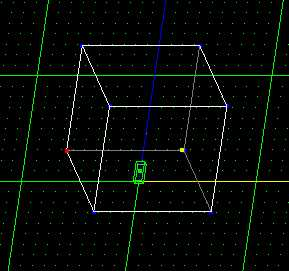

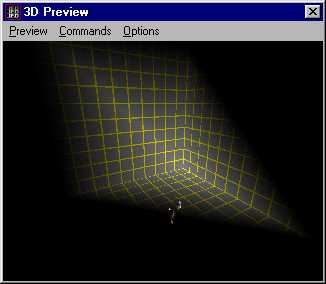

This is a little uncontrolled, and is perfectly fine if that's what
you're trying to get, but there is a way to control the lights path by
using edges. Light tends to follow or stop at edges. The next two
pictures show a technique to control lighting. By cleaving edges going
from the vertice where the light is situated you "guide" the light along
its path.

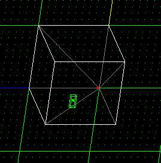

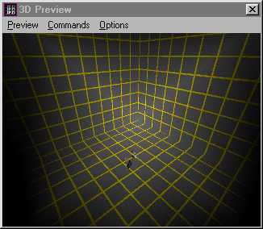

Another technique is to cleave around the vertex where the light is
situated. This fades out the light at the edges.

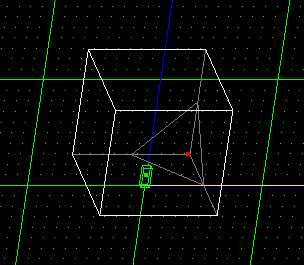

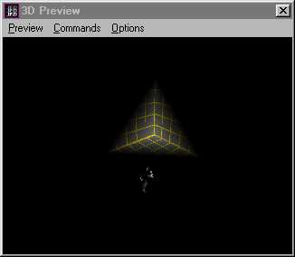

What you'll get is a dark room with a lit corner. This is a situation
where extra light would come in handy.

The basic rule is that when an edge extends from the lit vertex the
light will follow it, and if an edge is outside range of the light, then
the light will fade out at the edge. Try it out for yourself for a
better understanding. Words are failing me here.

These methods aren't the only way to do it. You can mix them up or
change them any way you want. Also, this is just a plain cube, try
different shaped sectors. Here's an example:

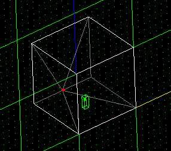

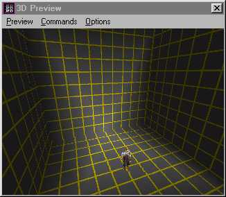

And another example.

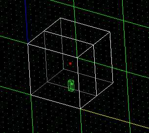

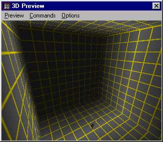

Learning lighting takes playing and experimenting. Try recreating my
examples and making your own. Normal JK lighting is not all that bad,
just counter-intuitive. You have to get used to the thought of vertices
giving off light, rather then the light you place.

### Dynamic lighting

Dynamic lighting is JK is, as I said above, a risky process. First, an
overview of how to place these lights into your level: Go to thing mode,
and select any of the light\* family. That's it.

Why use dynamic lights? Dynamic lights are, by definition, changeable.
That's what dynamic means, after all\! When you want a strobe effect,
use a dynamic light. Flicker? Use a dynamic light. **Any time that a
light must change in your level, use a dynamic light\!** As noted above,
you might have to write a cog to get the effect you want, but it is
possible.

But dynamic lights are buggy. If you've ever played around with Quake
mapping, you know about VIS/LIGHTS and how long they take\! What they do
is make it so that the dynamic lights of the levels won't shine through
to other surfaces/brushes. Jedi Knight has no such system. If you have a
dynamic light next to a wall, particularly if it is a strong dynamic
light, chances are it will shine though. Not only that, it'll flicker
bad enough to induce migraines. Not a Good Thing(tm).

Dynamic lights require more fussing around with than normal, vertice
lights. Since you are unable to preview them in the JED 3D preview, you
must boot up JK every time you want to test your lights.

These lights are best used sparingly. One here, as a flickering light.
Another there, are a light than can be turned off. The list will go on.
Most lighting, though, should be done with the Jedi Knight vertice
lighting. Despite all its quirks, it can be previewed in JED, and isn't
horridly buggy. Extra light should be used as a touch-up tool to dynamic
and vertice lighting.

None of these are rules, of course, simply guidelines I've found helpful
while editing. You might, too\! Have fun editing...
