Author:Locked Doors  
By: REZ  
  
OK, before I start this tutorial theres somthing I'd like to say, use
locked doors sparingly in your SP levels. Think of other ideas for
puzzles besides locked doors, as they're boring puzzles, but they do
give a new objective for the player. I'm going to assume you have basic
knowledge of JED and you know how to make doors. OK that said lets get
to the tutorial.  
  
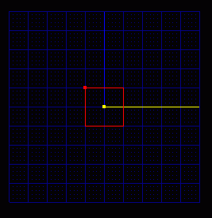  
  
Here we have our default JED box, lets start by cleaving a hall. Cleave
it out like so:  
  
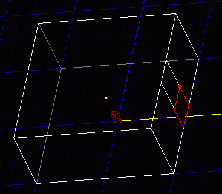  
  
Now extrude it:  
  
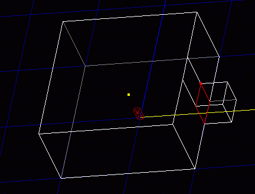  
  
OK now we have a basic hall. Put in door using the [door
tutorial](http://www.massassi.net/tutorials/doors/).In the end it should
look something like this:  
  
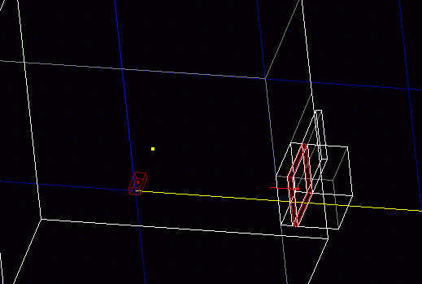  
  
Instead of using 00\_Door.cog use 00\_DoorKey.cog by going to placed
cogs... add cog... 00\_DoorKey.cog. We have some values to place in the
cog.  
  
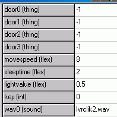  
  
OK what do these values Mean:  
Door 0-3: These are the door things the cog uses. \*Note, if you put
other values for doors other than Door0, then when one opens they all
will open.  
  
Movespeed: the speed the door moves (higher is faster)  
  
Sleeptime: How long the door stays open.  
  
LightValue: How much extra light is added. (Leave this value alone)  
  
Key: the key color needed to open the door. Put a 0 for red 1 for blue
and 2 for yellow.  
  
Wav0: The locked sound for the door. (Leave this alone)  
  
Fill in the appropriate values. Here are mine:  
  
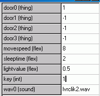  
  
OK now add a key. Sense I chose 1, Blue, I'll add a blue key. To do this
I press insert in item mode and chose KeyBlue. It should look something
like this in JED:  
  
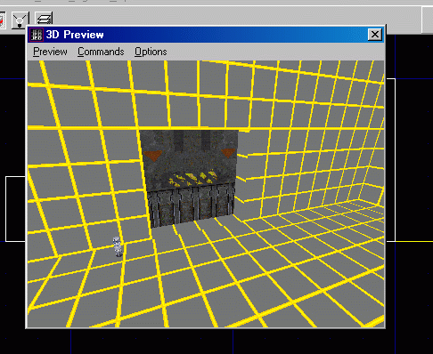  
  
Now if you saved and gobbed your key door would work, But look what
happens when you try to open the door with no key:  
  
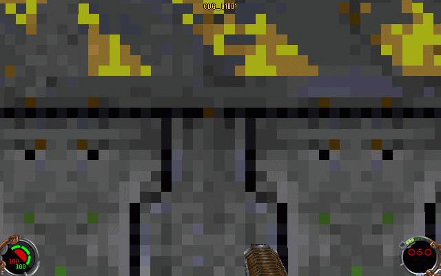  
  
How do we fix this? Quite simple really and we will have to add
something called level text to do this press F8. Click edit strings. You
will see this:  
  
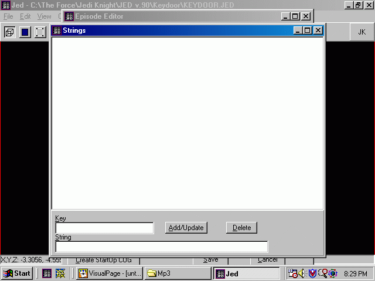  
  
OK all you have to do is type COG\_01001 in the Key Box and Locked\! in
the String Box. Like so:  
  
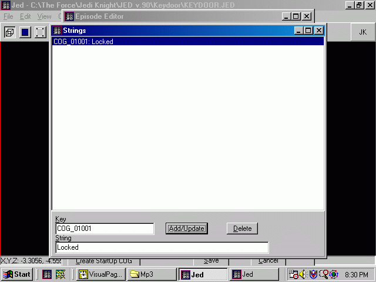  
  
Now press add/Update. Exit the string editor. Press update and then save
in the episode editor and exit. MAKE SURE YOU SAVE YOUR EPISODE. Note
how you character says LOCKED\! instead of COG\_01001. You could make
him say anything. All Done\! Here are a few working pics:  
  
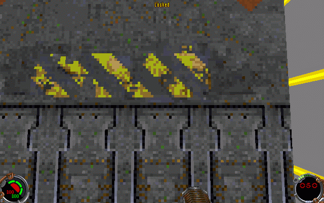  
  
  
  
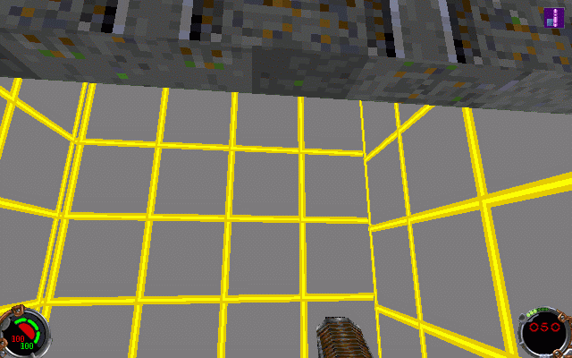  
  
Copyright 1999 REZ and the Massassi Temple.  
Any Questions? Hop to the Editing board and ask away\!
