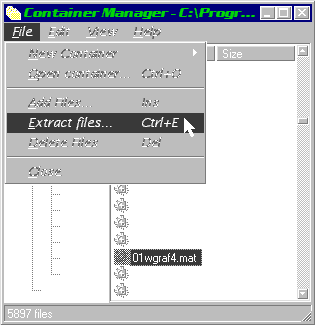
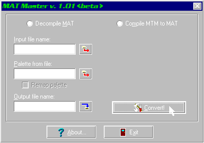
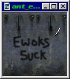
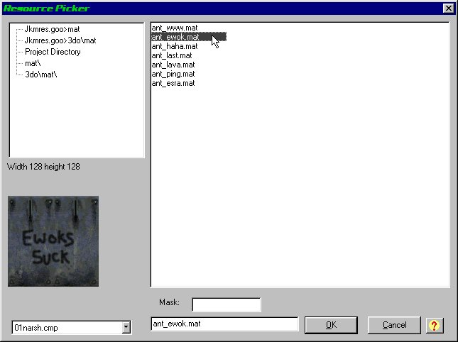

Author: Antony Espindola]
  
This tutorial teaches you how to add your own MAT files (textures) to
your Jedi Knight/Mysteries of the Sith level and give you a few tricks,
tips and hints along the way.

The tools you will need for this job are:

  - **MatMaster** from [Dark Jedi](http://www.darkjedi.com/)  
    This coverts between MAT and BMP formats
  - **ConMan**, also from [Dark Jedi](http://www.darkjedi.com/)  
    This allows us to get at some of the MATs already in the game if we
    want to simply create our own using these as a base.
  - Your favourite **Image Editor**  
    I prefer to use [Paint Shop Pro](http://www.jasc.com/) for creating
    MAT files so this tutorial will be based around it, but you can
    apply the same ideas to *your* favourite program

### MATs, BMPs and Stuff

First we need a little discussion about how MAT files are used. We
simply cannot just dive in and edit the MAT format as it's not supported
by any image editors that I know of. That's why we need the MatMaster
program as it converts it into the handy BitMap (BMP) format which is
very common and the native windows image format.

We also need to be wary of the colour palette. JK/MotS uses it's own
colour palettes depending on the level settings. As you should know, you
need to define the default colourmap (CMP) for your level and when
selecting textures you will see that some have horrible pink/purple
shades in them. This is because they are not compatible with the
colourmap you are using, so you need to pick a different texture. Most
of the textures are grouped by using a number at the start (which
appears to be a level indicator) and so if you find one texture that
works with a colourmap you can guarantee that the rest of the textures
in that range will also be ok.

Now we have the basics of how MATs work, let's go about making our own.

### Picking a Colour Palette

The first thing we need to do is get at the colour palette so we don't
go using colours that the game cannot use. The easiest way to do this is
to decide on which colourmap you are going to use for your level (if you
haven't already) and then pick a texture which works with it, as
described above. Make a note of the name of that texture as we're going
to extract that one from the GOB/GOO file it's in.

### Extracting the MAT

For this example, I have chosen the 01WGRAF4.MAT file which works with
the 01NARSH.CMP colourmap which I am using in my level. Using ConMan, I
open the JKMRES.GOO file and go to the \\MAT directory inside. There you
will find all the default MAT files used in the game and so I just pick
the one I want. I can now extract it from the GOB file by either using
the menus or simply dragging it to a directory in Explorer.

  
Extracting a MAT file

Once we've extracted our MAT, we now need the palette file (CMP) it uses
so we can decode the MAT file into the BitMap file. This is done by
simply selecting the right CMP from the \\misc\\cmp directory and
extracting it like we did the MAT file.

### Converting between MAT and BMP

Now we need to convert it from a MAT file into a BMP file so that we can
edit it. Using the MatMaster program, simply select the MAT file you
just extracted and also select the palette used for the MAT. Then type
in a name that you want to save your BMP files as and click **Convert**
button. Simple as that\! If the MAT file you picked has more than one
image in it (called a *Multiple MAT*) then it will create more than one
BMP file. Creating Multiple-MAT files is covered in a different tutorial
by **Evan C** called [multi-celled mats](/tutorials/mats_multicell/).

  
  
Using MatMaster to convert the file

### Getting the Colour Palette

Now we have our BitMap image, we can run the image editor and take a
look at it. What we have also done is extract all the colour information
for that palette - it's all stored in the BitMap. This is why I use
Paint Shop Pro because I can now use *only* the colours in this BitMap
and I can also **Save** this palette out for future use. It's a good
idea to save the palette with the same name as the CMP name that it's
given in the game. You might also need to use this later to "reload" the
palette or if you want to save the hassle of extracting the palette each
time. Again, most images editors won't understand the CMP format of the
palette file, so that's why we save it from the BitMap.

### Editing the Picture

Now we have our MAT (as a BMP) in the image editor we can either delete
the whole thing and create a new one from scratch or simply modify the
existing MAT, using it as a base to create our customised MAT.

For my example in this tutorial, I am going to create some "Graffitti"
on this existing MAT texture. Creating your own MATs is much harder as
you have to get all the shading and colours just right to make it fit in
with the quality of the other MATs used in the game. I certainly find it
hard\!

  
Customising an existing MAT

All I'm doing is simply painting over the top of the existing MAT file
to customise it. I'm also using the 'smoothing' tool (sometimes called
'fade' or 'anti-aliasing') to make nice smooth edges to my texture - it
will look much better in the game.

When you've finished editing your texture, you might want to reload the
palette you saved as some image programs modify the set of colours used.
If it does, reloading the palette will instantly show which colours have
changed. You can then go through and change these colours (using a
colour replacer or just the paint bucket) to a close colour in the
original palette. We don't need to worry about this as I didn't use any
extra colours this time.

### Converting Back to MAT

Now I've saved my BitMap file as ANT\_EWOK.BMP so that I don't get it
confused with my original MAT file. Don't go replacing all the files in
your GOB/GOOs otherwise you'll get some rather strange results\!

Using MatMaster again, I've simply converted the BMP file into a MAT
file, with the name ANT\_EWOK.MAT to stop it getting confused with the
others. That's it\! I've created my own MAT file which I can now use in
my level\!

### Using Your MATs

The only thing left to do is use the MAT file in your level. I've copied
the ANT\_EWOK.MAT file I created into the MAT directory inside my JED
level directory. This allows JED to see that MAT file and you can then
select it from the MAT selector (it will be in the MAT section in the
top right) like you would a normal MAT texture.

  
Selecting the Texture in JED

The only thing left to do is create my project as a GOB/GOO file and run
it. JED can automatically create GOB/GOO files for you and will also
include any extra textures, cogs, 3DOs and the like you have defined in
your level's directory. This saves you the trouble of creating your own
GOB/GOO files.

If you **do** want to replace a certain MAT file from the default to
your own, you can name the file the same as the MAT you want to replace.
When you compile your level to a GOB/GOO, the JK engine will simply use
*your* MAT file in the GOB/GOO instead of it's own one. Be **very**
careful when doing this though\!

### Finally...

Making MATs is not that hard - it's just a case of knowing **how** to do
it. Hopefully I've shown you an easy way to do it - there are many other
ways out there but I think this is the easiest one\!

  
The finished article\!

*Have fun\!*

Antony.
