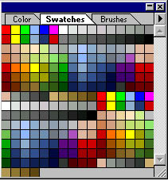
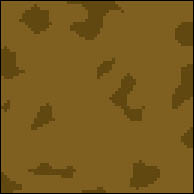
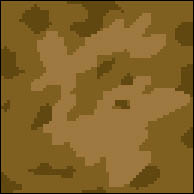
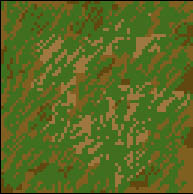
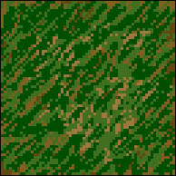
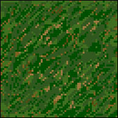
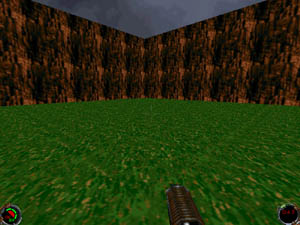

Author: PedHead  
  

If you're new to making Mats please go to [Antony Espindola's
tutorial](/tutorials/mats/) to learn how to get started with converting
mats. This tutorial goes into the finer points of creating a detailed
mat. Let's get started.

For this tutorial you are going to need:  

An image editor ([PaintShop Pro](http://www.jasc.com/psp6dl.html),
[Adobe Photoshop](http://www.adobe.com/products/photoshop/demodnld.html))

[Mat Master](/programs/matcmp/matmaster2.zip)

Okay, let's get started. First thing you need to do is create a new
image. Make sure you have the right palette for the .cmp your drawing
for. I am going to make a mat that is 64 by 64 in pixel size. Next thing
you need to do is think of what mat you're going to draw. For me, I am
going to want to make some grass. I selected my palette and I am going
to make this mat dflt.cmp compatible. When you draw a mat you're only
allowed to use a certain amount of colors. I selected dflt.cmp as my
palette and these are the colors I am allowed to use.

|                                                                                                                                                                                                                     |                                                                                                                                                                                                                                      |
| ------------------------------------------------------------------------------------------------------------------------------------------------------------------------------------------------------------------- | ------------------------------------------------------------------------------------------------------------------------------------------------------------------------------------------------------------------------------------ |
| Okay, its pixel time. First thing you want to do is create a simple colored background. You might want to zoom in a bit. I'm going to take the color brown with a big brush and paint the whole picture completely. | Once I have done that I want to blend in another color that is a lighter brown. See the picture below. The background might look a bit cheesy for right now, but it's not going to show much because I'm going to add grass over it. |
|                                                                                                                                                                                                        |                                                                                                                                                                                                                         |

|                                                                                                                                                                                                           |                                                                                                                                                                                                                                                                                                                                 |
| --------------------------------------------------------------------------------------------------------------------------------------------------------------------------------------------------------- | ------------------------------------------------------------------------------------------------------------------------------------------------------------------------------------------------------------------------------------------------------------------------------------------------------------------------------- |
| Once you've created your background you would want to put in some details. For instance, I'm going to add in some grass. I'm using a light-colored green and I am going to draw grass in a diagonal form. | The image still seems a bit plain. So I am going to put in a darker green for the grass. Using variations of the same colors but lighter and darker makes your image seem like it's less plain. If you can see, the background brown is still visible. Drawing more than one color for the background adds so much more detail. |
|                                                                                                                                                                                              |                                                                                                                                                                                                                                                                                                                    |

|                                                                                                                                                                                                                                             |                                                                                                                                                                                                                                                                                                           |
| ------------------------------------------------------------------------------------------------------------------------------------------------------------------------------------------------------------------------------------------- | --------------------------------------------------------------------------------------------------------------------------------------------------------------------------------------------------------------------------------------------------------------------------------------------------------- |
| If you still feel like your image needs more detail, add in more variations of colors add more darker, lighter, and dullness of colors. I am going to add in more of a dull green. Adding dark and light colors all has to do with shading. | Voila\! It's that simple. You can try more advanced mats with more details and shading. Making detailed mats aren't so hard as you thought they were, eh? Here is a screenshot below of the mat in Jedi Knight. The mat will look a bit choppy when drawing, but once converted to the game it's smooth\! |
|                                                                                                                                                                                                                                |                                                                                                                                                                                                                                                                                              |

Give it a try to make other detailed mats.
