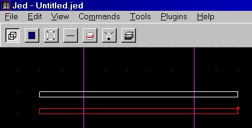
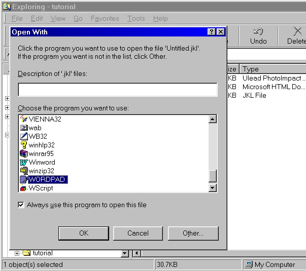
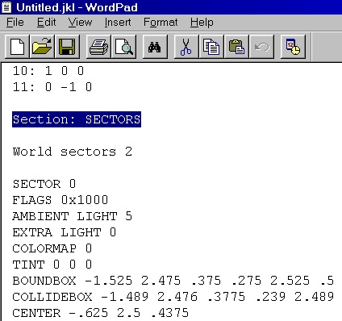
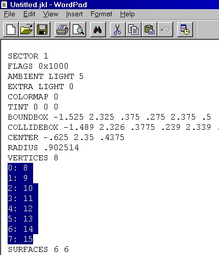
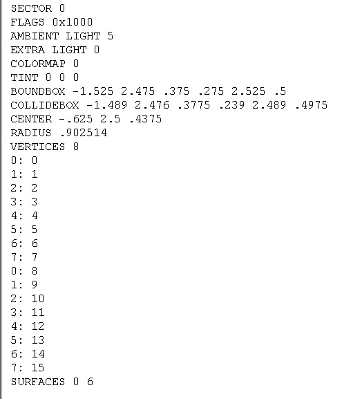
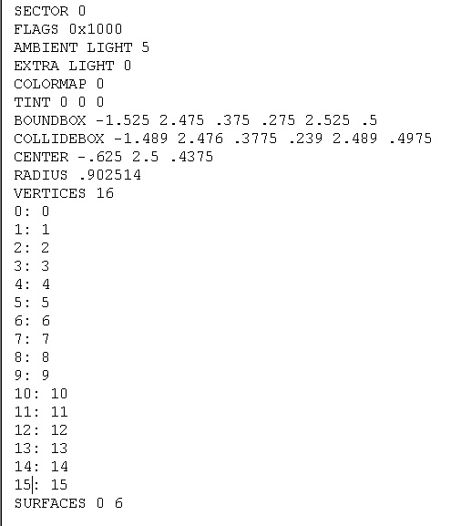
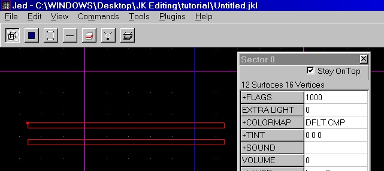

Author:**Merging Non-Adjoined Sectors via JED & Wordpad**

Author: [Red](mailto:theensers@earthlink.net)

  

-----

  
  
Let's start out with why in the world you would do such a thing? The
answer is simply to create 3dos. I used this technique to make Greedo's
gun playable, and in a few 3dos for an upcomming level. I'm sure
**someone** will find uses for this tutorial.. hopefully :-)  
  
Here we go.. (for lack of better words I am not the best tutorial writer
:-) )  
  
  
1\) Get the sectors set up how you'd like them in your 3do. My 3do is
going to be simple because the bigger it is, the more time it takes
:-)  

  
2\) Hit File -\> Save JKL  
  
3\) Open your new .jkl with Wordpad.  

  
4\) Scroll down to "Section: SECTORS"  

  
5\) Change "World sectors \#" to "World sectors 1" (The \# = another
number :-) )  
6\) Skip Sector 0's info and scroll down to "SECTOR 1"  
  
7\) Highlight and cut (Ctrl + X) Sector 1's vertices  

  
8\) Paste them (Ctrl + V) UNDER Sector
0's vertices  

  
9\) Do the same for any additional sectors (Paste them under your
previous Cut & Pastes -- they should count upwards)  
  
10\) Count all of your vertices and change Sector 0's "VERTICES \#" line
to correspond with this number (i.e. if I counted 16 verticies I'd
change it to "VERTICES 16")  
  
11\) Fix the numbering of your vertices so it continues to count
upward.  

  
Becomes:  

NOTE: The numbers SHOULD correspond\!  
12\) Scroll the "SURFACES \# \#" part of each sector (including sector
0) and add the 2nd numbers together. So
if you have 3 sectors you should've added 3 numbers together.  
  
13\) Take this number and plug it into the "SURFACES 0 \#' line of
sector 0. My number was 12 so my line reads "SURFACES 0 16"  
  
14\) Save your .jkl and re-open it with JED. Your end result?  

  
  
I hope I didn't confuse anyone too much. Do to this sector as you wish..
you can view my edited .jkl [here](jkl.txt)  
  
\~ Red
