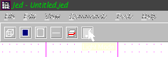
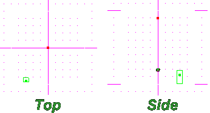
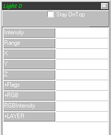
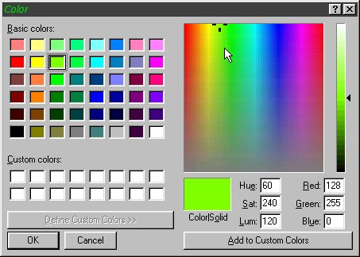
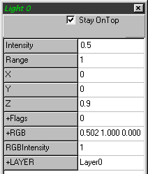
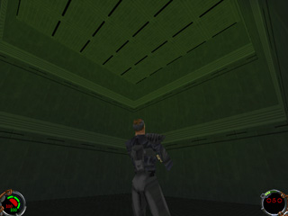
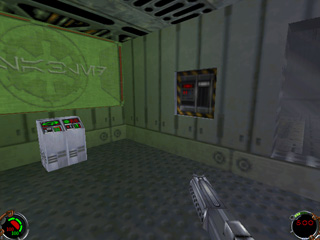

Author: Antony Espindola
  

This Editing tutorial covers how to create coloured lighting effects in
Mysteries of the Sith using the JED editor - how they work and how to
implement them into your level.

Creating coloured lighting is no harder than creating normal lighting.
If you haven't done any lighting yet then this shouldn't be a problem as
lighting in JED is quite an easy thing to do but a **very** hard thing
to get perfect\! It is worth taking the time to keep refining the lights
in your level until you are happy with it.

It's a good tip to also get your lighting checked on both a 3D Card
system as well as using the software mode. There can be great
differences between the two and refining the lighting to give the best
compromise will give a better overall impression with players using both
systems.

We'll start with the basics of creating a light in a room in JED. To
insert a new light on your map, select the *Light Mode* button from the
toolbar or by pressing the **L** key.

Now you are in Light Mode, we can insert a new light or edit an existing
light. Place the arrow over where you want your light to appear. I
always find it easier to do this in the Top-Down View (**SHIFT-1**) of
JED. Press the **INSERT** key and your light will appear\! Now you have
placed your light, switch to a Side View (**SHIFT-2** will do) and make
sure that the light is high enough up for the purpose. Obviously, if you
are creating ground-level lights, then you want the light to be near the
floor. Note that it is not a good idea to place a light directly on a
surface. This may give some strange results, so move the light to just
in front/above/below it instead.

In addition to my coloured light which I want to just light the ceiling,
I've also added a plain white light which will light the rest of the
room. To do this, I've put the light in the middle of the room like
this:

Now we have created our light and it's in the right place, we'll take a
look at the properties for lights. Click on your light and press
**ENTER** to make the property window appear (if it isn't there
already).

As with normal lights, you will only need to change the folloning:

  - **Intensity** - ranges from 0 (no light) to 1 (fully lit).  
    Negative values are also acceptable as they can be used to darken
    surfaces. If you are creating a purely coloured light, set this
    value as low as possible, usually to about **0.3** or lower,
    depending on the RGB Intensity you are using. If you set this value
    any higher, the white light it produces "overrides" the coloured
    light and it won't show in your level even though it may look
    correct in the 3D preview.
  - **Range** - this is in JKU's but the light delay is *quadratic*.  
    Confused? This means that the intensity of the light will be a
    quarter of the value at half the Range, eg. if your light's
    intensity is set at 1 and the range is 10, then at 5 JKUs away the
    light will be at 0.25 intensity.  
    *This is an important point to remember when setting the range value
    of your lighting*.
  - **RGB** - This defines the colour of the light. In Jedi Knight, all
    lighting is white but Mysteries of the Sith allows you to create
    fabulous coloured lighting (hence the point of this tutorial\!).
    Double-click on this box to get the familiar colour-picker. You can
    either select some predefined values, select a colour from the
    chart, or type in the values yourself.
  - **RGB Intensity** - This defines the intensity of your coloured
    light. Again, this works in the same way as the normal light
    intensity but applies to the colour. You could therefore have an RGB
    of pure blue, but no RGB intensity and so your light wouldn't show
    as blue\! Always make the **RGB Intensity** greater than the normal
    **Intensity** of the light, otherwise it won't work correctly.
  - **Flags** - The only Flag used in lighting is "Not Blocked". This
    means that the light is not blocked by impassable surfaces. Normally
    you would not need to set this flag unless you wanted to create
    light which passed through surfaces, which might look odd\!

So let's create a nice green light which will show up on the ceiling in
our room. As this is a tutorial, I've created a square room for my light
to be in. **DON'T DO THIS IN YOUR LEVEL\!** Square rooms suck\! Cleave
the top, sides or corners to make it more interesting\!

Double-click on the **RGB** section of the Light's properties and pick a
suitable green colour. I've chosen the *really* green colour here as I
want it to really stand out. You'll need to experiment with various
levels, colours and so on until you're happy.

Now I'll set the **RGB Intensity** to 1 so it will be at full brightness
at the position of the light. Notice that I've set the normal
**Intensity** to 0.5 to stop it overriding the coloured light.

Now set the **Range** of the light to 1. As my room is 1 JKU square,
this means that the light should have faded right out by the time it
reaches the edges. It'll help demonstrate how the lights work. If I
wanted to fully light the room I could increased the range of the light
to spread it out more.

Now you've created your light, you need to calculate the lighting. Pick
the **Calculate Lighting** option from the **Tools** menu. This will
calculate the lighting in your level. Now you can save your level and
GOB it too. Select **"Save JKL and GOB Project"** from the file menu.

Now you need to run Mysteries of the Sith and look at your level. Cool\!
Coloured lights\!

Experiment with coloured lighting and try to add it into your level in
appropriate places.

I've added a green glowing colour around the "View Panels" in my level\!

  
Imperial Satellite Outpost by Antony Espindola
