Author: Dino Delucchi

-----

This tutorial shows another way to use the sector within a sector idea
to create both the insides and outsides of buildings.

-----

  
Firstly, you have a large sector that will be an exterior scene and you
want a building in it.

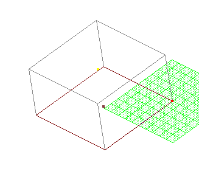

-----

  
Cleave out a sector within the large sector. In this example the inside
sector is 4 JK units by 4 JK units by 2 JK units high. In some cases I
have given the sizes of things I have cleaved out, but use whatever you
think looks good.

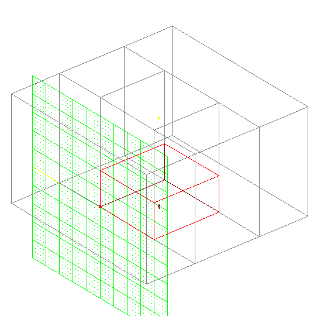

-----

  
Rename the sector to a new layer (Building) so you are only dealing with
the inside sector. Then spilt the sector horizontily 0.6 JK units from
the ground. Name the lower sector "Buildingrooms" and the upper sector
"Buildingroof". Display only Buildingrooms and align the grid to the
floor so that you are looking straight down on the grid. Cleave the
sector 0.2 units all the way around. This becomes the Eaves under the
roof. Cleave the inner sector 0.1 units all the way around. The 0.1
sectors become the walls.

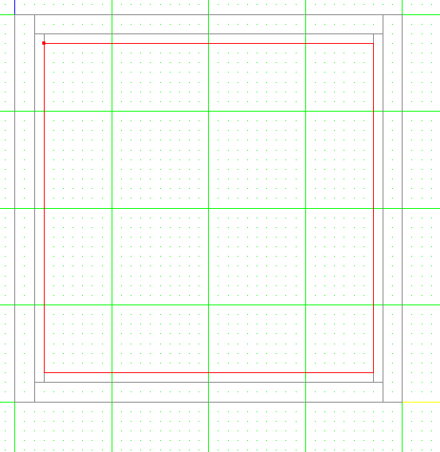

-----

  
Cleave across the 0.1 unit sectors to make allowance for windows and
doors. Note that where an interior wall will meet one of the exterior
walls, you need to allow 0.3 units, to mimic the way a real house is
built.

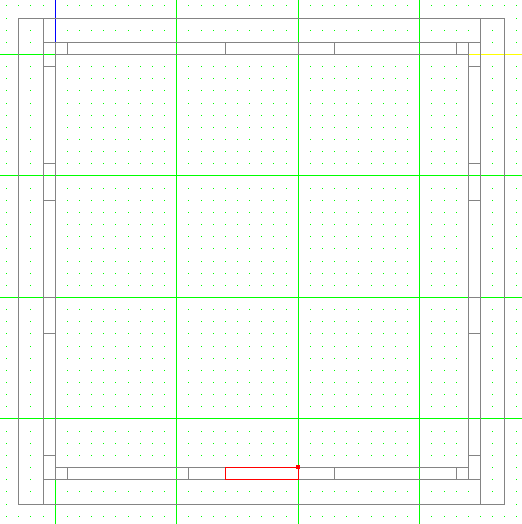

-----

  
Cleave in some interior walls and allow for doors in them. You should be
able to see that this example is a building with a central hall and
three rooms off each side of the hall.

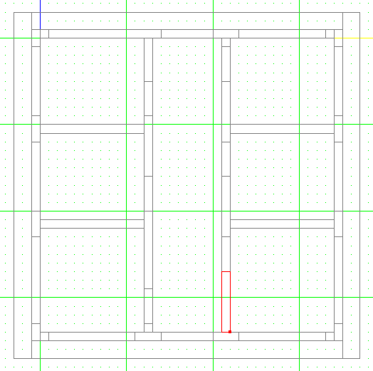

-----

  
Delete all the 0.1 sectors that are not windows or doors. The blue bits
on the picture below are the sectors that were deleted in this example.

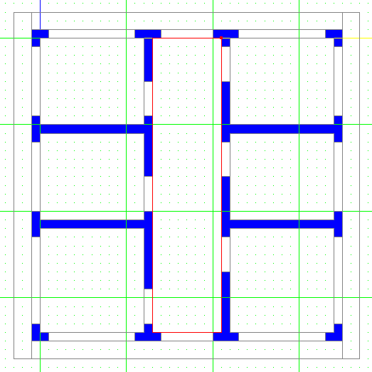

-----

  
An elevated view shows what we have achieved so far.

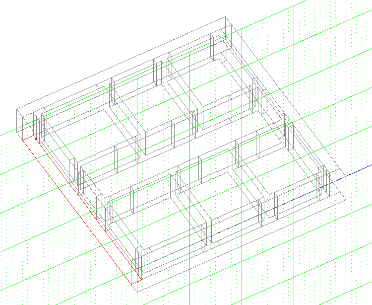

-----

  
Texturing the floor shows the partial bits of wall we have constructed
so far.

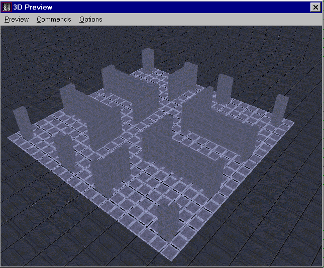

-----

  
Switch to a side on view and using the 3D preview, select each doorway
or window sector in turn and cleave them. In this example, doorways
finish 0.4 units from the ground so cleave the top off and delete the
sector. For the windows cleave at 0.1 units from the ground and at 0.4
units from the ground and delete the upper and lower sectors. The
picture below shows the result from a single window and doorway.

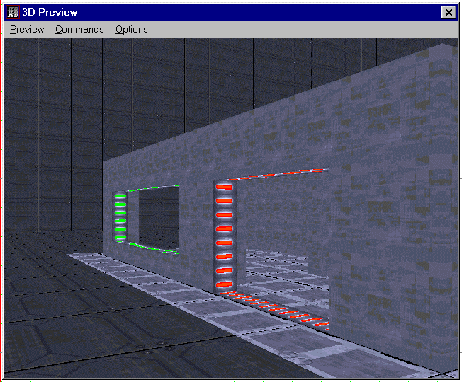

-----

  
The next picture shows the partially textured building with all the
doorways and windows done.

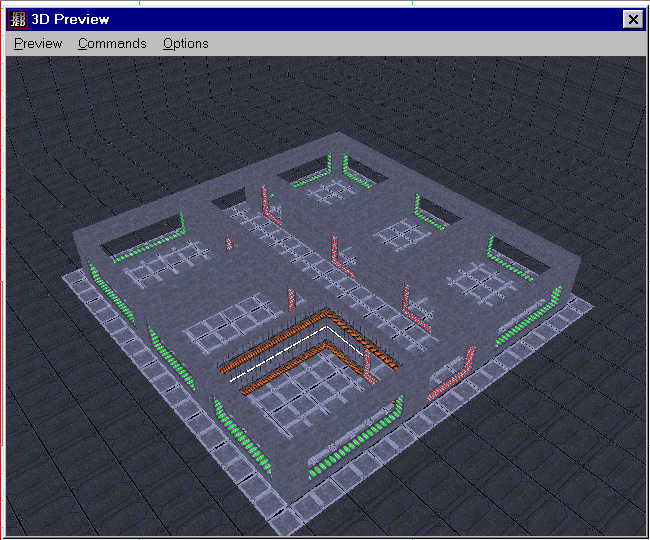

-----

  
Next, we will do the roof. Switch to the buildingroof sector.

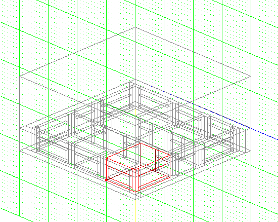

-----

  
From a side view, cleave this sector up to a peak.

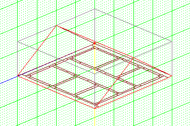

-----

  
From the next side around, do the same on the central sector. This
results in a roof coming to a single point from all four sides.
Obviously, heaps of variations are possible. You can delete the central
sector now and have a solid roof. However, we are going to apply the
same technique we used on the walls so the result is a hollow roof.

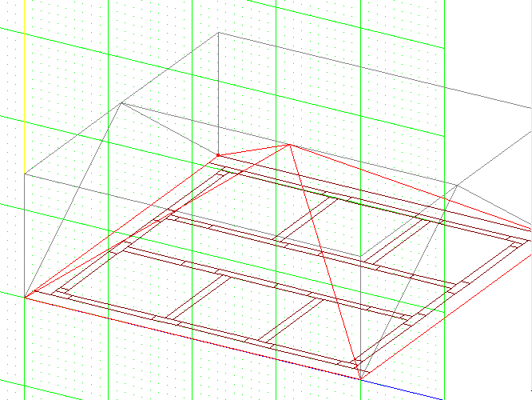

-----

  
Cleave from each side again, 0.3 unit below the first roof cleaves you
did. Delete the new sectors you formed and leave the central sector and
you now have a hollow roof from the inside.

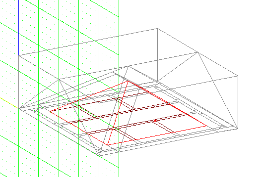

-----

  
Finally, here is the finished building partially textured. Sorry about
the colours I chose.

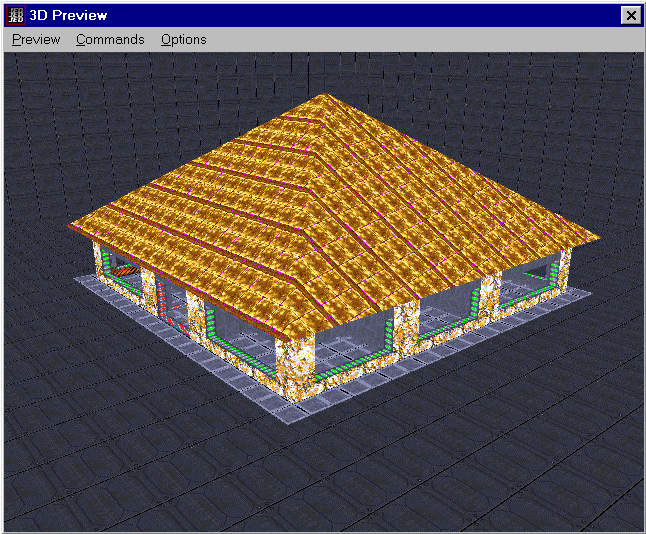

-----

  
A few points to note...

  - Make sure you know where the floor is every time so you don't cleave
    your doors or roofs upside down.
  - Try this technique with the floor higher than the ground and put in
    a few steps.
  - It would be possible to build a skyscraper using this method by
    cleaving out multiple floors.
  - Cleaving out ramps and stairs within these sectors is not difficult,
    but be careful and plan ahead.
  - Cleave the original large sector at an angle to put the build on an
    angle.
  - 0.2 units for the eaves is okay, but by planning ahead you can have
    verandas, awnings and patios around buildings.
  - Be careful and take your time.
  - Take your time and be careful.

-----

Good luck and I hope you can make use of this technique.  
[Download the JED file for this tutorial](building.jed)

