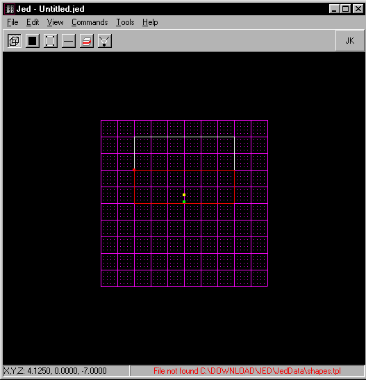
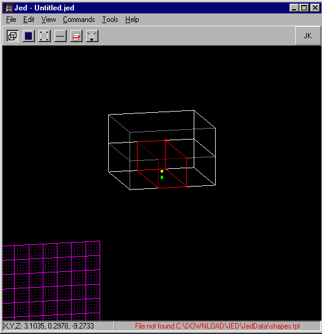
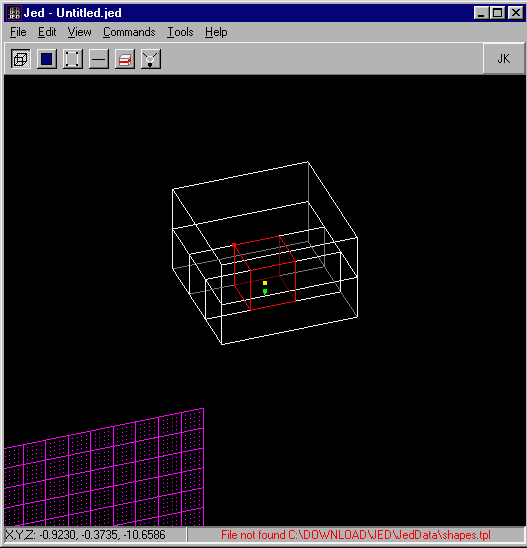

Author: [Brian Lozier](mailto:brian@massassi.net)

First of all, you need to know that you can not have a sector inside a
sector. "What's this?" you ask, "But Lucasarts did it in level \*put
number here\*\!" Well, they didn't\! How then, did they create a level
where it appeared to be a sector in a sector? It's not too difficult,
and following is a brief tutorial.

1.  Start JED and expand the default sector to be as big as you would
    the boundries of your level. To do this, simply go to the vertex
    mode and drag all the vertexes out. Then switch to a side view
    (shift+2), and stretch the top to be as tall as you would like.
2.  Stay at a side view, switch to "sector" mode, and cleave the top of
    the sector off, at the height you want your roof.
    
    

3.  Now, on the bottom sector, cleave the sides where you want the walls
    to be.
    
    

4.  Now switch to the other side view (shift+3), and making sure the
    center sector is selected, cleave the other two sides.
    
    

5.  Notice now, in the above picture, which sector is selected. Making
    sure the sector that is your building is selected, delete it. Yes,
    you read correctly, delete the sucker. Now hit "F12" and see what it
    looks like\! 
    
    

6.  I briefly textured the building so it was more visible. Now you have
    an outdoor structure. You can use this concept to create any shapes
    you want. Just cleave out the shape, and delete whatever sectors you
    want to be structures.

Next Section: [Creating Outdoor Buildings II - The
Insides](/tutorials/outdoor2/)
