Author: [Brian Lozier](mailto:brian@massassi.net)

Okay, first off, please make sure you understand the concepts and
processes presented in the first Outdoor Tutorial. It is important that
you not only know how to do the building, but also understand it. We'll
go over it one more time just in case.

You cannot create a sector inside a sector. You can however, create a
sector that appears to be inside a sector. You also can have a sector
surrounded by many other sectors. Remember, the building that we
deleted, there is **nothing** there. If you cleave out of the surface,
and extrude, the extrusion will go **into** the building, but will
actually be going **outside** the sector.

I hope that all made sense, so let's move on to the tutorial. I suggest
that you switch your grid and snap to to 0.1. We need to work a little
more detailed here than in previous tutorials.

First of all, we're starting here where we left off in the last [Outdoor
Tutorial](/tutorial/outdoor/), so you should have a structure that looks
like this:

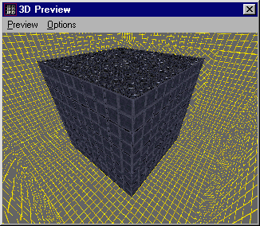

1.  The first thing that that we are going to do is insert another
    sector into the center of the building. Remember, we CAN do this
    because there is really no other sector there. Essentially, our new
    sector will float in space until we adjoin it to something. So,
    switch to top view and insert a sector into the center of the
    building. Remember to make it 1 unit *smaller* than the outside. To
    insert a sector in JED Beta 5, press the \[k\] key and then click
    the mouse where you want it. In JED Beta 3, just make sure you're in
    sector mode, then press \[Insert\]. Make sure you check from the top
    view and side views to make sure your sector is where you want it.
    Remember, the new sector should be a walls' width away from the
    outside surfaces, not directly on top of them. Also, it is a good
    idea to make the bottom of the new sector equal to ground level or
    you will have a step up/down when we do the door. The sector you
    insert will most likely not be the correct size. The easiest way to
    resize is to select the sector, then go to vertex mode, and move the
    vertexes into the correct position. Remember, if you use the \[n\]
    and \[p\] keys, you won't have to worry about moving the wrong
    vertices, as they will just scroll through vertices in the same
    sector. See this example for how the top view should look.Notice
    that the inside sector is smaller than the outside sector.

    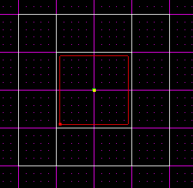

    And this example for how the side view should look.Notice
    that the inside sector is smaller than the outside sector.

    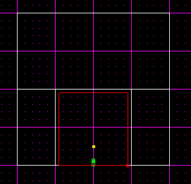

2.  Okay, that was easy enough. Now we have to create openings so we can
    walk in and out of the building. As of now, we have an outside, and
    an inside, but no doors/windows. Whenever I say "doors" in this
    tutorial, I basically mean holes in the walls to allow you to pass
    from the outside to the inside. I don't mean the doors that open and
    close and are controlled by Cogs. Okay, step 2 is to pick a surface
    on the inside sector, one of the walls, to create a door in. You
    need to cleave the surface into the shape of a door, like the
    following example.
    
    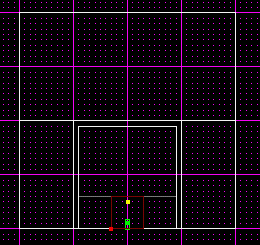

3.  Now, you have to extrude it with the \[x\] key. Notice that it goes
    away from the inside, as it extruded to the *outside* of the current
    sector.
4.  Most likely your extrude extended beyond the outer wall, as mine
    has.
    
    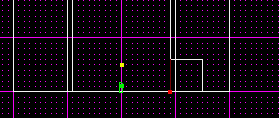

5.  So now we have to switch to vertex mode, and move the vertices so
    that the sector meets exactly with the outside wall.
    
    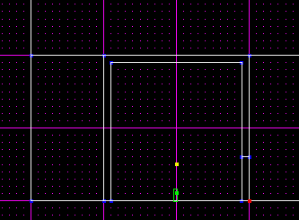

6.  Okay, now for the adjoining. First, select the surface that is the
    outside wall that the door is connecting to. The easiest way to do
    this is to enter 3D preview and just click on the surface, then go
    back into the normal editing window. Then switch to a side view that
    enables you to see the whole face of the surface, as shown below.

    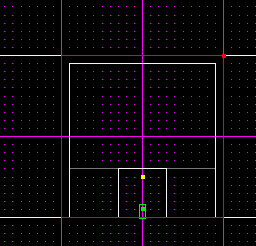

7.  Now that you have the correct surface selected, cleave a hole in it
    that *exactly* matches the door you extruded.
    
    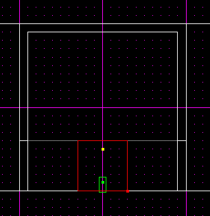

8.  Now, if you cleaved correctly, you should be able to select the
    surface shown above, and press the \[a\] key to adjoin. Then, in 3D
    preview, you will see that you can now move into and outside of your
    building.
    
    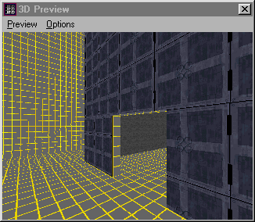

Now you have a building that appears to be outdoors. If you want to
learn a little more, please read on... We are now going to discuss how
to make this building two stories high. The easiest way to do that, from
this point, is to cleave the inside sector in two places, deleting the
divider. See the illustration below.

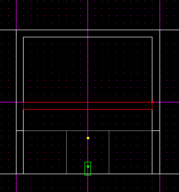

Notice the sector
selected. If we delete that, we end up with two separate sections to the
inside of our building. From this point, you can either cleave a hole to
make an elevator go up, or create another door on the outside, this time
just a little higher. You can also combine what you have learned in
other tutorials, such as the two-part [Tutorial on
Ramps](/tutorials/ramps/).

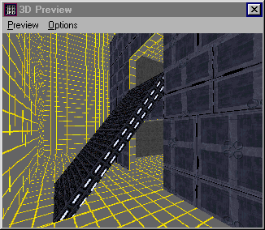
