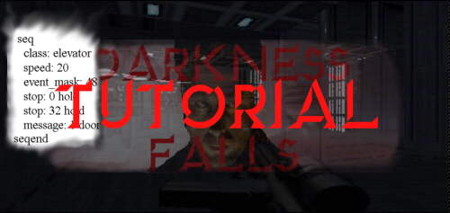
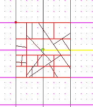
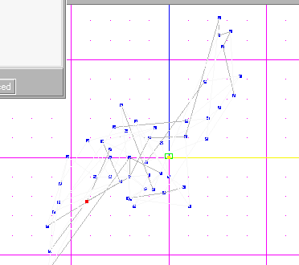
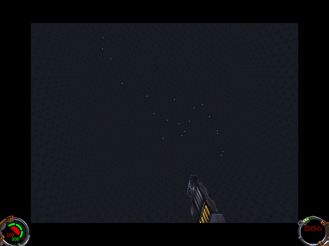

Author:

# Making .par Files the Easy Way  

by [EvanC](mailto:ev@wave.co.nz)  

  

-----

  
This tutorial tells you how to make particle files, the files used for
things like speres around people using force Protection(or is it
absorb?) and the green sparks you get when you respawn in an MP game.
These are very easy to do and if used right can be used for amazing
effects.  
  
Ok, you will need JED and notepad for this tutorial. Start JED up. Now,
take the default sector and cleave up it's SURFACES untill you get about
50 vertices in the sector. Here is wht mine looked like, yours doesn't
have to look like this at all though:  
  

  
  
Now, it's time for you to make the shape of the par file. All it is is a
group of vertice that are little points so, the shape you make has to be
with vertices and not surfaces. The shape I will make is a galaxy.  
  

  
  
It looks a bit like a galaxy :) You'll see that I haven't worried at all
about making the sector convex or the surfaces planar or any other
consistency errors. Thats because par files don't have anything but
vertices. Ok, export the sector as a 3do. After that, go open the 3do in
a text editor. Scroll down the 3do untill you find this line:

    VERTICES 50

(may not be exactly 50 but close to it). Copy that entire section from
the first vertice to the last with CTRL C. Open up another text editor
window and paste it in. ABOVE that paste this information:

    ###############
    SECTION: HEADER
    
    PAR 1.0
    
    SIZE .002
    
    MATERIAL 00teleport.mat
    
    LIGHTINGMODE 0
    
    
    ###############
    SECTION: GEOMETRYDEF
    
    # Object radius
    RADIUS   0.109546
    
    # Insertion offset
    INSERT OFFSET   0.000000   0.000000   0.108216

We have to change the radius line though. Get the "RADIUS" line from the
top of the 3do and paste it over the one in the par file. This header
came from a green par file but what we want is a white one to represent
stars. Change the "MATERIAL 00teleport.met" line into "MATERIAL
00ramp4.mat"  
  
Save this file as galaxy.par  
  
We have to now create a template for our par file. Here it is, paste
this at the bottom of master.tpl:

    # DESC:   galaxy particle file
    # BBOX: 0 0 0 0 0 0
    pargalaxy    none              orient=(0.000000/0.000000/0.000000) type=cog move=physics particle=galaxy.par angvel=(60.000000/60.000000/60.000000)

Now, run JED and insert the thing "pargalaxy" into your level.  
  

  
  
Notice I had to rescale it to a suitable size. Par files have so many
uses, you just have to be creative. This could be used for a hologram of
a galaxy in a control room.  
  
Evan C

-----

This tutorial courtesy of [ D A R K N E S S   F A L L
S](http://www.jediknight.net/darkfall/).
