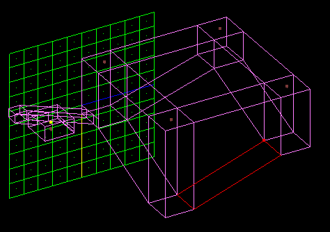
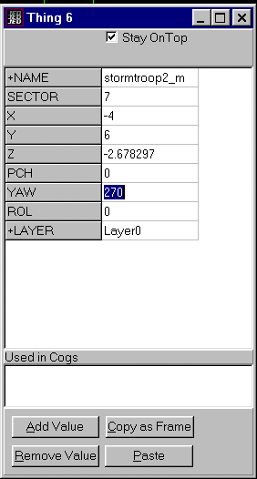
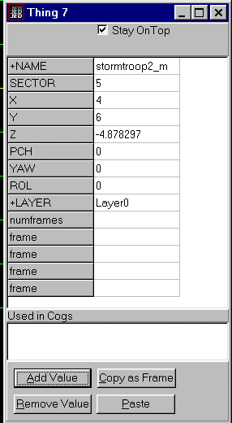
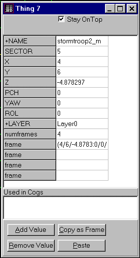
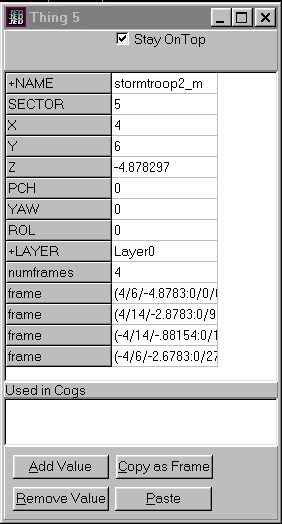
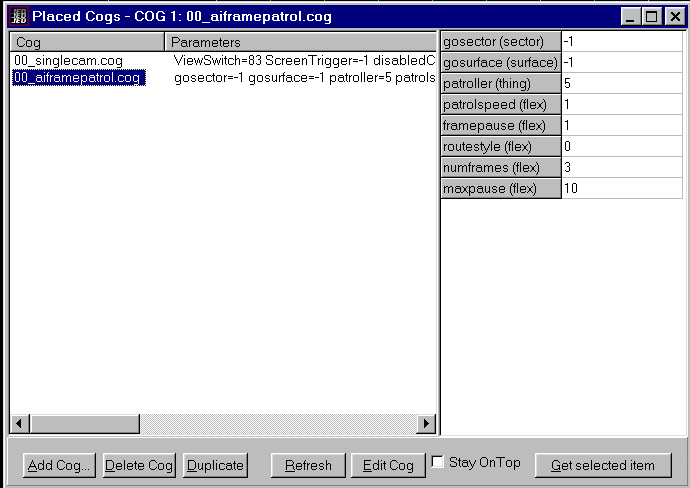

Author:## Tutorial: Patrolling Enemies

### By [Dino Delucchi](mailto:dino@giant.bnc.com.au)

-----

This tutorial shows how to use the 00\_AIFramePatrol.cog to make an
enemy that will patrol around a circuit.

-----

To demonstrate using the 00\_AIFramePatrol.cog, I have created this
small level. We make the patroller walk around the main part where the
four ramps are. I have set up four security cameras in the level so you
can see what happens.

  

-----

In this example we need four points (at the top of each ramp) for the
patroller to navigate by. Align the grid to the floor at each navigation
point and insert a stormtrooper at each point. We make the grid to the
floor so the inserted enemy is the correct distance off the floor. Then
make each of the four stormtroopers face the direction you want tham to
go from that point, that is, change the YAW. In this case they are all
multiples of 90 degrees.

  

-----

Select one of the storm troopers to be the first or start point. Add the
value NUMFRAMES once and the value FRAME four times in the item editor.

  

-----

The numframes value is 4, obviously. Now, click COPY AS FRAME and then
paste that into the first frame entry in the item editor.

  

-----

Get the other three frames from the other three enemies you placed at
the navigation points. Make sure you do this in the order that the
patroller will follow. Then delete the other three enemies as we don't
need them anymore.

  

-----

Now we need to set up the COG. Hit F7 to bring up the placed cogs dialog
box and add the cog 00\_AIFramePatrol.cog. You can look at the cog
details in the add cog box to see what the variables are, but we will
not change them at the moment. The ROUTESTYLE is the important one. We
will set it to 0 (it should be this by default) so that the patroller
continues around the circuit. Add the item number (5 in this case) and
add numframes as three. Numframes here is not four because you must
exclude the first frame.

  
Now save the JKL and GOB the file to test it and you will see (via the
cameras in this example) the stormtrooper making his patrol.

-----

### NOTES.

In this example, the cog runs at start up and continues until the enemy
is killed. An alternative is to make this cog run at a certain point and
then have the enemies go to a sector or surface. For example, the
WALKPLAYER uses a door and stormtroopers come running around a corner to
attack. I think this is possible, but I haven't quite worked out how to
do that yet. Perhaps someone else out there would like to contact me and
update this tutorial.

-----

Good luck and I hope you can make use of this technique.  
[Download the JED file for this tutorial](patroller.jed)  
Send comments to [Dino Delucchi](mailto:dino@giant.bnc.com.au)
