Authors: Brian, Josh, and Dave
  
This tutorial has really no purpose. Why do I say that? Well if you are
creating a level, and your polygons aren't exactly perfect, nobody is
ever going to notice. Why then, would you want to read this? Well for
things like spiral stairs and circular sectors, this stuff is really
pretty interesting. Take a read on through to see what you think.  
  
A square consists of 4 90 degree angles.  
  
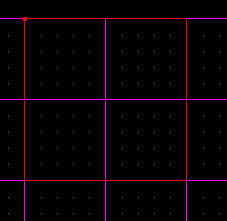  
  
If you cleave between the vertices on each angle 90 degree angle, you
will get 45 degree angles.  
  
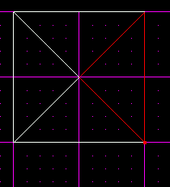  
  
Notice that there are only 45 degree angles in the outside corners of
the sectors. It is interesting to notice that when we connected the
vertices, it created 4 90 degree angles in the insides of the sectors.  
  
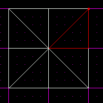  
  
Now we are going to cleave those so we get 45 degree angles in the
center.  
  
  
  
Now we have 8 sectors, each connected by 45 degree angles. Note that 45
\* 8 = 360. Also remember that in a perfect polygon, all the angles in
the center will equal 360 degrees.  
  
Now select any of the sectors. Its easiest if you try to find one that
has the index vertex in the center. The index vertex is the dot that
shows up when you select a sector.  
  
Once you have it selected, move your mouse away from those sectors and
press \[Insert\]. This will copy the sector. Line it up with the grid as
shown in the picture. This isn't necessary, but helps with lining up
later on.  
  
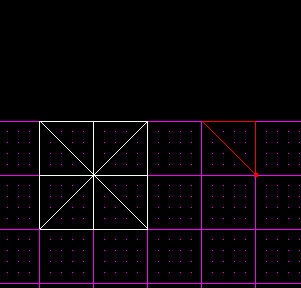  
  
Now, insert another one. With it selected, press \[F9\] to bring up the
tools menu. Use the radio button to select the "z axis." In the box for
rotate, type in 45 degrees. Then press the rotate button.  
  
Go back to your JED window, and line up your newly rotated sector as
shown below.  
  
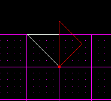  
  
Now, without de-selecting the new sector, press \[Insert\] again, rotate
it another 45 degrees, and line it up once again.  
  
  
  
Continue to do this until you get a complete circle of sectors. If you
add up the numbers, 45 \* 8, you get 360 degrees.  
  
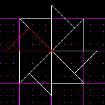  
  
Hmmm, looks kind of like the pinwheels I used to play with when I was a
kid. Anyway, now its time to cleave the points off each sector. This
will create the perfect octagon.  
  
To do this, just hold down shift while you cleave. This will snap to the
vertices, thus making sure everything lines up perfectly.  
  
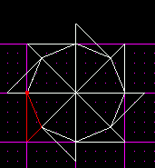  
  
Once you have cleaved them all, you can select each of the outside
sectors and delete them, leaving you with a great looking octagon.  
  
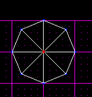  
  
If you go to 3d preview you can adjoin all the surfaces perfectly. You
can even merge them all if you want a perfect cylinder with no "inside"
surfaces.  
  
This was all fine and dandy. If you use this octagon for spiral stairs
using the technique shown in our [Spiral Stairs
tutorial](/tutorials/spiralstairs/), you will get some great results.  
  
But what if you want a higher ceiling in your staircase? Or what if you
want a dome (refer to the [Domes tutorial](/tutorials/dome/)) that's
very detailed? Now it's time for a perfect 16-sided polygon. Why will
this increase the height of the ceiling? Well just think about it. You
will be going up 2 steps in the area you only went up one step in an
octagon. The steps will be smaller, but will climb faster. You will be
able to see what I mean when you finish your 16-sided polygon.  
  
First off, make sure you know how to make an octagon. Then, select the
sector shown below from your 8-sided one. Note that if you did not get a
perfect octagon, this will not work.  
  
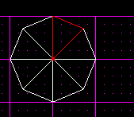  
  
Notice that I again picked one with the index vertex in the center. If
you do not do that, you will not be able to complete the process. If you
do not have one, you have to multiselect all your sectors, go to
side-view using \[Shift+2\], and cleave them all horizontally. Once you
do this, un-multiselect \[Backspace\], and you will be able to find
one.  
  
Now, use \[Insert\] to copy this somewhere else on your screen. Now
rotate it 22.5 degrees. Do this until the sector appears below, with the
top edge, opposite the index vertex, is exactly horizontal, and parallel
with the grid.  
  
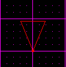  
  
Now this allows us to perfectly bisect the angle. To do that, press
\[Shift+s\] to align the grid with the sector. This will align it with
the index vertex. Now, cleave the sector in half vertically as shown
below.  
  
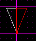  
  
What is a perfectly bisected 45 degree angle? 22.5 degrees. So, for an
8-sided, we use 8 45 degree angles. Then, for a 16-sided, we use 16 22.5
degree angles.  
  
Now its time to repeat the rotating steps above. Select one of the two
sectors and \[Insert\] it again somewhere else. Then \[Insert\] another
one, rotate it 22.5 degrees, and line it up using the index vertex.  
  
  
  
You can already see where we are going with this. Repeat the above steps
until you complete a full circle.  
  
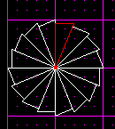  
  
Now, just as in the octagon, we need to use the \[Shift+c\] method to
snap our cleaves to the vertices.  
  
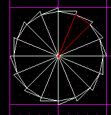  
  
Then, as before, you can go ahead and delete all the excess sectors,
leaving you with a perfect 16-sided polygon. You can adjoin and/or merge
all the surfaces on the inside to complete it. Sometimes after merging
all of them, you get a surface error. Just select the whole sector and
cleave the top and bottom off, delete the top and bottom, and the error
will be gone.  
  
Thus concludes our geometry lesson. Who said what you learned in
Geometry class isn't useful?  
  
You can download the .jed file that was used for this tutorial by
clicking [here](8-sided.jed).

