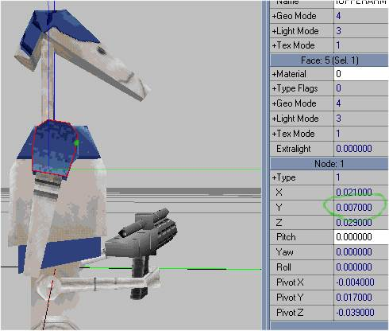
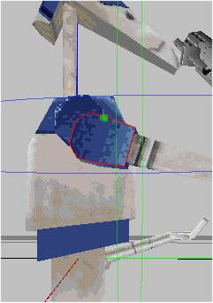
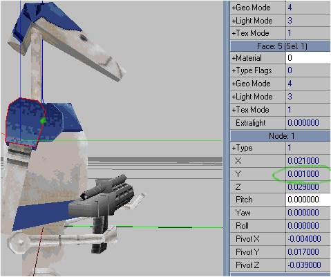
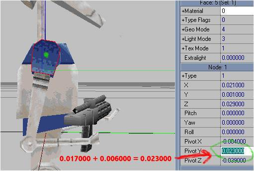

Author:\-------------------FIXING PIVOT POINTS ON
3DOS------------------------  
Authors: Mr. Xeinsane and Lilguy of Frontier Creature Creations

tools needed:

JED, Fun3do.

This tutorial will explain how you can take the 3do you've created, and
fix the pivot points on each mesh so you can create key frame animations
for it.  
  
1\. Open the 3do in Jed, and do a consistency check. If you get any
errors at all, make sure you fix them. If you get an error you don't
know how to fix, feel free to contact Lilguy on icq at 11933301. please
don't send Lilguy a 3do and ask him to fix it for you :)  
There is one thing you'll want to carefully do: delete any vertices that
connect only two lines, and those lines are collinear. Example:  
\-------\*-------  
These undetected extra vertices seem to render the surface they belong
to invisible in the JK engine.  
  
2\. To ensure that Fun3do and Jed won't have any conflicts, open the 3do
in Fun3do, save it, then do a consistency check in Jed again.  
Keep repeating steps 1 and 2 until there are absolutely no errors.  
  
3\. Texture your entire 3do. Try not to change your mind about how you
want the texture placed on the 3do, because you'll have to do the entire
pivot point fix again if you save it in Jed again.  
  
4\. open the 3do in Fun3do, and write down all regular xyz coordinate
numbers. (Pivot coordinates should all be at zero- if they are not, zero
them, then move your node to the place where you want it, then continue
to the next step)

*Figure1: here is an example of a node with an incorrect pivot point
(the pivot point is the green spot)*

  
  
5\. Move the node around (in regular move mode), the center (or place
where the place where it pivots around) of where you moved the node
being at the place you want the node to pivot at.  

*Figure 2: here is the node moved so the pivot point is in the correct
place:*

*Notice how the difference from the original position is 0.006000*

  
6\. Write the new numbers down. (Only the regular xyz coordinates, the
others shouldn't have changed)  
  
7\. Figure out the difference in each case (old numbers-new numbers)(so
they don't have to be reversed later)(xyz.)  
  
8\. Add this to the pivot coordinates respectively.

*Figure 3: here is the result of adding the difference to the pivot
point:*

  
  
  
  
Note: This messes up all the children nodes.

It's best to leave all the meshes in the $$dummy node until you fix the
pivot points, then arrange them one at a time. When you make a node a
child to another one, Fun3do moves the node out of place. Just move it
back to where it was, and everything should be all right.  
  
We hope this helps you, good luck with your new creation\!

*You can get a tutorial explaining many different aspects of creating
new enemies and actors at the homepage of  [Frontier creature
creations.](http://www.geocities.com/timessquare/zone/6310)*
