### The easy way

#### By Mike "LikWid" Watson

I've been interested in messing around with the 3do files since JK first
came out. I've been poking here and there, trying different things out,
seeing what worked, seeing what didn't. For a long time I wanted to be
able to make good, new player 3dos (my first attempt was the Santa skin,
but it wasn't as good as I hoped). Now, thanks to the latest version of
JED and a little smarts, it's possible to create new, good-looking
player models without too much trouble. This will require some knowledge
of 3dos and JED editing.

For this example, I'm going to make a new model of the Road Runner from
Loony Tunes. I picked this because it's very different from any existing
player 3dos, and changes will be obvious.

You need to start making this by importing your basic ky.3do in JED.
When you start editing, it should look like this:

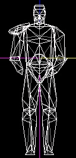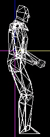

You'll spend a while editing the 3do until it looks like you want it to,
making sure that the basic mesh configuration stays the same. It now
looks like this:

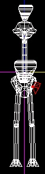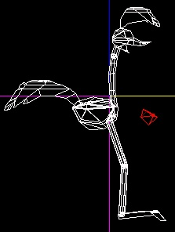

As you can see, the k\_torso mesh has been replaced by part of the neck.
The k\_hip mesh has been replaced by the body and tail. The arms are
replaced with tiny, invisible tetrahedrons. The rest of the body parts
are basically the same, transferred into a roadrunner shape.

Now you need to texture this. No real advice I can give here- just mess
with textures until it looks how you want. This is how the roadrunner
ends up looking in JED 3d preview:

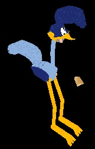

Now you need to go about turning this into a 3do. Save your JED file,
you'll need to open and close it a bit in the following parts of the
tutorial. Now select all of the sectors, so it looks like this:

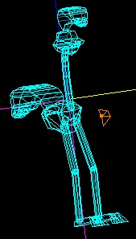

and export it as a 3do. Just call it temp.3do- it won't actually be used
for much in the end. Now in wordpad, open up that file and scroll down
the the texture list. It should look something like this:

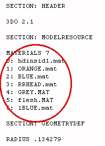

Keep that open- you'll need it in a minute. Go back to jed and start a
new project. This will be used to make turning the textured meshes into
the actually 3do- it'll save time, believe me.

You're going to have to create a sector with the same number of faces as
there are textures. This is quite easy in this case- just take the basic
box and cleave one side in half, so there will be seven faces. Then go
through each face one by one (starting with face 0) and put the
corresponding texture from the 3do onto it. Face 0 will have
hdinsid1.mat, face 1 will have orange.mat, face 2 will have blue.mat,
etc.

Now scale this sector so it is VERY very small (use the tool window,
generally a size change of 0.001 does the trick) and center it at the
origin. It will look about like this:

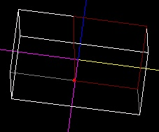

Save this file as box.jed and close it. Reopen the JED file in which you
built your model. Select the sectors that comprise 1 mesh- lets start
with the head. Copy the mesh, go back to box.jed and paste the mesh in
there. Now place the mesh so that it is centered how you want in the
3do. This is not necessarily the center of the mesh. To get a better
idea of how it should look, change the way things are viewed from boxes
to wireframes, and center Kyle's head on the origin. Then compare the
size of that to the size of the mesh. Here's a pic of the 2 on top of
each other:

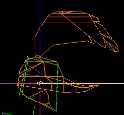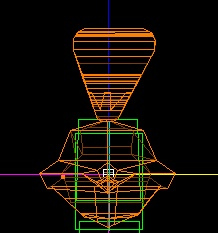

Now, select only the sectors that comprise the head, and change the
layer. I don't care what you change it to, just make sure that it's
different from the box in the center. Now it's time to export this mesh.
Select the head meshes, and THEN the center box last. Export the sectors
as a 3do- I would call it head.3do. Open it in wordpad, and scroll down
to the texture list. It should look the same as the one from temp.3do-
in other words, like this:

The only things which might be different are whether or not they're
capitalized. If there are differences other than that, you've done
something wrong. Go back and check to make sure you've done everything
exactly as told, from where you created box.jed file.

Do this for all of the different meshes- copy each from the main jed
file and paste it into box.jed. Export each as a separate 3do file, with
descriptive names for each mesh (torso is torso.3do, hip is hip.3do,
etc.) Check each time to make sure that the texture list is correct.

Now all that's left to put these meshes into a 3do is some simple text
splicing. Open kyle.3do and paste the texture list from temp.3do in
place of the list there. Then copy the mesh information for the main
mesh out of each of the 3dos and paste it in place of the mesh it
corresponds to in ky.3do. After you've done this with all the meshes,
you're done\! Try it out by putting it into your resource/3do directory,
using the -path thingy, with puppetjedi, whatever. It should now look
like this:

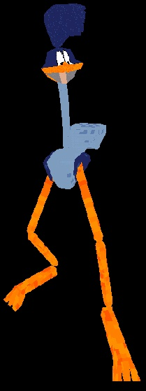

  
  

© Copyright 1998 [LikWid](mailto:jwatson@kent.edu) and [The Massassi
Temple](http://massassi.jedinights.com/).
