Author:
Making Your Own Pong Levels  

-----

Author: Mike "LikWid" Watson  
  

Before you try making a pong level, you should have a decent amount
experience with jed- you should know how to add templates, place cogs,
set frames for objects, and the like.

**[Download this first\!](neededfiles.zip)**  
This contains all the files necessary to make a pong level: the COG
files, the new templates, etc.

Note that even if you have the original "For Authors.zip" you should
download this, because the cogs have been updated and are now much
easier to work with.

### 1\. Structural requirements for a pong level:

  - **A lobby:** where players will first spawn.  
    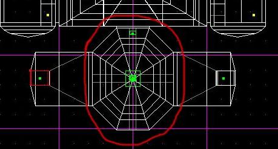

 

  - **2 team entrances:** 1 red, 1 gold. Best way I've found is doorway
    leading to a vertical shaft, which is cleaved into 3 sectors
    horizontally (so there are 3 sectors stacked on top of one
    another)  
    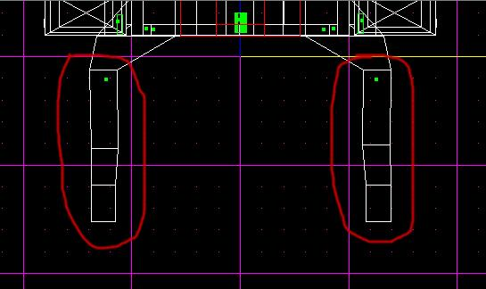

 

  - **2 control rooms:** 1 red, 1 gold. These must be split up in a
    certain way. In front of the viewing window through which you watch
    the action, there must be three sectors lined up in a row. There
    also must be a button used for "serving" the ball, and a cancel
    switch. It's best if each of these control rooms has exactly 8
    sectors- if they don't you'll have to do a little bit of cog
    editing- don't worry, I'll lead you through that later on.  
    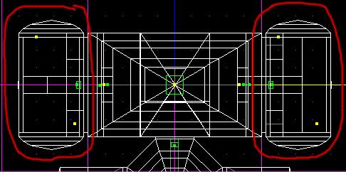

 

  - **An arena:** at either end there must be a sector which will be
    designated as the goal.  
    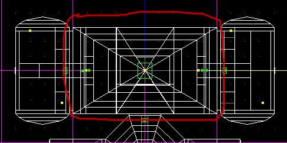

  - **4 scoring surfaces:** 2 red, 2 gold.  
    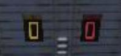 

 

### 2\. Item requirements for a pong level:

Once you have your level built the way you want it, you should start
adding the items. Here is how you'll need the items set up.

  - **24 walkplayer things:** the first 8 will be the locations the red
    player will respawn if he dies, which should go in the red control
    center. The next 8 will be where the gold player respawns- these
    should be placed in the gold control center. The final 8 will be
    where the players who are in the lobby respawn. They should, of
    course, be placed in the lobby.**  
    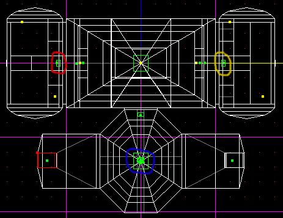**

  - **2 paddles:** 1 for the red player, 1 for the gold. Each of these
    paddles should have 2 frames- the 1st at the furthest position to
    the left that the paddle will reach, to 2nd to the furthest position
    on the right of the paddle.  
    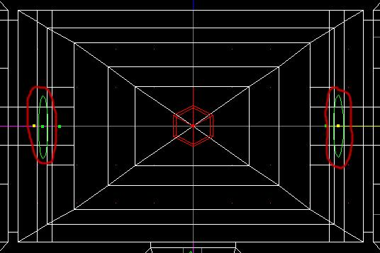

  - **4 ghosts:** 2 for the places the ball starts, 2 to make sure the
    player can safely enter the level. The first ghosts should be placed
    at the locations that you want the pong balls to appear when the
    players serve- 1 for gold, 1 for red. Make sure you have them
    pointed in the direction you want the ball to go as well. The second
    2 ghosts should be placed at the tops of the entrance shafts.  
    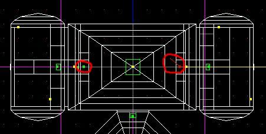  
    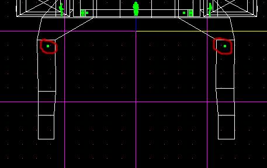

 

 

### 3\. Setting up PONG\_MAIN:

Now that you have all the sectors, surfaces and things set up correctly,
it's time to start assigning these values in the actual pong game.

For this part, you need to get the Pong cogs. These are available in the
zip at the top of the tutorial- they've been cleaned up a bit from the
ones in the original release, so they're easier to set up. Stick those
cogs into your project directory and then, using the "Placed cogs"
window in JED (F7) place those cogs into the level. Now, select the
first cog, pong\_main.cog, and let's start assigning those values.

  - 1: Noteam\_reset: These should be one of the last 8 walkplayers- the
    ones where the players without a team respawn.

  - 2: Red\_reset: One of the walkplayers for the red player

  - 3: Gold\_reset: One of the walkplayers for the gold player

 

  - 4: Red\_ball: The Thing where the pongball starts when red serves

  - 5: Gold\_ball: The Thing where the pongball starts when gold serves

 

  - 6: Red\_paddle: The red paddle

  - 7: Gold\_paddle: The gold paddle

 

  - 8: Red\_button: Red's serve button

  - 9: Gold\_button: Gold's serve button

 

  - 10: Red\_cancel: Red's cancel switch

  - 11: Gold\_cancel: Gold's cancel switch

 

  - 12: Redscore, Redscore1: The surfaces that display Red's score

  - 13: Goldscore, Goldscore1: The surfaces that display Gold's score

 

  - 14: Red\_center: The center sector of the 3 with which red moves his
    paddle

  - 15: Red\_left: The left sector of the 3 with which red moves his
    paddle

  - 16: Red\_right: The right sector of the 3 with which red moves his
    paddle

  - 17: Gold\_center: The center sector of the 3 with which gold moves
    his paddle

  - 18: Gold\_left: The left sector of the 3 with which gold moves his
    paddle

  - 19: Gold\_right: The right sector of the 3 with which gold moves his
    paddle

 

  - 20: Red\_enter: The sector in the red entrance shaft that sticks the
    player in the red control room

  - 21: Gold\_enter: The sector in the gold entrance shaft that sticks
    the player in the gold control room

 

  - 22: Gold\_score: The sector which gold has to hit the ball into to
    score on red- the sector is right in front of Red's control room.

  - 23: Red\_score: The sector which red has to hit the ball into to
    score on gold- the sector is right in front of Gold's control room.

 

### 4\. Setting up PONG\_SAFEENTRY.COG

Ok, that wasn't so hard, now was it? We're now ready to move on to
Pong\_Safeentry.cog. This one's a lot easier than the last.

  - 1\. Mark\_red1: The sector at the VERY BOTTOM of red's entry shaft-
    below the Red\_Enter sector you set in Pong\_Main.

  - 2\. Mark\_gold1: The sector at the VERY BOTTOM of gold's entry
    shaft- below the Gold\_Enter sector you set in Pong\_Main.

 

  - 3\. Ghost\_red: The ghost you placed at the top of red's entrance
    shaft

  - 4\. Ghost\_gold: The ghost you placed at the top of gold's entrance
    shaft

 

### 5\. Setting up PONG\_RESPAWN.COG

Ok, and now onto the last cog, Pong\_Respawn. If you have exactly 8
sectors inside each of your control rooms, proceed with this section. If
you have more or less than 8 sectors in the control rooms, go down to
the next section, entitled "THE HARD WAY".  

### THE EASY WAY

  - 1\. Mark\_red: The same sector as Red\_enter in pong\_main

  - 2\. Mark\_gold: The same sector as Gold\_enter in pong\_main

 

  - 3\. Red1 - Red8: Each of the sectors which make up red's control
    room. The first sector is red1, second is red2, etc.

  - 4\. Gold1 - Gold8: Each of the sectors which make up gold's control
    room. The first sector is gold1, second is gold2, etc.

 

### THE HARD WAY

For all of you who chose to be more creative with your levels, you'll
have to do a little more work. Don't worry, this won't be all that
difficult. First determine how many sectors there are in each of your
control rooms. Now open up pong\_respawn.cog in notepad, and find the
section that looks like this:  
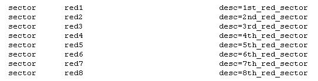

 

 

 

  
Now add to that list so there are the right number of sectors for the
red control room. Let's say you have 13 sectors instead of 8- when
you're done it should look like this:  
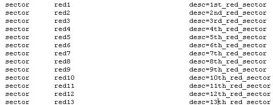

  
Now find the section that looks like this:  
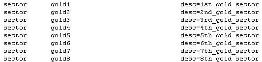  
And do the same, add the number of sectors so it's the same as in gold's
control room. Once again we'll go with the number 13.  
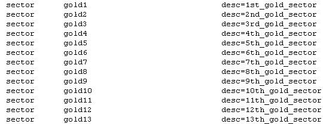  

  
Now that you've done that, scroll down to the section that looks like
this:  
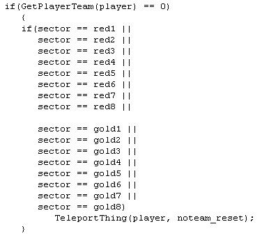  
And change it so it has the right number of sectors for red and gold,
and looks like this:  
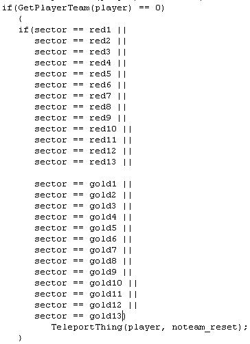  

  
Then do the same for each of these:  
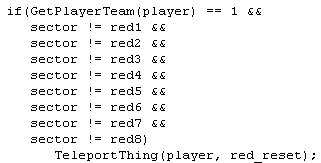 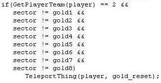  
So they look like this:  
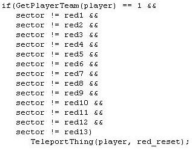 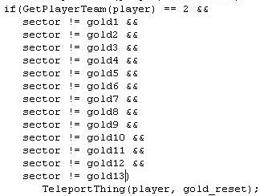  

Now save it, go back to the placed cogs section and set Red1-Red13 and
Gold1-Gold13 to the sectors which make up your control centers for red
and gold.

 

### 6\. FINAL SETUP

Ok, set up your episode.jk and cogstrings.uni like with any other level,
then paste this into cogstrings.uni:  

***"COG\_01001" 0 "Welcome to Jedi Knight Pong\! Programmed by LikWid"  
"COG\_01002" 0 "The Gold Player has won\!"  
"COG\_01003" 0 "The Red Player has won\!"  
"COG\_01004" 0 "The game is over."  
"COG\_01005" 0 "The other player has left the game."  
"COG\_01006" 0 "Unfriendly Mode"  
"COG\_01007" 0 "Time Limit = "  
"COG\_01008" 0 "Score Limit = "  
"COG\_01010" 0 "Gold Scored\!"  
"COG\_01012" 0 "Red Scored\!"  
"COG\_01019" 0 " has "  
"COG\_01020" 0 " point."  
"COG\_01021" 0 " points."  
"COG\_01022" 0 " "  
"COG\_01025" 0 "The Red player has requested to end the game."  
"COG\_01026" 0 "The Gold player has requested to end the game."  
"COG\_01027" 0 "The game was called on account of something."***  

and update the message count.  

**Okay, you're done\! Now go save your JKL and go test out the level...
if you've done everything just as I said, it should work\!**
