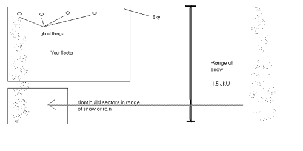

Author: Rain
and Snow Tutorial  

-----

Author: [Zagibu](mailto:swisshome@freesurf.ch)  
  

This simple tutorial will teach you how to add good looking rain or snow
to your level. You need to know how to create simple levels and how to
add things and cogs to them. The snow or rain will cause minimum lag and
framerate drop, due to the use of particles instead of sprites or
animated sector surfaces. Just remember not to add too many ghosts.

**Note:** Be sure to [download the
files](http://files.massassi.net/tutorials/rainsnow.zip) used in this
tutorial before proceeding.

1.  Build your level.  
      
2.  Set everything up as described in rainsetup.txt  
      
3.  Choose the open areas where you would like to have rain or snow in
    your level (usually the sectors with a skyflagged ceiling).  
      
4.  Create ghost things in these sectors, just below the sky, make sure
    they have pitch entries set to -90. Refer to the picture at the end
    (sorry for the bad quality of the picture, but I have only MSPaint
    installed at the moment). I suggest a horizontal distance of 0.5 - 1
    JKU between the ghosts. The distance to the sky should be quite
    small.  
      
5.  Place the particlestream10.cog into your level and fill in the
    fields (Placed Cogs F7). Enter the thingnumbers of your ghosts in
    the streampos fields. There can be 10 ghosts for each cog. If you
    want more ghosts, add more cogs. The stream field must either be
    filled with +rain or +snow, depending on what you want to do.
    Finally, the interval determines how often the effect is recrated,
    it's the delay in seconds. Leave the default value (0.25) there.  
      
6.  Save the .jkl and gob your level. That's it, rain or snow is falling
    down on your head.

If you want to know more about the effect itself (the particles), open
your level's .jkl or the master.tpl in JED\\Jeddata with a Text editor
and search for +snow or +rain. The values you find there are explained
in other tutorials on Massassi, such as the [template
reference](/tutorials/template_reference/) or the [weapons
templates](/tutorials/weapon_template/), and you might want to check the
jkspecs for explanation of the flags. If you want a sample level with
snow, download [Hoth Defense Station](/levels/files/866.shtml): it uses
the same technique and almost the same particles...

**Note:** The falling distance of the two particles are set to 1.5 JKU,
so make sure you have no enclosed rooms below within this range, or the
effect will there be seen, too (look again at the picture). To adjust
the range change the timer value of the template. You can also change
the vel value (velocity), because the range is timer \* vel, but this
will probably destroy the rain or snow feeling...

