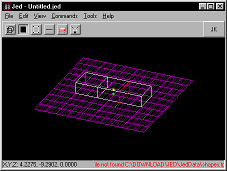
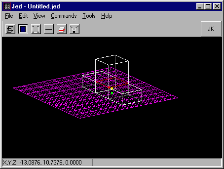
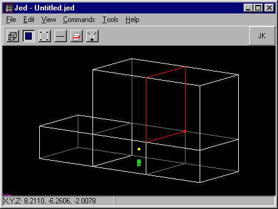
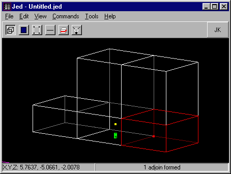
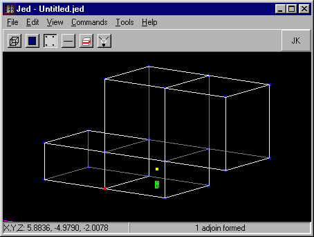
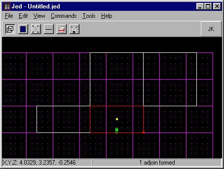
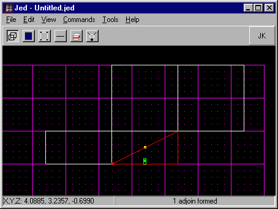
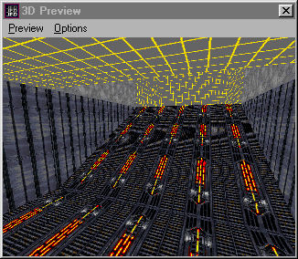

Author:
Ramps and Slanted Walkways  

-----

Author: [Brian Lozier](mailto:brian@massassi.net)  
  

The first part of this tutorial will show you how to link two rooms
together with a slanted walkway (ramp). It is very basic. The second
part will show you how to expand upon that concept to create a multitude
of interesting features you can use in your levels.

1.  Start with the default sector in Jed, choose a surface, select it,
    and extrude it, using the \[x\] key. Then, extrude the exact
    opposite surface of the original sector. You should have 3 sectors,
    adjoined like this:  
      
    
      
      
2.  Now, extrude the top surface of the original, center, sector.  
      
    
      
      
3.  The next step is to select the top surface of one of the remaining
    two "outside" sectors, and extrude that. It should be the exact same
    height as the extrude of the center sector. Now, select the surface
    between the two top sectors, and adjoin it using the \[a\] key. This
    will allow you to pass between the two sectors.  
      
    
      
      
4.  Now, select the bottom corner sector (you must be in sector mode),
    and delete it using the \[delete\] key.  
      
    **Note:** This is the sector you must delete:  
      
    
      
      
    **Note:** This is how it should look after you delete the sector:  
      
    
      
      
5.  Now, I suggest you save a backup copy of this level so far, because
    I will work off of it in my next tutorial, on catwalk-like ramps.  
      
6.  Okay, now use the \[shift+2\] keys to get a side view, and select
    the original sector, as shown in the illustration below.  
      
    
      
      
7.  Press the \[c\] key to invoke the cleaver, and cleave a diagonal
    line as shown below, from the bottom corner of the default sector,
    to the opposite top corner.  
      
    
      
      
8.  Okay, now delete the bottom sector that resulted from your previous
    cleave. It is the one that is selected in the above diagram.  
      
9.  This is the end result, textured for clarity, of course:  
      
    

For a more advanced application of this concept, head over to the
[Intermediate Ramps Tutorial](/tutorials/ramps2/).
