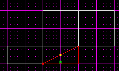
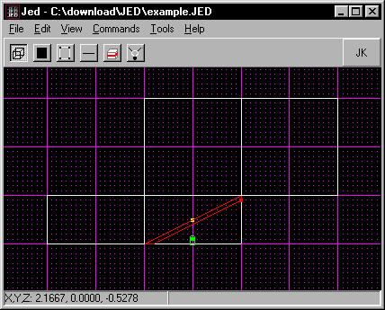
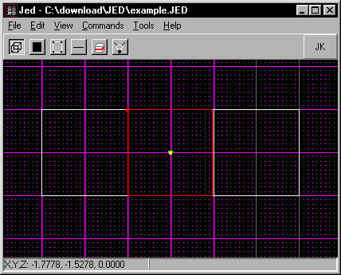
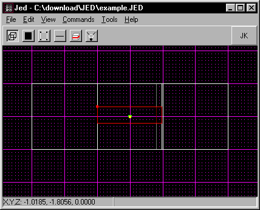
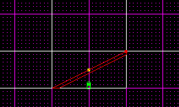
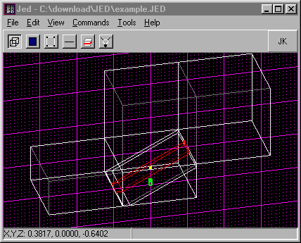
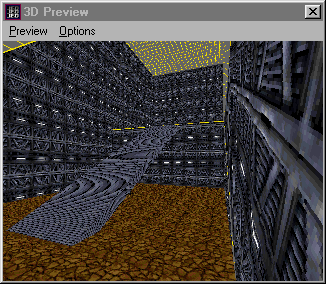

Author: Brian Lozier

It is recommended that you work through the first [Ramps
Tutorial](/tutorial/ramps/). We will begin here using the following
project that I suggested saving in the last half:

**Note:** this is before the bottom cleaved sector was deleted\!

Another thing, for this tutorial, since there are more precise cleaves
required, I have switched the grid dots to 0.1, and the snap to 0.1. As
I just said, this will allow you make more precise cleaves. 

1.  The first step in this tutorial is to cleave the bottom cleaved sector
    (the one selected above) just below the original cleave, like
    illustrated below.

    

2.  Now making sure the SECTOR shown above is highlighed, switch to the top
    view using \[shift+1\].

3.  You will notice that the sector now looks square, but remember, it is
    slanted upwards, you just can't see it from this view.

    

4.  Now it's time to make 2 cleaves, creating a ramp in the center of your
    room, going up. Follow the diagram below to see where to make the
    cleaves. I suggest switching back and forth between side and top view to
    make sure you have the correct sectors selected before cleaving\!

    

    Note: if you did it correctly, your side view should still look like
    this:

    

5.  Now, almost done already\! Make sure the sector below is highlighted,
    and delete it\!

    

6.  Below is the finished product, textured for clarity of course:

    
