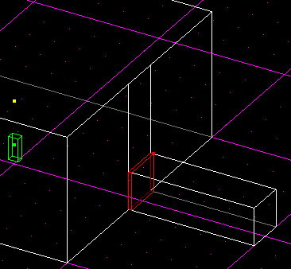
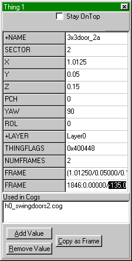
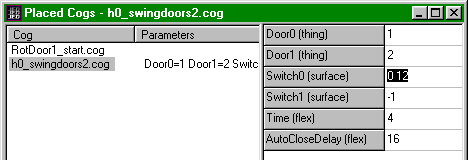

Author: Heinz Högel

Without doors every level would be extremely boring. They add a good
amount of uncertainty  to a Jedi Knight's playground (who knows what is
waiting behind them). But their appearance lacks a specific element of
realism: they're always sliding up or aside and don't swing open like
real-life doors. Well, in a high-tech environment like a spaceship or a
station that makes sense, it's just the appropriate design for the Star
Wars universe. But what about normal houses and low-tech areas? Ask an
engineer or a carpenter how easy a swinging door is to be made compared
with those sliding closings. No need for hollow spaces behind the walls,
just a plain opening with a door in it.

If you look around in the original JK levels you won't find any
exemplars of these real-life type doors. At first glance the reason for
it seems to be: the JK engine can only move things along a linear path
without changing it's orientation. But wait, there *are* definitely a
lot of rotating things (ships, actors, fans etc.) — so how is that done?
The answer depends on the type of thing. I.e. a fan has a rotational
velocity (and according flags) given to it in it's template and it
rotates constantly (stopping a fan by damaging it is done by replacing
the rotating fan with a static one). An actor or ship is animated by
so-called keyframes (.KEY files), that are much to difficult to make for
most of us amateur level designers (at least until a 3DO editor appears
with animating features for KEY files).

However, there are rare examples of rotating doors in the original game:
level 9 (the ramps opening to Fuel Station's big pipes area, the giant
semicircle doors in the pipe area itself and some concave doors in the
inner pipe walls) and 10 (the large cargo doors in the ship's exterior
area). Investigating more deeply into these levels you will find the cog
scripts used to control these special doors: **09\_tilting\_floor.cog**,
**09\_pipedoor*xx*.cog** (*xx* stands for variations) and
**10\_cargodoors.cog**. Besides the level specific extra code these
scripts are very similar to normal door scripts. Their "secret" is the
use of the function **RotatePivot()** instead of the usual
**MoveToFrame()**. Because this function isn't documented in the *Jedi
Knight Unofficial Specs* (version 0.3) yet, I did this little tutorial
to give you an idea on how to use it for swinging doors.

What I have in mind is a double wing door swinging open to both sides of
the door frame. I assume that you're pretty experienced in making
standard doors, so I will only discuss steps in detail that are
different or new for rotating doors.

First, we need a room with an adjoined corridor. The corridor should be
twice as wide as a single door wing and exactly as high. Also, you can
cleave a sector at the entrance to the corridor that is as deep as the
door wings are (this is not a must with the cog script I will present
later). And of course the corridor can be a very small sector just to
connect two separate rooms.

 

<table>
<colgroup>
<col style="width: 50%" />
<col style="width: 50%" />
</colgroup>
<tbody>
<tr class="odd">
<td>

</td>
<td></td>
</tr>
</tbody>
</table>

Next, we insert the door wings themselves into the beginning of the
corridor. I used **3x3door\_2a** and **3x3door\_2b** for this example
(each wing: height 3 m, width 1.5 m,  depth 0.25 m).  
 

<table>
<colgroup>
<col style="width: 50%" />
<col style="width: 50%" />
</colgroup>
<tbody>
<tr class="odd">
<td>

</td>
<td></td>
</tr>
</tbody>
</table>

As usual with normal doors each door thing needs four additional entries
in the thing editor: THINGFLAGS (0x400448), NUMFRAMES (2) and two FRAME
entries. The value of the first frame should be the position of the door
itself (simply click on the "Copy as Frame" button and paste it (Ctrl+V)
as the value of the first FRAME entry.

The second frame makes the difference: It's not a positional frame like
those used with normal doors (that is: it's not the end position of the
door). Instead it's something the JK programmers call a "rotational axis
frame" (according to some rare comments in JK cog scripts). The X, Y and
Z values of such a frame define a center point (pivot) around which the
door (or other thing) shall rotate. The values of PCH, YAW and ROL
define the amount (angle) and direction of rotation.

You can define the second frame this way: Insert temporarily a (ghost)
thing and move it to the position of a (nonexistent) hinge of the door.
The Z coordinate doesn't matter here, so you can do this all in top
view. Then copy the coordinates of that auxiliary thing to the second
frame of the door (again with the the "Copy as Frame" button and
Ctrl+V). Set the PCH and ROL parts of that frame (first and third value
behind the colon) to 0.00000, if they aren't already. Insert as YAW
value (second part behind the colon) the opening angle (that is: how far
the door will swing open) - angles between 90.00000 and 180.00000
degrees would be appropriate for a realistic door (depends on the
architectural details around that door). In top view a positive angle
goes counter-clockwise. Of course, for a two wing door you have to go
through that procedure twice.  
 

<table>
<colgroup>
<col style="width: 50%" />
<col style="width: 50%" />
</colgroup>
<tbody>
<tr class="odd">
<td>

</td>
<td></td>
</tr>
</tbody>
</table>

Finally you have to link a control cog script to the doors.
Unfortunately you can't use one of the predefined scripts from the game,
because there is no standard script for swinging doors like
**00\_door.cog** for sliding doors. Therefore I present kind of a
standard script for our purpose here. It's not as sophisticated as the
JK scripts tend to be (no special treatment of the door sector for
example) but basically it's doing the job it was crafted for:
[h0\_swingdoors2.cog](h0_sd2.txt).

Place it in your level directory and add it to the placed cogs list. Six
parameters have to be filled in:  
 

 

|                    |                                                                                                                                                                                                                                            |
| ------------------ | ------------------------------------------------------------------------------------------------------------------------------------------------------------------------------------------------------------------------------------------ |
| **Door1, Door2**   | The thing numbers of the two door wings.                                                                                                                                                                                                   |
| **Switch0**        | The surface ID of a switch I added to a wall near the doors. By activating this switch you can open or close the doors. The switch is displayed in activated state as long as the doors are moving.                                        |
| **Switch1**        | Same function as Switch0. Not used in this example, therefore set to —1.                                                                                                                                                                   |
| **Time**           | This time (in seconds) determines the duration of open/close actions.                                                                                                                                                                      |
| **AutoCloseDelay** | Normally you have to activate one of the switches once more to close the doors again after they were opened. Setting AutoCloseDelay to a positive value causes the doors to be closed automatically after the specified time (in seconds). |

   
That's all, folks\! Save the level and start it in JK. Activate the
switch and voilá — the doors swing open.  
 

<table>
<colgroup>
<col style="width: 50%" />
<col style="width: 50%" />
</colgroup>
<tbody>
<tr class="odd">
<td>

</td>
<td></td>
</tr>
</tbody>
</table>

   
Heard the noise? It comes from the same source as with normal doors, and
that is the SND file specified in the template of the doors. In this
particular case it's **med\_door.snd** linked to the **3x3door\_2a**
thing:

> 
> 
>     # Foley description for medium doors
>     startmove df_door2-1.wav  0x0     0.1  1.0
>     stopmove  df_door2-3.wav  0x0     0.1  1.0
>     moving    df_door2-2.wav  0x0001  0.1  1.0   0.5

The flag value 0x0001 in the "moving" action class causes the sound to
be repeated until the move stops. If you would like to hear different
sounds or even none of them at all, you can add a template to the JED
master list, based on the door you've chosen and overloading the
soundclass adjective with the name of a self supplied SND file that
contains the sounds you want. Done in this way you can use a SND file
without the action classes *startmove*, *stopmove* and *moving* to make
your door silent. Also notice that, in our little example, only the
**3x3door\_2a** thing has a SND file associated. The second door wing is
"silent by nature" — otherwise every sound would be played twice\!

One more annotation: Rotating doors (or similar things) ignore the
sector geometry around them. Therefore you don't have to worry about
little edges or ledges hindering the door from moving along the planned
path. But look out for other things with move class "physics" (i.e.
actors of all kind, displaceable crates, debris etc.) - they will block
the rotation\! Doors with vertical rotation axes will push away such
obstacles in many cases, however there is no guarantee for that\!  
   
You find the described door example as a (very small) demonstration
level here:  [rotdoor1.zip](rotdoor1.zip)
