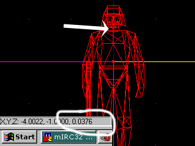

Author: Captain Ramen

Questions? Drop 'em off at our [forum](https://forums.massassi.net/).

-----

This tutorial shows how to do regional damage in JK / MotS. It was
surprisingly easy to do, but only because the damage can only be applied
in vertical 'layers,' with a front and back section for each layer. JK /
MotS actors don't collide in the legs, and determining where the arms
are with vectors is damn near impossible.

You'll need a solid understanding of cog and how to set up variables.
This cog only contains 2 messages, *damaged* and *killed*. You'll have
to put in *skill* and any other messages you might want in yourself.

For human actors you'll only need two layers, chest and head. I suppose
you **could** add a third layer for the groin, but that's up to you.
This tutorial won't cover that.

### Step 0: Download the Sample Actor Cog

This step is pretty easy. Click [here](actor_lsp.cog) to get it. Open it
up. Take note of the following variables: *HeadDist*, *HeadFactor*,
*BackheadFactor*, *ChestFactor*, and *BackFactor*. You'll have to fill
those in.

### Step 1: Measure Your Actor

I'm assuming that your actor model is already complete. Insert your
actor's template into a level. Figure out how far the bottom of the head
region is from the thing's center. Insert this value into the HeadDist
variable. I personally use 0.0036, but you might want to do something
different.

### Step 2: Damage Factors

Here's where you decide how much damage each area should receive before
killing him off. Use the deafult values or play around until you get
what you want.

I have four variables here because there are two layers ( \<= HeadDist
and \> HeadDist ), and a front and back to each layer. I figured that
most JK / MotS actors wear helmets, so face shots and back of the head
shots should recieve different amounts of damage.

### Step 3: Other Variables

The only other variable you need to set us what powerup the actor drops
when he dies - *powerup*. Right now it's *+dstrifle*.

You might want to do other things with this cog, like change the model
depending on where the actor gets shot, create special templates
depending on where the actor gets shot, play a key, etc. It's all
dependent on **your** imagination.

### Step 4: You're Done

That's all there is to it. You might want to add a *skill* message. JK
and MotS have different stuff here, which is why I left it blank. Plus,
DFA doesn't concern itself with *skill*. =)

When testing it, I recommend that you turn 'autoaim' off. You won't be
able to get headshots with it on.
