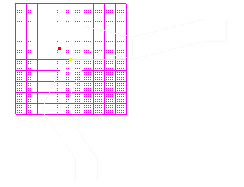
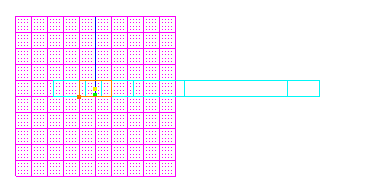
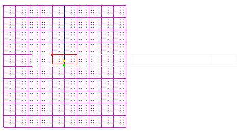
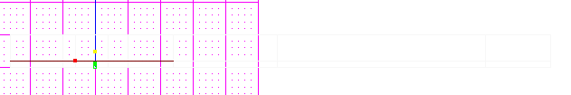
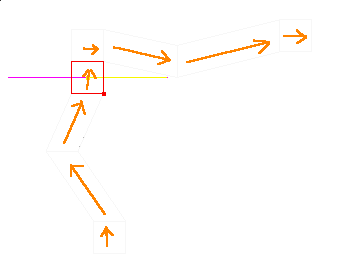
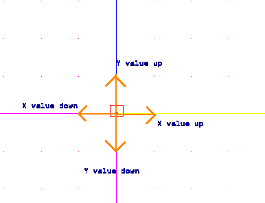
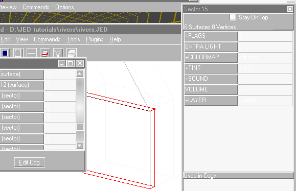

Author: EvanC  
  
When making a level, there are a few little tricks you can learn to make
the level a little bit more interesting and a lot more fun to play. One
good trick is to have dynamic flashing lights, patrolling storm
troopers, or possibly flying ships. But the best thing you can add to a
level to make it interesting is water. Simple old water. It adds a whole
new feel to a level if you have water that the player has to splash
through to finish their objectives. If the water is flowing and moving
it makes it far better. That is the subject of this tutorial: How to
make a river.  
  
Now, this tutorial is made with the assumption you know a bit about JED
and have a river system already put down. Because of the almost
unlimited types of rivers, this tutorial cannot tell you exactly how to
do each one, but it will tell you how to make a simple river.  These
ideas can be used on all sorts of water creations, from small streams to
huge canals.  
  
Here is the shape I have chosen for my river. These are the defaut
square in height(1 JKU):  
  
  
  
The first step in transforming this into a river is to cleave out the
water sectors. Multi-select all the sectors and move the grid and view
so it's side on to the sectors (usually shift+2 or shift+3):  
  
  
  
Now, push "c" and make a cleave along the sectors. Make the cleave
however deep you want the river to be. In this case it is 0.2 deep.  
  
  
  
What you will see in 3d preview is still the same as what you had
before; no water surface. To add this in we take advantage of one of the
greatest JK editing inventions ever, multi-select. Without this the job
would be much longer. Anyway, select one of the adjoins between the
river sectors and the air sectors:  
  
  
  
Then, draw a box along the other adjoins like this(hold alt and then
drag):  
  
  
  
They all should be multi-selected. Go to the item editor menu and then
change the "GEO" value to "4". This makes the surfaces visible in 3d
preview but they are still in dflt.mat Change the texture in the item
editor to a water one, like 00fwater.mat.  
  
Now we have two layers of sectors each seperated by a layer of water.
But, the water sectors still won't behave like water in JK. To do that,
clear your multi-select by pushing backspace and then select one of the
underwater sectors. Drag along a box again and select all the lower
sectors. Go to the item editor menu box and double click on the flags
value. Check the tick-box beside "underwater" and hit "ok." Then double
click on the "tint" value and change the tint to one of the blue
colours. You now have the choice of adding a sound to the sector, I
personally don't like having one though. Please yourself. If you don't
know what to do there is a good tutorial at this site that tells you how
to make water sectors with sounds.  
  
Now, it might be a good idea to go through the river in 3d preview and
align the textures. This is explained in the basic editing section under
"stitching". Remember to align the surfaces on the top AND bottom of the
water.  
  
The water at the moment is completly still. It doesn't flow at all. You
want it to flow, to give it that added realism. Some tips for this:

  - Don't make it go uphill. This just looks pathetic and takes away
    from the level.
  - Make it follow a realistic path. Make it flow in one direction and
    one direction only, don't have it change ways just like that.
  - Making water falls can pay off, it isn't covered in this tutorial
    however so for now make the river as flat as possible.

The path I have chosen for my river is one going up from the bottom(view
is set at position 1):  
  
  
  
You now know where you want to make the river go but you don't know how
to make it go there. Normally you'd need to make your own cog but I have
made one already you can use.  
  
[Download cog](river.cog)  
  
Put it in your project directory. Push "f7" and go to the placed cogs
menu. Add the cog to your level (if you don't know how look in the basic
editing section). You will notice it has a lot of values in this
pattern:  

```
vec1(vector)  
...  
...  
vec12(vector)  
top1(surface)  
bottom1(surface)  
...  
...  
top12(surface)  
bottom12(surface)  
water1(sector)  
...  
...  
water12(sector)  
speed(flex)  
```
  
An explanation: The vectors are the direction that the water flows in
that section of your river. The surfaces are the top and bottom of the
water adjoin (the ones that are the water texture). The sectors are the
underwater sectors(the ones with the tint).  
  
Now, go to your first sector and work out a direction vector. There are
some good tools for this called things like "vector calculator" ETC.
They usually have good documentation with them that will help you use
them. I prefer to work out my vectors by eye though, saves time. Here is
how you do it; Make up an imaginary point in the middle of your sector.
Now, go up/down/across 1 grid square from there in the direction of the
river. See how far you have moved across the square. Remember, a vector
is filled in like this (X/Y/Z).  
  
  
  
Once you have that vector, fill it in as "vec1". Take the sector you
just worked with and enter that in the cog as "water1". The vector for
my river is (0/1/0).  
  
  
  
Now select the adjoin between the underwater sector and the air. Fill
that in as "top1". Do the same for the opisite side of the adjoin only
put it in as "bottom1".  
  
Repeat this process for all the vectors, sectors and surfaces. Now go
choose a speed value. 1 is a medium strength river, the player can swim
up and down it fairly easily. 2 is a fast flowing river and the player
has difficulty going upstream with this on. Any higher you just get
faster and faster. Remember, in real life rivers flow differently
depending on angle,width and depth. Make sure the speed you choose suits
your river.  
  
I hope this tutorial helps you with your level, as said before, flowing
water adds an awful lot to a level. It can be used to make interesting
puzzles as well.  
  
Good luck with your rivers and if you need any extra help don't
hestitate to ask me.  
  

© Copyright 1998 EvanC and The Massassi Temple
