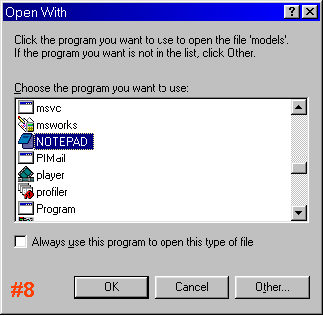
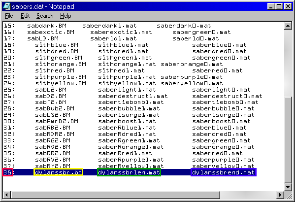
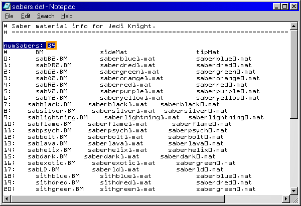

Author: Dylan

First off, download ConMan (Container Manager). You can get this in the
[programs section](/programs/).

After running ConMan, find the Res2.gob file (probably on the CD, it may
be in your Jedi Knight\\Resource folder). Open the file. After you have
done that, follow these directions:

1.  Select the "**misc**" GOB directory.  
2.  Select the files "**models.dat**" and "**sabers.dat**" using the
    **\[CTRL\]** key to multiselect.  
    **NOTE:** sabers.dat is the only file
    required to add multiplayer saberss, but you should also extract
    models.dat while you're at it since
    you'll need it if you want to add new models.

3.  Go to the **File Menu** and click on **Extract files...**.

    

    

4.  Go to the **Jedi Knight** directory.  
5.  Go to the **Resource** directory.  

    

6.  Click the **Create New Folder** button.  
7.  Name the new directory "**misc**". Click "**Open**".

8.  Open your **Jedi Knight\\Resource\\misc** directory through Windows
    Explorer and double-click the **sabers.dat** file. When prompted,
    open the file with **Notepad** (or another text editor).

    

    

9.  Go to the end of the file. Add the next number in the sequence
    followed by a colon, then hit **\[TAB\]**.  
10. Add the BM file name, then hit **\[TAB\]**. This is the picture
    shown in the Edit Character window in JK.  
11. Add the side material (.MAT) file, then hit **\[TAB\]**.  
12. Add the tip material (.MAT) file.

    

13. Go to the top of the file. Add *ONE (1)* to **numSabers** for each
    saber added to **sabers.dat**.

After that, you're ready to run JK and use your new sabers.
