Author: GrndAdmThrawn

This tutorial is about Shellfish Stairs, theyre similar to spiral stairs
with couple important difference, one end is biger than the other end.
EX. the top part is small but after a couple steps it get biger, aka
wider and wider, if you don't get it, take a look at the two pictures
below it shows the stairs fairly good. This stair has some good
appication like for royal palances it could start small at like the
royal room the spiral a floor and at the bottom it would be an decent
size like maybe upward of 4 or more times larger than the top one, width
wise I mean.

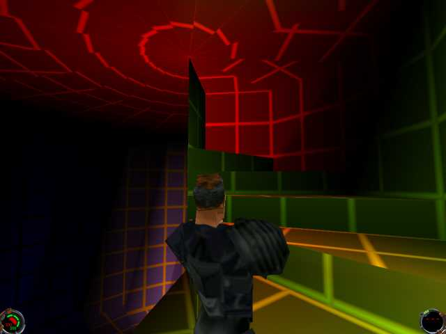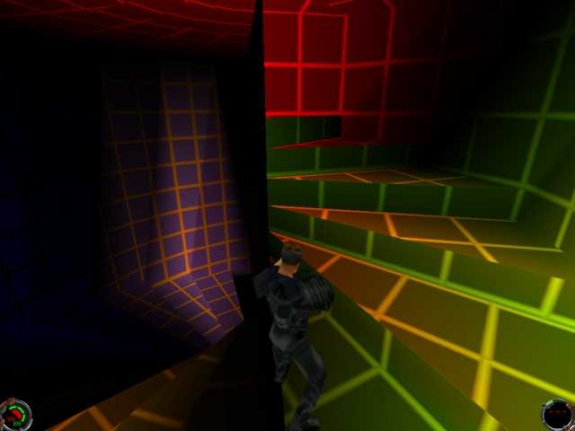

Excuse the funky lighting, I put em in there for the heck of it.  Well
let's get to the tutorial.

First thing we got to do is to cut down that default JED box that JED
hands to us when we starts up.

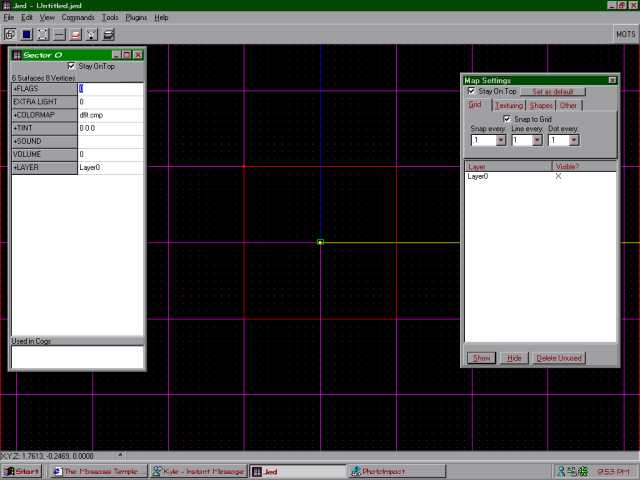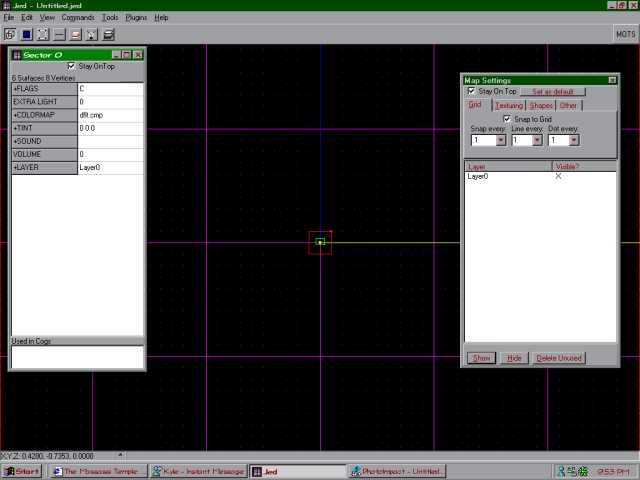

Then after resized the default JED box down to a more reasonable size we
will cleave it in half dialonly wise, then extrude the the surface that
is red in the following picture by about 0.2 JK units.  (if not clear
egough see the following pictures)

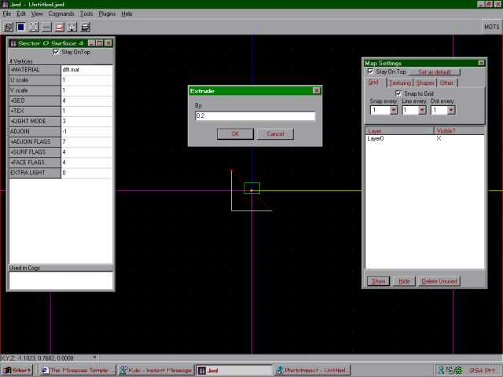

Next we cleave that surface we extruded again in half dialongly wise and
repeat that patten a few time.

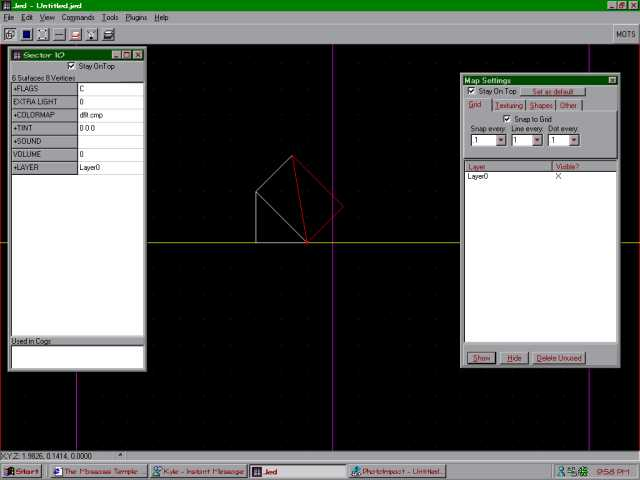

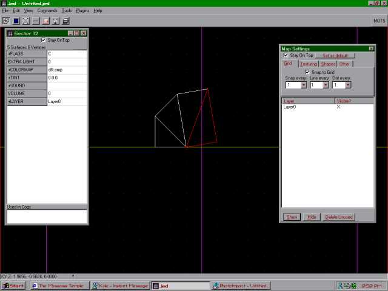

Here's the result of extruding and cleaving it in half dialongly wise
\\/ \\/

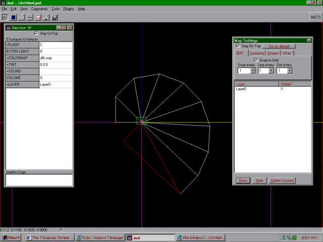

Ok, now to actually make the steps.  First thing to do is to choice the
largest sector you got and cleave off 0.5 JK unit off the bottom of the
sector (if not clear egough see the following pictures)

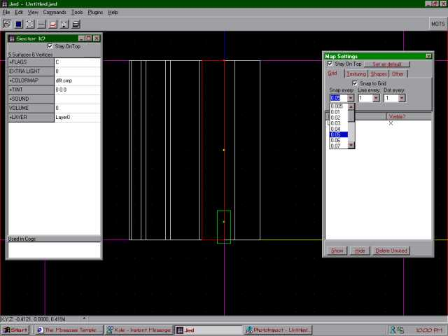

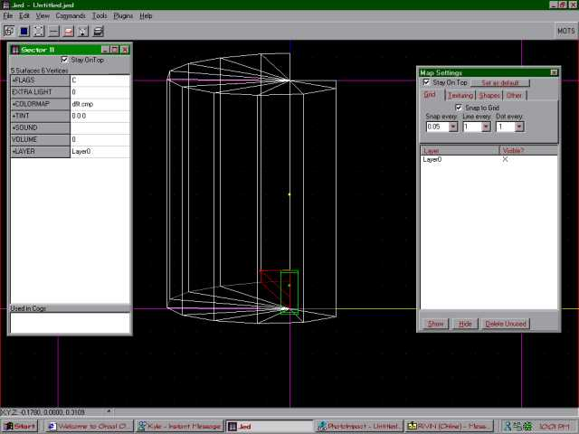

Now delete that sector that you just cut, not the big one but the
smaller one.

Repeat that patten and cleave it about 0.5 higher than the previous one.

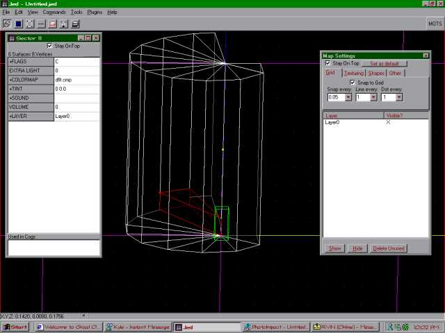

Keep on cleaveing and deleteing untill you get this result.

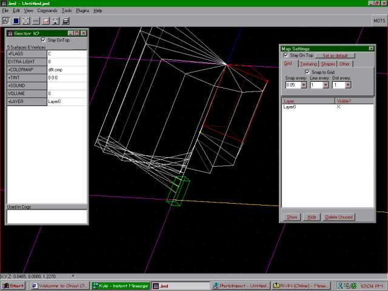

There youre done with that Shellfish stair.  Now texture it and save it
to a gob file and put it in the episode directory in your local JK or
MotS folder and enjoy the new Shellfish stair you just made.
