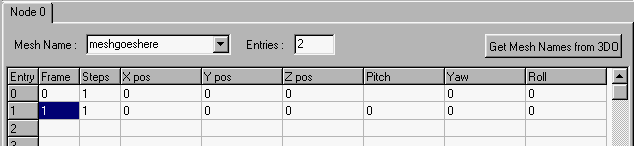
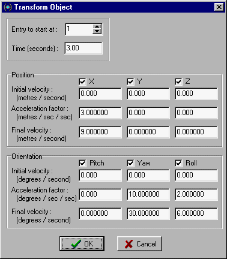

Author: EvanC

  
In this tutorial you will learn how to use Trajedi (available in the 
[programs section](/programs/) to make ships fly with keyframes.
Download Trajedi before you begin.  
  
Before you can do keyframes you need to understand 3d movements. An
objects position is determined by a 3d co-ordinate. The co-ordinate will
have three numbers, an X value, a Y value and a Z value. The X value is
how far along the X-axis the object is, the Y value is how far it is
along the Y-axis and the Z value is how far it is along the Z-axis. An
objects direction(the way it is facing) is given by 3 values, pitch,yaw
and roll.  
  
Now onto the keyframe making. First, open trajedi. You will have to fill
in the name of the mesh your ship 3do is useing. The Moldy Crow has one
mesh called "crow". Now you need to fill in two frames. Make the
starting one zero and the second frame one. Fill in all the
values(except for STEPS--leave that alone for now) with 0. you should
have this:  
  

  
  
Now you will actually make the 3do move. Click on the TOOLS menu and
then TRANSFORM OBJECT. A box will come up. At the top there is a box
called "entry to start at". This should be changed to "1". Below that
there is a box called "seconds". This determines how many seconds the
transformation(movement) will take. Set it to "3.00". You will notice
there are also six different columns. The first three are position and
the last three are direction. Each column has a check box above it. Make
sure all of these are checked. Now click on the bottom square of the
first column. Change the "0.000000" into "9.000000". What this means is
that at the end of the 3 seconds the 3do will be 9 metres along the
X-axis(it will go up 9 metres). You might have notice that the square
just above the one you just edited has changed to "3". This just shows
how much the object changes per second. So if it was at 10 and the key
was 10 seconds long the 3do would be 100 metres up in the air. Now fill
in the bottom square of the "YAW" column with "30.000000". This will
mean that at the end of the transformation the ship will be rotated 30
degrees. Finally, change the bottom square of the "ROLL" column into
"6.000000". Thats means that the finall roll will be 6 degrees. This is
what you should have:  
  

  
  
Once that is done push "OK". You will notice the squares have filled up
with numbers. That is the transformation we just did. Save the key in
your project directory. To use the keys in your level you will need to
use a cog. I have made some simple cogs that will play a key in some
common situations.  
  
[Download cogs](shipcogs.zip) 
  
Here is what the cogs do: SPFYACT.COG This will make the ship fly when a
button is pushed by the player SPFYENT.COG This will make the ship fly
when the player enters a sector SPFYSIT.COG This makes the ship fly when
the player first sees it in a single player game. SPFYSRT.COG This will
make the ship move when a level starts up SPFYTCH.COG This makes the
ship fly when the player touches a thing  
  
There is a text file with the cogs that explains how to use each one in
detail. If you need the ship to fly in different situations then you
will have to make your own cog using the PlayKey() line.  
  
Good luck,  
  
Evan C
